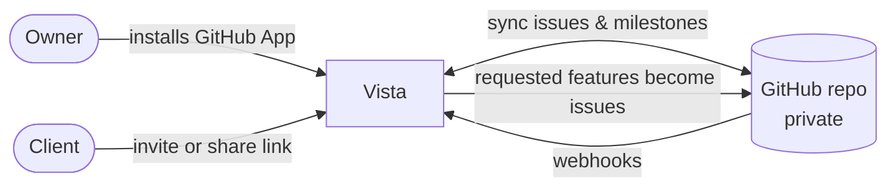
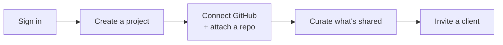
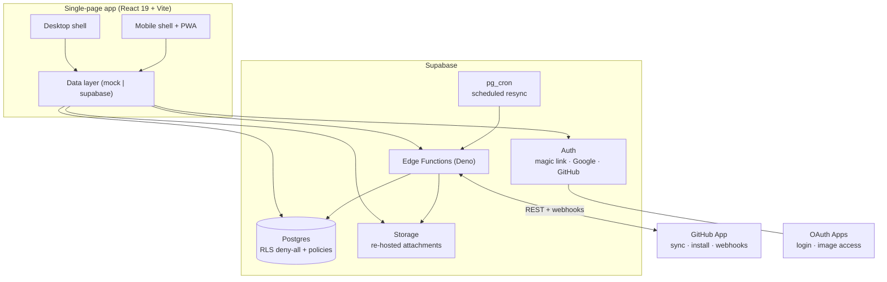

# Vista

**A shared product roadmap, built on your GitHub.** Project owners connect a private GitHub repository; Vista turns its milestones and issues into a polished roadmap dashboard and decides, per project and per issue, what clients are allowed to see. Clients join through an invite or a read-only share link, follow progress, comment, and request features — without ever needing GitHub access to the private repo.

[](https://react.dev)
[](https://www.typescriptlang.org)
[](https://vite.dev)
[](https://tailwindcss.com)
[](https://supabase.com)
[](./LICENSE)

> [!NOTE]
> Vista runs against a **mock backend by default** (`VITE_BACKEND=mock`) — the whole app is testable end to end with no accounts and no cloud setup. Point it at a real Supabase project (`VITE_BACKEND=supabase`) to enable GitHub sync, auth, storage, and realtime.

## How it works



An owner installs the Vista GitHub App on a repository. Vista syncs that repo's milestones and issues into a read-cache, and the owner curates which project is **available on Vista**, which issues are **shared**, and writes client-facing summaries. Clients see only the curated roadmap. When a client requests a feature, it lands in a moderation inbox; once approved, Vista writes it back as a labelled GitHub issue.

## Features

**For owners**

- Connect a private GitHub repo through a GitHub App; milestones and issues sync automatically (hourly cron + live webhooks).
- Per-project availability and per-issue sharing, with owner-written client summaries — owner-curated columns are never clobbered by sync.
- Members and roles, invite links (copy or rotate), and an access-request review queue.
- A moderation inbox for client-submitted feature requests, written back to GitHub on approval.
- Private attachment images are re-hosted so clients can see them without repo access.

**For clients**

- A polished roadmap dashboard: a zoomable Gantt timeline of milestones and issues, with progress, due dates, and overdue markers.
- Join by invite link (request access, owner approves) or open a read-only, token-scoped public share link with no account.
- Comment on shared issues and submit feature requests.
- Realtime updates across desktop and mobile.

**Across the product**

- Authentication via magic link, Google, or GitHub (identities auto-link by verified email).
- Bilingual FR / EN with localized dates.
- Mobile-first shell with a dedicated touch UI, plus a full desktop layout — installable as a PWA with an offline app shell.
- Editorial design system (see [`DESIGN.md`](./DESIGN.md)).

## Owner onboarding

From zero to a shared roadmap in five steps. Everything below happens in the hosted app — no GitHub access is ever shared with your clients.



1. **Sign in.** Use a magic link, Google, or GitHub. Signing in with different methods on the same verified email links to one account.
2. **Create a project.** From the **Admin** console (or the sidebar), choose **New project** and name it.
3. **Connect GitHub and attach a repo.** Open the project, then **Settings → General → GitHub**. Install the Vista GitHub App on the repository you want (the **Manage on GitHub** button takes you there), then attach that repo. Vista syncs its milestones and issues automatically — hourly, plus live on webhooks.
4. **Curate what clients see.** In the **Admin** console, toggle the project's **availability on Vista** and its **sharing**. In **Settings → Sharing**, choose which issues are shared and write client-facing summaries. Owner-curated fields are never overwritten by sync.
5. **Invite a client.** In **Settings → Members**, copy the invite link (rotate it any time). The client opens it, requests access, and you approve them under **access requests**. For a read-only audience with no account, use a public share link instead.

> [!TIP]
> If your repo is private and issues contain pasted/dragged images, connect image access once under **Account → Settings**. Vista then re-hosts those attachments so clients can see them without GitHub access to the repo.

## Architecture



> [!IMPORTANT]
> The data layer is an adapter, selected per domain by `VITE_BACKEND`. The `mock` adapter is backed by `localStorage` with seeded demo data; the `supabase` adapter talks to Postgres, Auth, Storage, and Edge Functions. Both implement the same service interfaces, so UI code never branches on the backend.

GitHub integration spans three distinct apps, by design:

| App | Type | Purpose |
|---|---|---|
| Vista Roadmap | GitHub App | Install on a repo, sync issues/milestones, receive webhooks |
| Vista Login | OAuth App | Sign in with GitHub (identity only) |
| Vista Image Access | OAuth App | Owner-granted repo-scoped token to re-host private attachment images |

The frontend lives in `src/` and the backend in `supabase/`:

```text
src/
  components/   shared UI, layout, markdown, motion primitives
  features/     admin, auth, notifications, project, workspace
  mobile/       mobile-first shell, screens, and touch UI
  pages/        route-level screens (landing, auth, app, join, share)
  routes/       react-router config + auth guards
  services/     the data layer — one folder per domain, mock | supabase adapters
  lib/          i18n (FR/EN), supabase client, query keys, utilities

supabase/
  functions/    Edge Functions (Deno): sync-repo, github-webhook,
                connect-installation, connect-repos, connect-image-access, create-issue
  migrations/   schema, RLS policies, RPCs, cron
  tests/        pgTAP policy tests
```

## Getting started

> [!NOTE]
> Prerequisites: Node.js and npm. The mock backend needs nothing else. The full local stack additionally needs Docker (for Supabase) and the Supabase CLI (installed as a dev dependency).

```bash
make install     # npm install
make web         # Vite dev server on http://localhost:5173 (mock backend)
```

That is enough to explore the whole app: sign up with any email, and the demo data seeds itself.

### Full local stack

To run against a real local Supabase (Postgres + Auth + Storage + Edge Functions):

```bash
cp .env.example .env                              # set VITE_BACKEND=supabase + Supabase URL/anon key
cp supabase/functions/.env.example supabase/functions/.env
make dev                                          # Supabase + edge functions + web + webhook relay
```

`make dev` starts everything in one command and prints the local service URLs (Studio, mail, API). See [Configuration](#configuration) for the environment variables, and [`docs/CONVENTIONS.md`](./docs/CONVENTIONS.md) for code conventions.

### Common commands

| Command | What it does |
|---|---|
| `make dev` | Full stack: Supabase + edge functions + web + webhook relay |
| `make web` | Vite dev server only |
| `make supabase` / `make stop` | Start / stop the local Supabase stack |
| `make migrate` | Apply pending migrations (additive) |
| `make types` | Regenerate `src/types/database.types.ts` from the local DB |
| `make db-test` | Run the pgTAP RLS/policy tests |
| `make check` | Every gate: lint + typecheck + tests + pgTAP |

Run `make help` to list all targets.

## Configuration

All client variables are prefixed `VITE_` and bundled into the browser — never put a secret there. The mock app needs none of them.

| Variable | Scope | Purpose |
|---|---|---|
| `VITE_BACKEND` | client | Data layer: `mock` (default) or `supabase` |
| `VITE_SUPABASE_URL`, `VITE_SUPABASE_ANON_KEY` | client | Supabase project (anon key is safe client-side; RLS protects data) |
| `VITE_APP_URL` | client | Base URL used to build invite links; defaults to the window origin |
| `VITE_GITHUB_APP_SLUG` | client | GitHub App slug for install/manage links |
| `VITE_GITHUB_OAUTH_CLIENT_ID` | client | Image-access OAuth App client id (empty hides the button) |

Server-only secrets (service-role key, GitHub App ID and private key, webhook secret, OAuth app secrets) live in Supabase Edge secrets and `supabase/functions/.env` — see [`supabase/functions/.env.example`](./supabase/functions/.env.example). They are never exposed to the browser.

> [!WARNING]
> Anything prefixed `VITE_` ends up in the client bundle. Keep tokens and secrets server-side, in Supabase Edge secrets or `supabase/functions/.env` (both gitignored).

## Deployment

The frontend deploys as a static SPA (Vercel, with `vercel.json` providing the SPA fallback rewrite). The backend is a hosted Supabase project: apply migrations, deploy the Edge Functions, configure the three GitHub apps and their secrets, and the `pg_cron` resync schedule. Self-authenticating functions (`sync-repo`, `github-webhook`) set `verify_jwt = false` in `supabase/config.toml` and authenticate via their own shared secret / HMAC. Before exposing the app publicly, work through [`docs/security-checklist.md`](./docs/security-checklist.md).

## Tech stack

- **Frontend** — React 19, TypeScript (strict), Vite 7, Tailwind CSS v4, react-router-dom, TanStack Query, `motion`, radix-ui, react-i18next.
- **Backend** — Supabase: Postgres with row-level security, Auth, Storage, and Edge Functions (Deno), with `pg_cron` and `pg_net` for scheduled sync.
- **Content** — react-markdown with remark/rehype (GitHub-flavoured markdown, sanitized), mermaid, tiptap.
- **Quality** — ESLint, Prettier, Vitest (unit + integration), pgTAP for database policies.

## License

Released under the [MIT License](./LICENSE).
