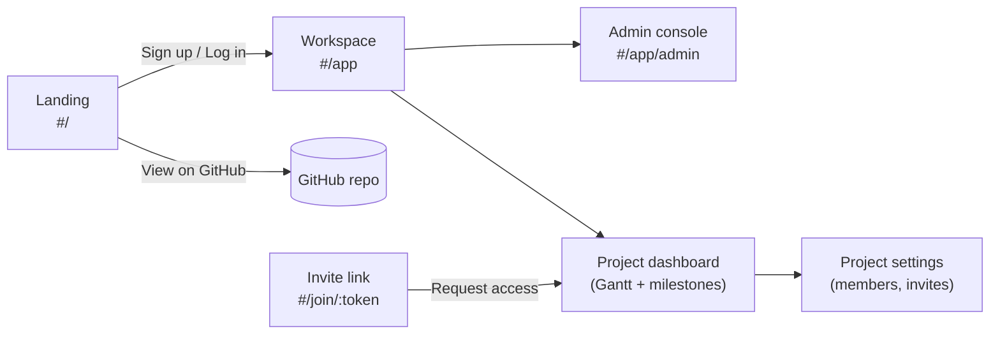
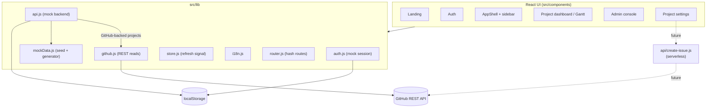
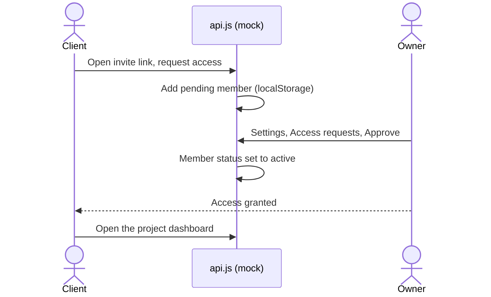

# Vista — a shared product roadmap

A multi-tenant roadmap platform built around **GitHub milestones and issues**.
A public landing page presents the product; project **owners** sign up, create
projects, and decide which ones are **available on Vista** and which to **share**.
**Clients** join a shared project through an **invite link**, request access, and —
once approved — follow a polished **roadmap dashboard**.

> [!NOTE]
> There is **no real backend yet**. Auth and data are mocked (in `localStorage`,
> seeded with demo content) so the entire app is testable end to end. The modules
> are written with a real backend in mind — see
> [Swapping in a real backend](#swapping-in-a-real-backend).



## Features

**Platform**

- Landing page presenting Vista, with a "View on GitHub" link to the product repo.
- Sign up / log in, then a workspace listing the projects you own or that are shared with you.
- Admin console to toggle, per project, its **availability on Vista** and its **sharing**, with live counts of members and pending requests.
- Project settings: members and roles, access-request review (approve or deny), invite link (copy or rotate), visibility, and deletion.
- Join-by-link flow: open an invite link, request access, the owner approves.
- Bilingual FR / EN toggle with localized dates.
- Editorial design system (see [`DESIGN.md`](./DESIGN.md)): white canvas, dark ink, signature cards. Icons come from `lucide-react`.
- Installable **PWA** with offline app shell (see [PWA](#pwa)).

**Roadmap (the Gantt)**

- Two-tier time header (months plus day or week dates) with weekend shading.
- Zoom by Month / Week / Day, or **Ctrl/Cmd + wheel** anchored on the cursor.
- **Grab to pan** the chart in both axes; native scroll still works.
- Collapsible milestones with progress fill, due-date markers, and an overdue indicator.
- Issues as bars with status icons and the author's avatar; click an issue in the list to scroll and center it.
- Search and jump to any issue; sort milestones (default, due date, name, progress) and issues (chronological, status, number).
- A dedicated, list-based mobile view (no horizontal timeline) that swaps in automatically on phones.

## Quick start

```bash
npm install
npm run dev        # http://localhost:5173
```

That is enough: the app runs against the mock backend with no configuration.
Sign up with any email and password, and the demo data seeds itself.

> [!TIP]
> Reset the demo at any time by clearing these `localStorage` keys:
> `vista-session`, `vista-accounts`, `vista-db`, `vista-lang`.

## Architecture



> [!IMPORTANT]
> The mock boundary is intentional. `auth.js` and `api.js` expose `async`
> methods shaped like a real API; only their bodies talk to `localStorage`
> today. Reads of public GitHub data run client-side through `github.js`.

## App structure

Client-side hash routes (no router dependency — see `src/lib/router.js`):

| Route | Screen | Access |
|---|---|---|
| `#/` | Landing page (marketing) | public |
| `#/login`, `#/signup` | Auth (mocked) | public |
| `#/join/:token` | Join a shared project (request access) | requires sign-in |
| `#/app` | Workspace (your projects) | requires sign-in |
| `#/app/admin` | Admin console (availability and sharing) | requires sign-in |
| `#/app/projects/:id` | Project dashboard (roadmap) | members only |
| `#/app/projects/:id/settings` | Project management | owner only |

Authed screens share an app shell with a sidebar (`src/components/app/AppShell.jsx`).
Visiting a protected route while signed out redirects to `#/login` and returns you to
the original link after sign-in (for example, an invite link).

### Access-request flow



> [!TIP]
> The seed already adds **pending requests** to the demo projects, so the
> approval side is testable from a single account: open a project, then
> Settings, then Access requests.

## PWA

Vista ships as an installable Progressive Web App.

- `public/manifest.webmanifest` — name, standalone display, theme color, icon.
- `public/icon.svg` — maskable app icon.
- `public/sw.js` — service worker: offline app shell plus runtime caching. It
  bypasses `/api/` routes and the cross-origin GitHub API so live data is never stale.
- Registered from `src/main.jsx` in production builds only.

> [!NOTE]
> The service worker is active in builds, not in `npm run dev`. Test it with
> `npm run build && npm run preview`, then use the browser's install action and
> DevTools, under Application, to inspect the manifest and service worker.

> [!TIP]
> Icons are SVG, which installs on recent Chromium browsers. For best results on
> iOS, add PNG icons (180, 192, 512) and reference them from the manifest and the
> `apple-touch-icon` link.

## Configuration

All variables are optional; the mock app needs none of them.

| Variable | Where | Purpose |
|---|---|---|
| `VITE_VISTA_GITHUB` | client | Vista's own repo, used by the landing and footer "View on GitHub" link. |
| `VITE_GITHUB_OWNER`, `VITE_GITHUB_REPO` | client | Default GitHub source for GitHub-backed projects (public). |
| `VITE_GITHUB_TOKEN` | client | Optional, local dev only. Read token for GitHub-backed projects. |
| `GITHUB_TOKEN`, `GITHUB_OWNER`, `GITHUB_REPO` | server | Used only by the future real backend (`api/create-issue.js`). |

> [!WARNING]
> Anything prefixed `VITE_` is bundled into the browser. Never ship a real token
> that way on a public deployment — leave `VITE_GITHUB_TOKEN` empty in production.

## Swapping in a real backend

Everything is mocked behind two modules. Replace their bodies and keep the
signatures:

- `src/lib/auth.js` — `login`, `signup`, `logout` (currently `localStorage`).
- `src/lib/api.js` — projects, members, access requests, invites, and `createRequest`
  (currently `localStorage` plus seeded demo data). Every method is already `async`.

`api/create-issue.js` is a ready-made serverless function (Vercel-style) showing how
`createRequest` would create a real GitHub issue: the title is prefixed by type, a
`via:vista` label is added, and the submitter is noted in the body. It is not called by
the mock app yet.

## Stack

- Vite and React 18, no UI framework (vanilla CSS tokens from `DESIGN.md`).
- `lucide-react` for icons.
- GitHub REST API v3 for reading public milestones and issues.
- Inter and Inter Tight (a Haas Grotesk substitute).
