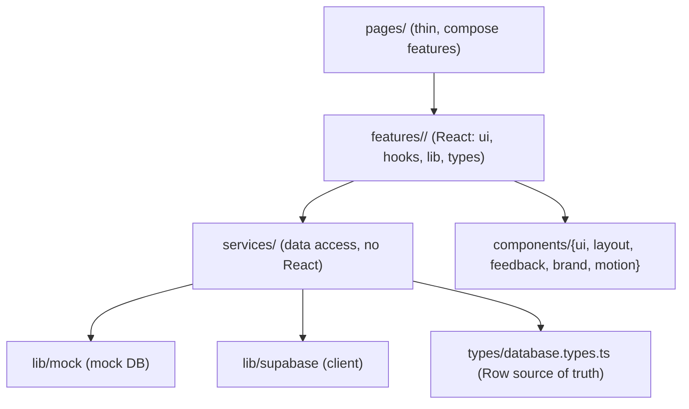

# Vista - Code & architecture conventions

The rules the codebase already follows. Read before adding code; new code must look like the surrounding code. When in doubt, copy the nearest existing module.

> [!NOTE]
> Stack: Vite 7, React 19, TypeScript (strict), Tailwind v4 + shadcn/ui (new-york, neutral) on the unified `radix-ui` package, TanStack Query v5, React Router v7, react-i18next, Motion + auto-animate. Backend is a mock today, Supabase later - behind a stable service seam.

## 1. Layering



> [!IMPORTANT]
> The dependency direction is one-way: `pages -> features -> services`. A **service never imports React or a feature**. A **component never fetches data** - it receives data/handlers from a feature hook. A page is thin: it wires a feature into a route.

## 2. Directory structure & naming

- Files: **kebab-case** with a **dotted role suffix**: `*.service.ts`, `*.dto.ts`, `*.keys.ts`, `*.config.ts`, `*.context.ts`, `*.provider.tsx`, `*.mappers.ts`, `*.types.ts`, `*-page.tsx`.
- Every folder has a barrel `index.ts` that re-exports its public surface; import from the barrel (`@/components/ui`), not deep paths, except where a file must avoid a barrel cycle (e.g. `dialog.tsx` imports `@/components/ui/button` directly).
- Components are **named exports** in PascalCase (only `App` is a default export). Hooks are `useX`. Path alias `@/*` -> `src/*`.
- A feature owns `ui/` (components), `hooks/` (React Query + state), `lib/` (pure helpers), `types/` (view-model types). Pure, testable logic goes in `lib/`, never inside a component.

## 3. Services (data-access layer)

Each domain is `services/<domain>/` with `*.dto.ts` + `*.service.ts` + `index.ts`. The service file defines one interface and **two implementations** switched by env:

```ts
export interface ProjectsApi { getProject(id: string): Promise<ProjectRow | null> /* ... */ }
const mock: ProjectsApi = { /* reads/mutates mockDb() */ }
const supabase: ProjectsApi = { getProject: () => notImplemented('projects.getProject') /* ... */ }
export const projects: ProjectsApi = env.backend === 'supabase' ? supabase : mock
```

> [!IMPORTANT]
> Rules: the `supabase` branch is always **wired but stubbed** with `notImplemented(...)` so `VITE_BACKEND=supabase` fails loudly, never silently. Keep the two branches in lockstep (same interface). Signatures must be **stable across the swap** - prefer a signature Supabase can satisfy with RLS (e.g. `getRoadmap(projectId)` resolves the viewer itself rather than taking a role).

- DTOs derive from the **single source of truth** `src/types/database.types.ts` (`Tables['x']['Row']`), plus input/view types. Never redefine row shapes by hand.
- Services may read other services' data layer (`auth.currentUser()`, `mockDb()`); they must not import React, hooks, or features.
- Never put real secrets in `VITE_*` (bundled to the browser); server-only keys live in non-`VITE_` env.

## 4. State & data fetching

- TanStack Query for all server state. Query keys live in `lib/query-keys/<domain>.keys.ts` as factory objects:

```ts
export const projectKeys = {
  all: ['projects'] as const,
  list: (userId: string) => [...projectKeys.all, 'list', userId] as const,
}
```

- Reads: a feature hook wraps `useQuery` (`enabled` guards empty inputs, `select` to shape). Writes: `useMutation` that invalidates the right key(s) on success. Never call a service directly from a component.
- React context only for cross-cutting app state (`auth.context`, `sidebar.context`) via a `*.provider.tsx`; consume with a `useX()` that throws if used outside its provider, or ships a safe default when it must render standalone (see `sidebar.context`).

## 5. Styling & design system

- Tailwind v4 + shadcn primitives in `components/ui` (generated form, `data-slot`, CVA variants). Merge classes with `cn()` (`lib/utils`). Match the reference primitives exactly when adding new shadcn components.
- Tokens live in `src/styles/index.css`: shadcn oklch variables + the **Vista signature palette** exposed as theme colors (`ink`, `body`, `muted-ink`, `hairline`, `link`, `success`, `sig-*`, `surface-soft/strong/sunken`, `surface-dark`, `on-dark`). Use the token utilities (`bg-sig-coral`, `text-ink`) - do not hardcode hex except inside bespoke SVG/brand marks. A token used as one thing (e.g. `surface-sunken` = app background) is not reused for unrelated surfaces.
- Ported bespoke components (the Gantt) read the editorial bridge vars (`var(--ink)`, `var(--surface-soft)`, `var(--r-xs)`) via inline styles - keep that, do not "Tailwindify" them.

> [!WARNING]
> Design rules (DESIGN.md): no pill radius outside pricing - badges `rounded-sm`, buttons `rounded-md`, progress bars `rounded-xs`. Icons are **lucide-react only**; the two non-lucide brand marks live in `components/brand`. **No unicode icons, no ASCII art** anywhere. Reuse shared controls (`Segmented`, `Button`, `Dialog`) - never hand-roll a toggle/modal.

## 6. Animations

Centralized in `components/motion/` (presets in `motion.config.ts` + reusable wrappers `PageTransition`, `TabTransition`). Lists use `@formkit/auto-animate` (one `useAutoAnimate()` per container). Overlays (dialog/popover/tooltip/dropdown) keep their Radix + `tw-animate-css` enter/exit. The animated indicator for option groups lives in `Segmented` (Motion `layoutId`).

> [!IMPORTANT]
> No animation logic scattered in pages: compose the wrappers/hooks above. `prefers-reduced-motion` is honored globally via `<MotionConfig reducedMotion="user">` at the root - do not bypass it.

## 7. Internationalisation

react-i18next with **flat dotted keys** (`'ps.tab.general'`), FR + EN catalogs in `lib/i18n/i18n.ts`. Every user-facing string is a `t('...')` key added to **both** catalogs. French content keeps its accents and typographic apostrophes (the right single quote, not a straight `'`) so the string literals stay valid. No hardcoded UI copy in components.

## 8. TypeScript & lint idioms

`strict` + ESLint `strictTypeChecked` + react-hooks + react-refresh + jsx-a11y. `verbatimModuleSyntax` and `erasableSyntaxOnly` are on. The gate is non-negotiable: **`npm run lint`, `npm run build`, `npm test` all green before a commit.**

- Type-only imports use `import type` / `import { type X }`. No enums, no TS `namespace`, no constructor parameter properties (erasable syntax only). shadcn primitives use `import * as React` for `React.ComponentProps<...>` types.
- `noUncheckedIndexedAccess` is **off** - `arr[0]` is `T`, so `arr[0]?.x` / `arr[0] ?? y` trip `no-unnecessary-condition`. Use a `.length` check instead, or index directly after guarding.
- Event handlers that return nothing use a **block body** (`onClick={() => { setX(v) }}`); floating promises are `void`-ed (`void navigate('/')`); a promise-returning callback passed where void is expected is wrapped (`onSuccess: () => { void navigate(...) }`).
- No `any`; narrow `unknown`. Prefer `??` over `||` (`prefer-nullish-coalescing`). When a shadcn export co-locates a non-component (e.g. `buttonVariants`), it carries the documented `// eslint-disable-next-line react-refresh/only-export-components`.
- `react-hooks/set-state-in-effect`: do not reset state in an effect - re-key the component or rely on unmount (e.g. a form inside `DialogContent`, which Radix unmounts on close, resets naturally).

## 9. Accessibility

jsx-a11y is enforced. Icon-only buttons get an `aria-label`; toggles use `aria-pressed`; clickable non-button elements get `role` + key handlers (or an `eslint-disable` with a one-line justification, as in the Gantt pan surface). No `autoFocus`. Labels are associated with inputs (`htmlFor` / `Label`).

## 10. Testing

Vitest + Testing Library (+ MSW available), jsdom, tests mirror `src/` under `__tests__/{unit,integration}`; jsdom polyfills (ResizeObserver, matchMedia, Web Animations) live in `__tests__/setup.ts`.

- Unit-test pure logic and services (mappers, `seed`, service branches). Integration-test flows with the real providers (Query + Router + i18n + Auth), asserting **by role/text**, not implementation details.
- Reset state between tests (`resetMockDb()`, `localStorage.clear()`). Every new feature ships at least a render/flow test. Keep the suite green.

## 11. The mock layer

`lib/mock`: a single mutable `mockDb()` singleton (`resetMockDb()` for tests), normalized Row collections seeded deterministically. Services read and mutate it directly (the same seam Supabase will replace).

> [!WARNING]
> Documented mock-only simplifications to reconcile later: `shared` defaults **false** on every milestone/issue (allowlist invariant); identity is keyed on **email** (Supabase real user ids in Phase 2); the invite token is the **project id** (opaque tokens in Phase 4). Flag any new such shortcut in code comments + the relevant phase issue.

## 12. Workflow

- Conventional commits, scoped (`feat(ui): ...`). **Never** add a `Co-Authored-By` trailer. Commit only when asked; branch off the default branch first.
- GitHub is the source of truth: issues/PRs read as a factual changelog (no chat talk), use mermaid + GitHub callouts, **no unicode icons / no ASCII art**.
- `issue-fix` flow: verify each claim in the code first, minimal-diff patches, keep existing patterns, run lint/build/typecheck, update the issue's acceptance checklist + a factual comment - and leave the work uncommitted for the maintainer.
