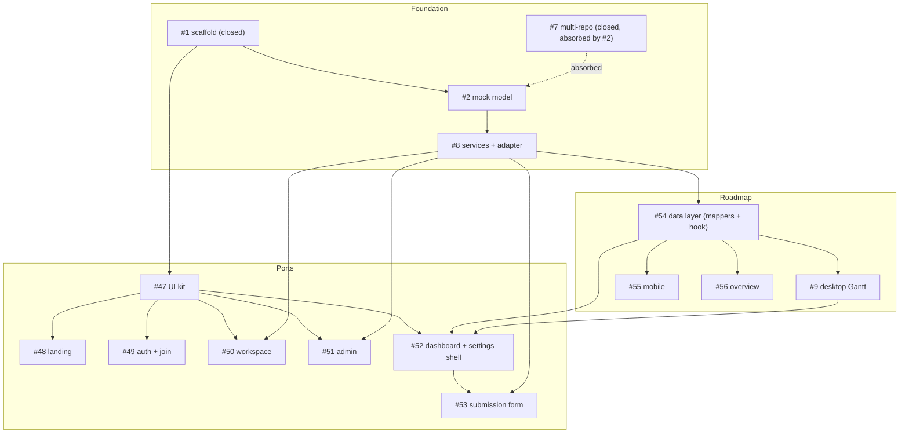

# Milestone audit — Phase 0 - Readiness (#7)

Date: 2026-06-06
Branch: `restructure/sota-architecture`
Auditor: technical review (no code produced)

> [!NOTE]
> This is a **completion (retrospective) audit**: every issue's acceptance criteria are already satisfied in the working tree. The usual "go/no-go on starting the build" therefore reframes to **go/no-go on closing the milestone, merging the branch, and advancing to Phase 1**.

## Method

- Read all 15 issues in the milestone (`gh issue list --milestone "Phase 0 - Readiness" --state all`, then each body).
- Cross-checked claims against the working tree: `src/services` (6 domains), `src/features` (workspace, admin, project/{roadmap,dashboard,settings,submission}), `src/components/ui` (16 primitives), and 16 test files.
- Confirmed the gates: `npm run lint` clean, `npm run build` green (`tsc -b` + vite), `npm test` 48 passing (unit + integration).

## Snapshot

| Status | Count | Issues |
| --- | --- | --- |
| Closed | 2 | #1, #7 |
| Open, acceptance fully checked (done) | 13 | #2, #8, #9, #47-#56 |
| Implemented but uncommitted at audit time | 1 | #53 |

> [!WARNING]
> 13 issues are **functionally complete but still OPEN**. This is the single biggest hygiene gap. They should auto-close on PR merge via `Closes #N` in the squash/merge body, or be closed manually. Until then the milestone reads as 2/15 done when it is effectively 15/15.

## Per-issue assessment

### Foundation

**#1 Scaffold SOTA frontend structure & tooling** (closed)
- Context: complete; clear scope + acceptance, vault doc linked.
- Fit: the root of everything; mirrors the ARIA reference standard the user mandated.
- Architecture: sound — Vite + React 19 + strict TS, Tailwind v4 + shadcn, flat ESLint `strictTypeChecked` + jsx-a11y, router with auth-guards, TanStack Query, i18n.
- Justification: warranted; non-negotiable base.
- Risk & recommendation: **Keep**. Done and closed correctly.

**#2 Mock data model (normalized, Row-typed)** (open, done)
- Context: excellent — explicit normalization mandate, `database.types.ts` as single source of truth, defers `profiles`/`project_invites`/`github_installations`/`sync_state`.
- Fit: directly enables the mock -> Supabase swap promised in later phases.
- Architecture: strong — normalized Row collections (not a tree), `shared=false` invariant on every milestone/issue, `submissions` rename. Verified in `seed.ts` + `database.types.ts`.
- Justification: warranted; the data seam is the spine of the whole frontend.
- Risk & recommendation: **Keep, close on merge.** Placeholder `database.types.ts` must be regenerated from Supabase in Phase 2 (already noted in the file header).

**#7 Multi-repo per project (mock)** (closed)
- Context: thin (two unchecked acceptance lines), but deliberately superseded.
- Fit: still valid as a capability; folded into #2 (`project_repos`) and the roadmap aggregation (#9/#54).
- Architecture: realized through `project_repos` + cross-repo aggregation in `roadmap.getRoadmap` / `buildGanttData` (keyed by `milestone_id`, not `number`).
- Justification: redundant as a standalone; correctly closed as absorbed.
- Risk & recommendation: **Drop (already done).** Closed-but-unchecked is cosmetic; the capability is delivered and tested (`services.test` asserts multi-repo aggregation).

**#8 Data-access layer + VITE_BACKEND adapter** (open, done)
- Context: excellent — explicit decision to build both branches now; `supabase` branch must fail loudly (`NotImplemented`).
- Fit: locks the service seam early so UI never touches the backend choice.
- Architecture: strong — per-domain `*.service.ts` + `*.dto.ts`, `env.backend` switch, `notImplemented()` stubs. Verified across all 6 domains (auth, invites, projects, roadmap, submissions, _shared).
- Justification: warranted; pairs with #2.
- Risk & recommendation: **Keep, close on merge.** See cross-cutting note on the `supabase` stub surface growing — keep stubs in lockstep with the mock interface (so far they are).

### Roadmap

**#54 Roadmap data layer — mappers + use-roadmap** (open, done)
- Context: outstanding — the keystone, with the critical `milestone_id` (not `number`) keying rule called out to avoid cross-repo collisions.
- Fit: prerequisite for #9/#55/#56; pure + unit-tested.
- Architecture: strong — `buildGanttData`, `sortRoadmap`, `overallStats`, `use-roadmap` over TanStack Query. Unit tests cover id-keying, unscheduled split, sort.
- Justification: warranted; correct to split from #9.
- Risk & recommendation: **Keep, close on merge.** Exemplary scoping.

**#9 Roadmap: desktop Gantt (port)** (open, done)
- Context: thorough — every legacy capability enumerated (zoom, pan, search, sort, collapse, due marker, avatars, today line, viewport-fit).
- Fit: the heart of the product.
- Architecture: a 640-LOC bespoke port; consumes `groups` (no data access in the component), depends on #54. Render-tested.
- Justification: warranted.
- Risk & recommendation: **Keep, close on merge.** Highest-complexity surface; flag for the visual pass (see cross-cutting) and for future allowlist filtering (#3).

**#55 Roadmap: mobile list view** / **#56 Roadmap: overview** (open, done)
- Context: clear; both consume #54's view model and depend on it.
- Fit: complete the roadmap across breakpoints + the overview tab.
- Architecture: consistent — `useMediaQuery` swap for mobile; overview owns stats + milestones table (not the dashboard shell). Render-tested.
- Justification: warranted; correct separation from #52.
- Risk & recommendation: **Keep, close on merge.**

### Ports

**#47 Port shared UI kit** (open, done)
- Context: explicit primitive list + legacy-replacement list.
- Fit: base layer for #48-#53.
- Architecture: 16 shadcn (new-york) primitives on the unified `radix-ui`, matching the reference client; brand marks in `components/brand`; lucide-only icons. Smoke-tested.
- Justification: warranted; built first, correctly.
- Risk & recommendation: **Keep, close on merge.**

**#48 Landing** / **#49 auth + join** / **#50 workspace** / **#51 admin** (open, done)
- Context: each scoped to specific legacy files with crisp acceptance.
- Fit: the client-facing + owner surfaces.
- Architecture: idiomatic Tailwind rebuilds on the kit; new service domains where needed (`auth`, `invites`); enriched `projects` service (summaries, `createProject`, `updateProject`). Integration-tested (join request-access, workspace create, admin toggle).
- Justification: warranted.
- Risk & recommendation: **Keep, close on merge.** Note the deliberate mock simplifications below.

**#52 Project dashboard + settings shell** (open, done)
- Context: best-documented issue — the note explicitly defers the pillar tabs (members/invite/requests) to Phase 1.
- Fit: composes the roadmap + hosts the Phase 1 pillars.
- Architecture: `getProjectAccess` drives both guards (active-member for the dashboard, owner-only for settings); general settings tab functional; pillar tabs are placeholders by design. Integration-tested (both guards).
- Justification: warranted; the deferral is correct, not scope-cutting.
- Risk & recommendation: **Keep, close on merge.**

**#53 Port issue submission form** (open, done, uncommitted)
- Context: clear; wired to `services/submissions`.
- Fit: closes the client feedback loop; fills the #52 modal shell.
- Architecture: type/title/description/name/email form, `useSubmitRequest`, success + error states; creates a `pending` submission. Integration-tested (submit + required-title).
- Justification: warranted.
- Risk & recommendation: **Keep — commit, then close on merge.** Only outstanding mechanical step in the milestone.

## Cross-cutting findings

> [!NOTE]
> Coherence is high. Clean layering (services with no React vs features with hooks/ui), barrels everywhere, kebab-case + dotted-role-suffix naming, and a respected build order (data seam first, then the view layers). 48 tests span unit (mappers, services, seed) and integration (join, workspace, admin, project pages, request form).

> [!WARNING]
> Tracked debt and gaps to carry forward:
> - **Issue hygiene**: 13 done issues are still open. Close on merge (`Closes #N`).
> - **No visual verification**: every screen was validated by tests + build, never in a browser (no browser tooling this session). Do a `npm run dev` pass before merge; weight the Gantt (#9), the two-panel auth (#49), and the admin table (#51).
> - **Migration debt (Phase 2/4)**: the mock keys identity on **email** (`services/auth`) and the invites mock treats the **token as the project id**. Both are documented simplifications, but Phase 2 (real Supabase user ids) and Phase 4 (opaque invite tokens) must reconcile them. Recommend a short note in the Phase 2/4 issues.
> - **Bundle size**: vite warns the single JS chunk is >500 kB (no route code-splitting). Acceptable now; assign to Phase 6 (polish/PWA).
> - **Minor DRY**: `useUpdateProject` exists in both `features/admin` and `features/project/settings`. Harmless; dedupe opportunistically if a shared project-mutations module appears.

## Verdict

> [!IMPORTANT]
> **GO** — close the milestone, open the PR, and advance to Phase 1.

- **Coherence**: strong; the architecture matches the mandated reference standard and the doc set.
- **Build order**: correct and already executed (#1 -> #2/#8 -> #54 -> #9/#55/#56; #47 -> #48-#53).
- **Completeness**: 15/15 acceptance satisfied; gates green.
- **Conditions before "done-done"**:
  1. Commit #53.
  2. Open the PR with `Closes #2, #8, #9, #47, #48, #49, #50, #51, #52, #53, #54, #55, #56` (and confirm #1/#7 already closed).
  3. Run a manual visual pass (`npm run dev`).
  4. Add migration-debt notes (email-as-id, token-as-project-id) to the relevant Phase 2/4 issues.

Phase 1 (Mock future-ready: #3 allowlist filtering, #4 share-picker, #5 role enforcement, #6 moderation inbox) is unblocked: the settings shell, services seam, and `shared` invariant are all in place to receive the pillars.
