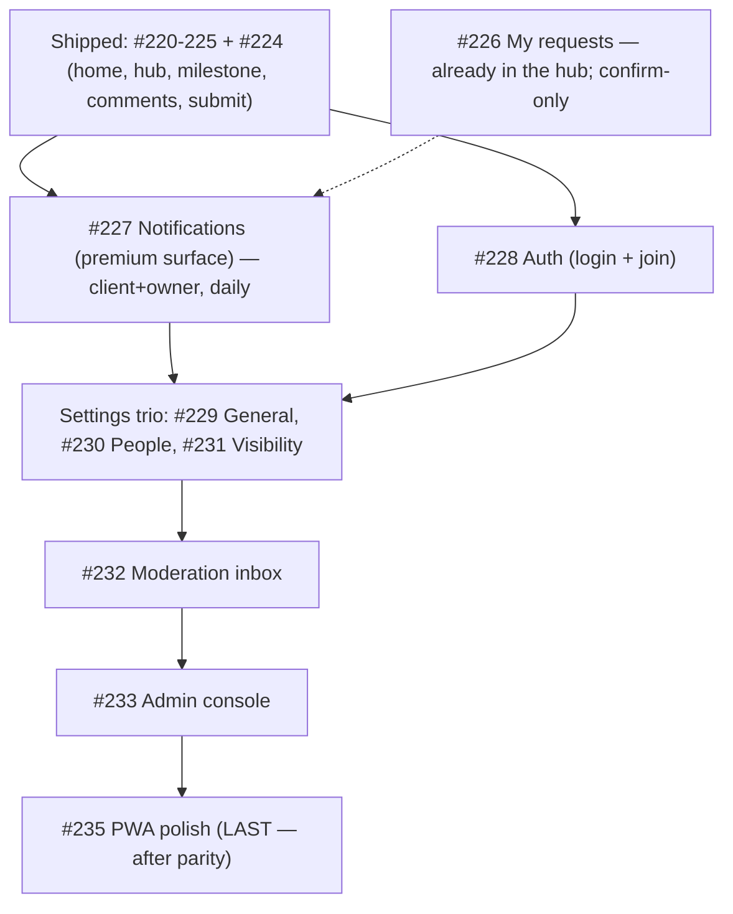

# Milestone #12 — Mobile-first experience — audit

> [!NOTE]
> Re-audit after #224 shipped. Scope: the remaining **open** sub-issues of epic #219. Evidence is from the code at `main` (commit `75832b4`). "Inferred" is flagged where I did not run the exact scenario.

## Status snapshot

Built bespoke mobile screens (under `MobileShellLayout`): Home `/app`, Account `/app/account`, Project hub `/app/projects/:id`, Milestone `/app/projects/:id/m/:num`, plus the Submit composer, New-project composer and the Comments sheet (#224).

Still falling back to the **desktop** shell/pages (`mobile-route-config.tsx:46-54`): `/app/admin`, `/app/submissions`, `/app/projects/:id/submissions`, `/app/projects/:id/settings`.

## Per-issue audit

| # | Title | Claim check (evidence) | Verdict |
|---|-------|------------------------|---------|
| #226 | My requests / status | The client's own submissions are **already surfaced on mobile**: the project hub renders `<MyRequests projectId={id} />` in its Requests tab (`mobile-project.tsx:111`), reusing `useMySubmissions` (`features/project/submission`). Same component the desktop roadmap uses. There is no *global* my-requests page on desktop either — it is per-project by design. | **Largely done / polish.** Acceptance ("reusing `useMySubmissions`, reachable") is met via the hub. Keep only to confirm the card's mobile styling; not a build. |
| #227 | Notifications | The `NotificationBell` is persistent on every mobile header (`screen-header.tsx:45`) and reuses `useNotifications`/`useMarkNotifications`. BUT it renders a **desktop radix `Popover`** (`notification-bell.tsx`: `PopoverContent align='start' w-80`) — a fixed ~320px dropdown anchored top-right. On a phone that is cramped and not "premium mobile-first". Deep-links exist. | **Refine → build.** Reachable but the surface is a desktop dropdown bolted onto mobile. Needs a bespoke mobile presentation (sheet/full screen list). Self-contained, reuses all hooks, no deps. **Do now.** |
| #228 | Auth (login + join) | `/login` and `/join/:token` use the **shared desktop** `LoginPage`/`JoinPage` in the mobile tree (`mobile-route-config.tsx:32,35`). Responsive from the laptop pass (inferred — not yet device-checked), but not bespoke mobile. | **Keep (build).** Real gap. Entry point but low-frequency (once) and already functional; lower premium-priority than notifications. Note: Google OAuth from a LAN IP is a *testing* limitation, not a product defect. |
| #229 | Settings — General | Falls back to desktop `SettingsPage` → `GeneralTab` (`settings/ui/general-tab.tsx`), reuses `useUpdateProject`. Owner-facing, behind the hub kebab → Settings. | **Keep (build).** Part of the settings trio. |
| #230 | Settings — People | Falls back; `PeopleTab` (`features/project/members`) reuses `useMembers`/`useMemberAction`/`useInviteLink`. | **Keep (build).** |
| #231 | Settings — Client visibility | Falls back; `ClientVisibilityTab` reuses `useRoadmapData`/`useSetShared` + the live client preview (the same share-picker fixed earlier this milestone). The desktop preview is wide — the hardest of the trio to make premium on a phone. | **Keep (build).** Most effort of the three. |
| #232 | Moderation inbox | Falls back to desktop `SubmissionsInboxPage` (`/app/submissions`), reachable from the bottom nav (owner-only, `bottom-nav.tsx:18`). Owner triage of submissions. | **Keep (build).** |
| #233 | Admin console | Falls back to desktop `AdminPage` (a summaries table). Admin-only, lowest reach. | **Keep (build, last-but-one).** |
| #235 | PWA polish | Acceptance text is a **copy-paste template** ("Bespoke mobile screen under `src/mobile/`, reusing the manifest and `sw.js`") that does not fit a PWA polish task. The real work = PNG/maskable icons (192/512), apple-touch-icon, install affordance, offline read, portrait manifest. | **Refine acceptance, keep last.** Must come after parity. |

> [!WARNING]
> Two issues carry the same templated acceptance that does not match their real scope: **#227** (a bell already exists — the work is *re-presenting* it on mobile, not "reachable via mobileRoutes") and **#235** (PWA, not a screen). The checkboxes should be rewritten when each is picked up.

## Milestone synthesis

### Coherence
The issues form a consistent whole: finish the **client** journey to full premium parity, then the **owner** surfaces, then PWA. No conflicts. #226 turns out to be already satisfied by the hub; #227 is reachable-but-not-premium.

### Dependency & order

Hard dependencies are few — the settings trio shares one entry point (hub kebab → Settings) so doing them together is natural; PWA must be last. Everything else is ordered by **reach × premium-impact**, not by code coupling.

### Gaps
- No bespoke mobile entry to **Settings** yet (the hub kebab currently routes to the desktop settings fallback — verify the kebab target once #229-231 land).
- `#235` offline/install criteria are under-specified (templated). Rewrite before building.
- `#226` has no dedicated issue work left beyond a visual confirm.

### Go / no-go
> [!IMPORTANT]
> **GO.** No blockers. Recommended next issue: **#227 Notifications** — highest reach (every session, client and owner), currently a desktop `Popover` awkwardly rendered on mobile, fully self-contained, reuses existing hooks with zero new dependencies. It advances the "premium mobile-first without breaking desktop" mandate most directly.
