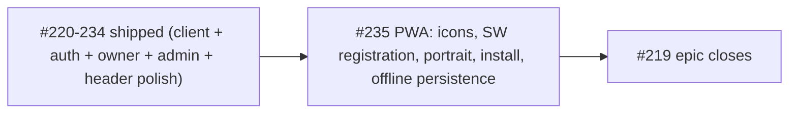

# Milestone #12 — Mobile-first experience — audit (final, pre-PWA)

> [!NOTE]
> Final audit before the closer. 14 of 15 sub-issues shipped; only #235 (PWA) remains, plus the epic #219 which closes when #235 lands. Evidence from `main` (commit `e4e315d`). "Inferred" is flagged where the exact scenario was not run.

## Sub-issue status (all verified shipped except #235)

| # | Title | State | Evidence it landed |
|---|-------|-------|--------------------|
| #220 | Platform split + MobileShell | closed | `mobile-route-config.tsx`, `MobileShell`/`ScreenStack` |
| #221 | Home / projects list | closed | `mobile-home.tsx` |
| #222 | Project Overview (vertical roadmap) | closed | `mobile-project.tsx` (hub) |
| #223 | Milestone detail | closed | `mobile-milestone.tsx` |
| #224 | Comments sheet | closed | `mobile-comment-sheet.tsx` (vaul) |
| #225 | Submit a request | closed | `mobile-composer.tsx` + `MobileFormSheet` |
| #226 | My requests / status | closed | Hub Requests tab (`<MyRequests>`); closed as done-in-hub |
| #227 | Notifications | closed | `mobile-notifications.tsx` (sections + swipe-to-read) |
| #228 | Auth (login + join) | closed | `mobile-login.tsx` / `mobile-join.tsx` + shared `useInviteJoin` |
| #229/#230/#231 | Settings trio | closed | `mobile-settings*.tsx` + owner gate |
| #232 | Moderation inbox | closed | `mobile-submissions.tsx` + `mobile-project-submissions.tsx`, `OwnerInbox` |
| #233 | Admin console | closed | `mobile-admin.tsx` + bottom-nav tab |
| #234 | Preview-as-client | closed | folded into #222 |

Every authenticated route is bespoke mobile under `MobileShellLayout` — the `DesktopShellLayout` fallback was removed from the mobile tree (#233). Headers are unified on the large-title style with auto-hide/reveal (post-#233 polish, PR #246).

## #235 — PWA polish (the only open work)

| Claim (rewritten acceptance) | Verdict | Evidence |
|---|---|---|
| Service worker is wired | **Refuted** | `public/sw.js` exists but is **never registered** — no `serviceWorker.register` in `src/` or `index.html`. Offline does not work today. |
| Icons cover PWA/iOS | **Refuted (partial)** | Only `public/icon.svg`; no PNG 192/512, no maskable PNG. iOS/Android home-screen need PNGs. |
| Portrait-first manifest | **Refuted** | `manifest.webmanifest` has `orientation: "any"`. |
| Offline read of last-synced data | **Refuted** | No query-cache persistence (`persistQueryClient` absent); SW caches the shell but data would be empty offline. |
| Install affordance | **Unproven/absent** | No `beforeinstallprompt` handling found. |

> [!IMPORTANT]
> #235's acceptance was rewritten away from the templated "bespoke screen" wording to the real infra scope (icons, SW registration, portrait manifest, install affordance, offline data persistence). It is **actionable and accurate** now.

## Milestone synthesis

### Coherence
Fully coherent and essentially complete. The client journey, public auth, owner settings, moderation, and admin are all mobile-native; the header system is unified. #235 is the only remaining piece and is pure infra/polish.

### Dependency & order

PWA correctly comes last — it certifies parity. No remaining inter-issue dependencies.

### Gaps
- The only functional gap left in the milestone is the PWA layer (#235), itemized above.
- After #235, **close the epic #219** (its checklist will be fully ticked).

### Duplicates / scope creep
None. #226 was confirmed done-in-hub (not a duplicate, just already satisfied) and closed.

### Go / no-go
> [!IMPORTANT]
> **GO — build #235 as the finale.** Scope is accurate and self-contained: register `/sw.js`, add PNG/maskable icons + apple-touch-icon, set portrait manifest, add an install affordance, and persist the TanStack Query cache for offline reads. No blockers. On merge, close epic #219.
