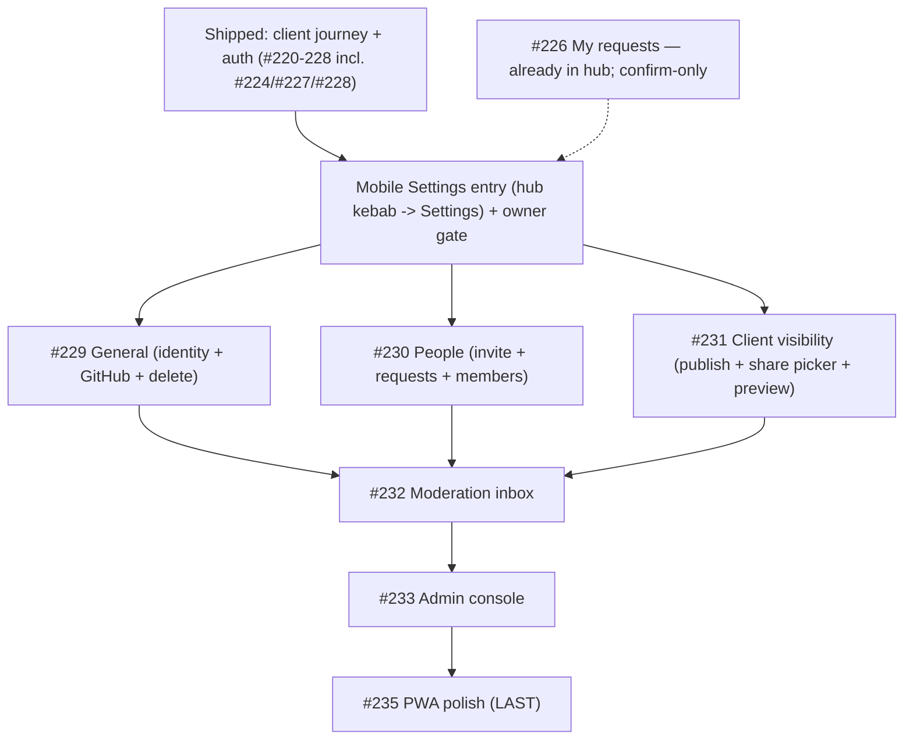

# Milestone #12 — Mobile-first experience — audit

> [!NOTE]
> Refreshed after #227 and #228 shipped. The client journey + public auth are now fully mobile-native; everything remaining is owner-facing, then PWA. Evidence from the code at `main` (commit `1d7b6dc`). "Inferred" is flagged where the exact scenario was not run.

## Status snapshot

Shipped bespoke mobile surfaces: Home, Account, Project hub, Milestone, Submit composer, New-project composer, Comments sheet (#224), Notifications sheet (#227), Login + Join (#228).

Still falling back to the **desktop** shell/pages (`mobile-route-config.tsx`): `/app/admin`, `/app/submissions`, `/app/projects/:id/submissions`, `/app/projects/:id/settings`.

## Per-issue audit

| # | Title | Claim check (evidence) | Verdict |
|---|-------|------------------------|---------|
| #226 | My requests / status | Already surfaced: hub Requests tab renders `<MyRequests>` reusing `useMySubmissions`. Unchanged. | **Done / confirm-only.** |
| #229 | Settings — General | `GeneralTab` (`settings/ui/general-tab.tsx`) = **identity** (name/description via `useUpdateProject`) + **GitHub connection** (`<GithubTab>`) + **danger zone** (delete via `useDeleteProject`, `window.confirm`). The issue says "name, description, **visibility basics**" — **partly refuted**: visibility moved to its own tab (#139/#231); General is identity + GitHub + delete. | **Keep (build) — refine scope.** Mobile General must include the GitHub section + delete for parity, not just name/description. |
| #230 | Settings — People | `PeopleTab` (`members/ui/people-tab.tsx`) reuses `useMembers`/`useMemberAction`/`useInviteLink`: invite link (copy/rotate), pending approve/deny, active members (role `Select`, comment-access `Switch` with a grant-confirm `Dialog`, removal). **Verified.** Densest of the trio (tables + dialogs + selects). | **Keep (build).** |
| #231 | Settings — Client visibility | `ClientVisibilityTab` = publish `Switch` (`useUpdateProject`) + `<SharePicker>`; SharePicker uses `useRoadmapData` + `useSetShared` with a **live client preview** (`share-picker.tsx:19`). **Verified.** The preview is wide/desktop-oriented — hardest to make premium on a phone. | **Keep (build).** Most effort. |
| #232 | Moderation inbox | Falls back to desktop `SubmissionsInboxPage` (`/app/submissions`), reachable from the owner-only bottom-nav tab. Unchanged. | **Keep (build).** |
| #233 | Admin console | Falls back to desktop `AdminPage` (summaries table). Admin-only, lowest reach. Unchanged. | **Keep (build, late).** |
| #235 | PWA polish | Acceptance still a copy-paste template that does not fit (PWA, not a screen). Real work = PNG/maskable icons, apple-touch-icon, install affordance, offline read, portrait manifest. | **Refine acceptance, keep last.** |

> [!WARNING]
> - **#229** scope in the issue is slightly wrong ("visibility basics" — that's #231's domain) and **understated** (it omits the GitHub-connection section + danger zone that `GeneralTab` actually owns). Build to the real `GeneralTab` surface, not the issue's one-liner.
> - **#235** acceptance still needs a rewrite before it's actionable.

## Milestone synthesis

### Coherence
Consistent. The three settings issues are **tabs of one desktop surface** (`SettingsTabs`: general / people / visibility) behind one owner-gated page (`SettingsPage`, redirects non-owners). They naturally form a single mobile **Settings** surface.

### Dependency & order

> [!IMPORTANT]
> The trio shares one **entry point + owner gate**. Build that mobile Settings shell once (route `/app/projects/:id/settings`, owner-gated like `SettingsPage`), then land General -> People -> Client visibility into it. Pattern choice (settings landing with sub-screens vs. segmented tabs) is a fix-phase decision; a settings landing -> sub-screens reads more native on a phone given the density (especially People + the share preview).

### Gaps
- The hub kebab -> Settings currently lands on the **desktop** fallback; the trio's shared shell must replace that target.
- `#235` offline/install criteria under-specified — rewrite before building.
- `#226` needs only a visual confirm.

### Duplicates / scope creep
None across issues. The only mismatch is the **#229 issue text** vs. the real `GeneralTab` surface (noted above).

### Go / no-go
> [!IMPORTANT]
> **GO. Next: #229 -> #230 -> #231 as a batch** behind a shared owner-gated mobile Settings shell. All logic is reusable (`GeneralTab`/`PeopleTab`/`ClientVisibilityTab` hooks already exist); the build is mobile framing + the shell + the owner gate. No blockers.
