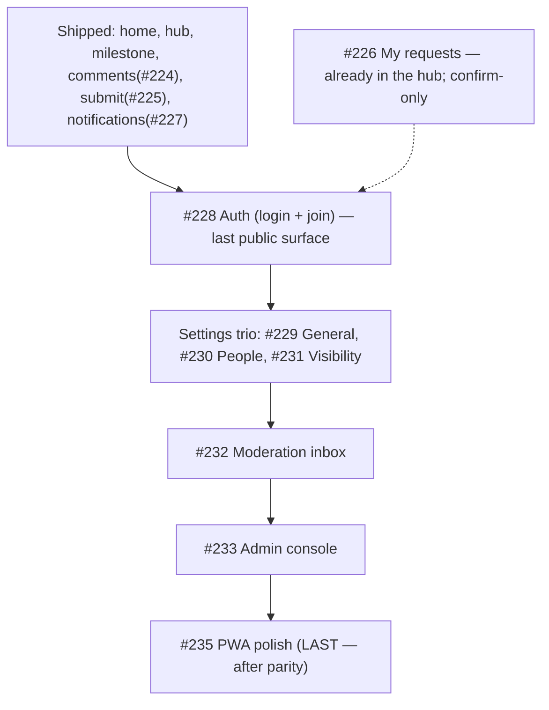

# Milestone #12 — Mobile-first experience — audit

> [!NOTE]
> Refreshed after #224 and #227 shipped. Scope: the remaining **open** sub-issues of epic #219. Evidence from the code at `main` (commit `a59538a`). "Inferred" is flagged where the exact scenario was not run.

## Status snapshot

Shipped bespoke mobile surfaces: Home `/app`, Account `/app/account`, Project hub `/app/projects/:id`, Milestone `/app/projects/:id/m/:num`, Submit composer, New-project composer, Comments sheet (#224), Notifications sheet (#227).

Still falling back to the **desktop** shell/pages (`mobile-route-config.tsx`): `/app/admin`, `/app/submissions`, `/app/projects/:id/submissions`, `/app/projects/:id/settings`; and the **public** `/login` + `/join/:token` still use the shared desktop pages (epic decision: "public routes shared until #228").

## Per-issue audit

| # | Title | Claim check (evidence) | Verdict |
|---|-------|------------------------|---------|
| #226 | My requests / status | Already surfaced on mobile: the hub renders `<MyRequests projectId={id} />` in its Requests tab (`mobile-project.tsx:111`), reusing `useMySubmissions`. No global my-requests page exists on desktop either (per-project by design). Unchanged since last audit. | **Done / confirm-only.** Acceptance met via the hub; not a build. |
| #228 | Auth (login + join) | "email/Google" **verified** — `MagicLinkForm` (`features/auth/magic-link-form.tsx`) offers email magic-link **and** Google (`signInWithGoogle`, `auth.service.ts:92`), shared by `LoginPage` and `JoinPage`. BUT the pages are **already responsive on mobile**: `LoginPage` is `lg:grid-cols-2` with the brand aside `hidden lg:flex`, so mobile gets a single centered column (`max-w-[380px]`); `JoinPage` is a centered card. So this is a **premium-feel rebuild**, not a functional gap. Counter-evidence: the forms work today; the gain is mobile-native framing (large title, brand presence, comfortable touch targets, full-bleed). | **Keep (build), next.** Last public surface still on shared desktop pages. Reuse `MagicLinkForm` + invite hooks; build standalone mobile screens (no bottom nav). |
| #229 | Settings — General | Falls back to desktop `SettingsPage` → `GeneralTab`, reuses `useUpdateProject`. Owner-facing, behind hub kebab → Settings. Unchanged. | **Keep (build).** Settings trio. |
| #230 | Settings — People | Falls back; `PeopleTab` reuses `useMembers`/`useMemberAction`/`useInviteLink`. Unchanged. | **Keep (build).** |
| #231 | Settings — Client visibility | Falls back; `ClientVisibilityTab` reuses `useRoadmapData`/`useSetShared` + the wide live client preview — hardest of the trio on a phone. Unchanged. | **Keep (build).** Most effort. |
| #232 | Moderation inbox | Falls back to desktop `SubmissionsInboxPage` (`/app/submissions`), reachable from the owner-only bottom-nav tab. Unchanged. | **Keep (build).** |
| #233 | Admin console | Falls back to desktop `AdminPage` (summaries table). Admin-only, lowest reach. Unchanged. | **Keep (build, late).** |
| #235 | PWA polish | Acceptance still a copy-paste template ("Bespoke mobile screen … reusing the manifest and `sw.js`") that does not fit. Real work = PNG/maskable icons, apple-touch-icon, install affordance, offline read, portrait manifest. | **Refine acceptance, keep last.** After parity. |

> [!WARNING]
> Templated acceptance still mismatches scope on **#228** ("reachable via mobileRoutes; fallback until shipped" — the fallback already exists, the work is the premium rebuild) and **#235** (PWA, not a screen). Rewrite the checkboxes when each is picked up.

## Milestone synthesis

### Coherence
Consistent whole. The **client** journey is now complete to premium parity (home → hub → milestone → comments → submit → my-requests → notifications). Remaining = the **public** entry (#228) and the **owner** surfaces (settings trio, moderation, admin), then PWA last.

### Dependency & order

Few hard code dependencies: the settings trio shares one entry point (hub kebab → Settings) so they group naturally; PWA must be last. Order is otherwise by reach × premium-impact.

### Gaps
- Hub kebab → Settings currently lands on the **desktop** settings fallback; verify the target once #229-231 land.
- `#235` offline/install criteria under-specified (templated) — rewrite before building.
- `#226` has no build work left beyond a visual confirm.
- **Testing caveat (not a product defect):** Google OAuth does not complete from a LAN IP in local dev; #228's Google button still ships, verify email magic-link locally and Google on a real origin.

### Go / no-go
> [!IMPORTANT]
> **GO. Next: #228 Auth.** It is the last public/client-facing surface still rendered by shared desktop pages. All logic is reusable (`MagicLinkForm` + invite hooks); the build is bespoke mobile **screens** (standalone, no bottom nav) with native framing. No blockers.
