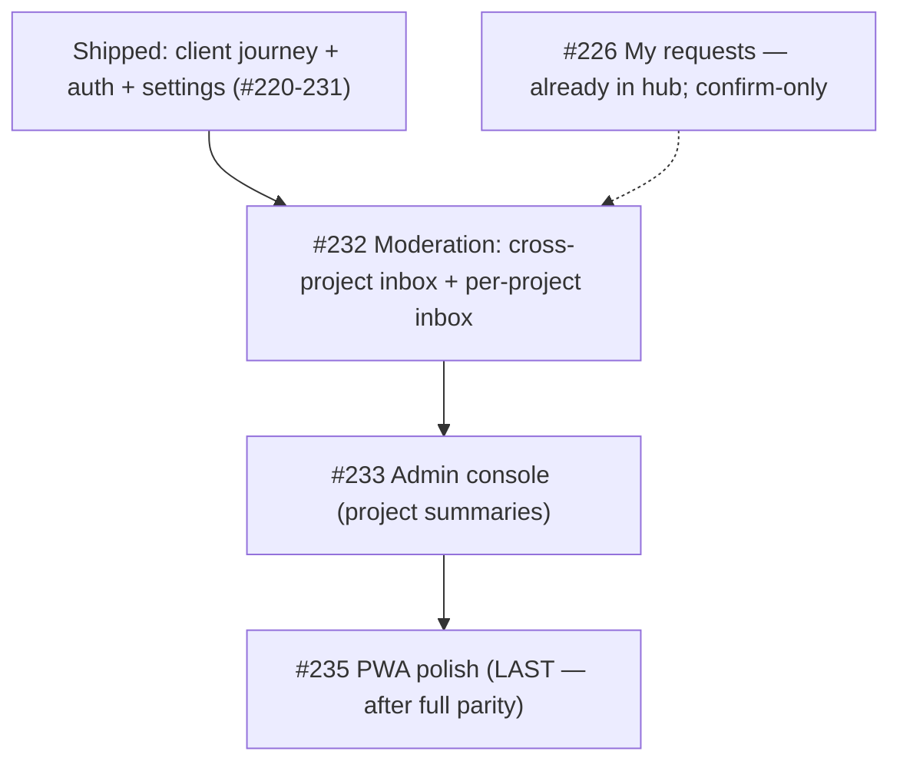

# Milestone #12 — Mobile-first experience — audit

> [!NOTE]
> Refreshed after the settings trio (#229/#230/#231) shipped. Client journey, public auth, and owner settings are all mobile-native now. Evidence from the code at `main` (commit `d0d5c87`). "Inferred" is flagged where the exact scenario was not run.

## Status snapshot

Shipped bespoke mobile surfaces: Home, Account, Project hub, Milestone, Submit composer, New-project composer, Comments sheet (#224), Notifications (#227), Login + Join (#228), Settings landing + General/People/Client-visibility (#229-231).

Still falling back to the **desktop** shell/pages (`mobile-route-config.tsx`): `/app/admin`, `/app/submissions` (cross-project inbox), `/app/projects/:id/submissions` (per-project inbox).

## Per-issue audit

| # | Title | Claim check (evidence) | Verdict |
|---|-------|------------------------|---------|
| #226 | My requests / status | Already in the hub Requests tab (`<MyRequests>` + `useMySubmissions`). Unchanged. | **Done / confirm-only.** |
| #232 | Moderation inbox | "triage submissions (approve/decline) **per project**" — **partly refuted/understated**. There are **two** owner moderation surfaces, both still desktop-fallback on mobile: (a) the **cross-project inbox** `SubmissionsInboxPage` (`/app/submissions`, owner bottom-nav) using `useOwnerInbox` + `SubmissionCard` + `ApproveDialog`; (b) the **per-project inbox** `SubmissionsPage` (`/app/projects/:id/submissions`, hub kebab) using `ModerationInbox`. `SubmissionCard` is already a collapsible mobile row (`submission-card.tsx`). | **Keep (build) — widen scope to BOTH surfaces.** Reuse `useOwnerInbox`/`ModerationInbox`/`SubmissionCard`/`ApproveDialog`; mobile-frame both. Owner-gate the per-project one (like settings). |
| #233 | Admin console | Falls back to desktop `AdminPage` (a project-summaries table). Admin-only, lowest reach. Unchanged. | **Keep (build, late).** |
| #235 | PWA polish | Acceptance still a copy-paste template that doesn't fit (PWA, not a screen). Real work = PNG/maskable icons, apple-touch-icon, install affordance, offline read, portrait manifest. | **Refine acceptance, keep last.** |

> [!WARNING]
> - **#232** issue text ("per project") undersells it: the primary surface is the **cross-project** inbox in the bottom nav, plus a per-project inbox from the hub kebab. Build both for parity, or the bottom-nav Inbox tab stays a desktop page.
> - **#235** acceptance must be rewritten before it's actionable.

## Milestone synthesis

### Coherence
Consistent. After #232, the only owner workflow left on desktop is the admin console (#233), then PWA polish (#235). #226 is already done.

### Dependency & order

No hard code dependencies; order is reach × premium-impact. PWA must be last (it certifies parity).

### Gaps
- Bottom-nav Inbox tab (`/app/submissions`) + hub kebab Submissions (`/app/projects/:id/submissions`) both still render desktop pages — #232 must replace both.
- `#235` offline/install criteria under-specified.
- `#226` needs only a visual confirm.

### Duplicates / scope creep
None across issues. The cross-project and per-project inboxes are distinct surfaces (global triage vs. one project), not duplicates — both reuse `SubmissionCard`/`ApproveDialog`.

### Go / no-go
> [!IMPORTANT]
> **GO. Next: #232 Moderation** — build **both** the cross-project inbox (`/app/submissions`) and the per-project inbox (`/app/projects/:id/submissions`) as mobile screens, reusing the existing moderation hooks/components. The bottom-nav Inbox tab and the hub kebab both currently land on desktop pages; this closes them. No blockers.
