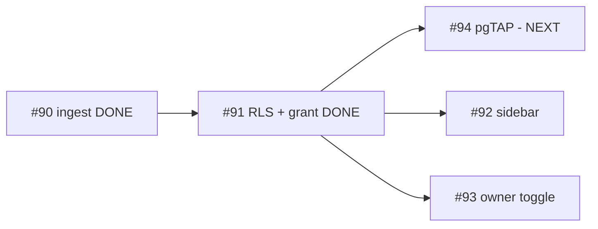

# Milestone checkpoint — Client comments (#8), after #90 + #91

Cadence checkpoint (every 2 resolved issues). #90 (ingest) and #91 (per-member RLS) are merged and
closed; this re-validates that they shipped coherently and that the remaining three (#94, #92, #93)
are still sound given what actually landed. The pre-build go/no-go is in
`milestone-Client comments (milestone #8)-audit.md`; this only records the deltas.

## Done — verified shipped

> [!NOTE]
> **#90 Ingest** (closed): `comments` projection table + `listIssueComments` (backfill + incremental `since`) + `issue_comment` webhook. PR/orphan comments excluded structurally (a comment links only to an issue already in the projection). Live-confirmed: 274 real comments backfilled across 138 issues, 0 orphans, idempotent re-sync. Owner-read RLS + in `supabase_realtime` (+ replica identity full).
>
> **#91 Per-member RLS** (closed): `project_members.can_view_comments` (deny-by-default), `is_issue_visible_to_member` + `member_can_view_comments` helpers, `comments_read_member` policy, owner-gated `set_member_comment_access` RPC. Leak vectors proven: hidden issue / unshared milestone / unpublished project / pending member / cross-project all return nothing; non-owner grant -> 403.

These two give the remaining UI/test issues a **concrete, proven contract** to build on — a real 274-comment dataset and an exact list of visibility gates.

## Remaining issues — re-assessment

### #94 Policy tests: comment visibility (NEXT) — area:backend

- **Context**: Now even sharper than at pre-build. The exact leak vectors to encode were proven by hand in #91's review: granted-on-visible, non-granted, hidden issue, unshared milestone, unpublished project, pending member, non-owner-grant-forbidden. #94 turns those rolled-back smokes into permanent pgTAP.
- **Architecture**: Mirrors `allowlist_rls.test.sql` (Phase 4 capstone). Transactional, runs under `npx supabase test db` (currently 50/50).
- **Risk & recommendation**: **KEEP, build next.** Locking the contract before the UI (#92/#93) is the right order — it makes the RLS a regression gate. No changes to scope.

### #92 Comment sidebar + markdown — area:frontend

- **Context**: Unchanged and still the highest-visibility issue. The data layer it needs is now live.
- **Carried build notes (still true, re-verified)**:
  - **No markdown deps** in `package.json` — needs `react-markdown` + `remark-gfm` + a sanitizer. Sanitization is a hard security requirement (untrusted GFM bodies).
  - **No `Sheet` primitive** in `components/ui` — add a radix-Dialog-based right panel.
  - **Latent leak still present**: `roadmap-gantt.tsx:632` does `window.open(b.url)` (raw GitHub URL) on issue-bar click, for clients too. #92 must replace this; decide whether the owner keeps an explicit "Open on GitHub" affordance.
- **Risk & recommendation**: **KEEP.** Same three refinements as pre-build; no new risk introduced by #90/#91.

### #93 Owner UI: grant toggle — area:frontend

- **Context**: Now fully unblocked — the `can_view_comments` column and `set_member_comment_access` RPC exist. The toggle wires to that RPC.
- **Architecture**: Extends the #103 MembersTab, reuses the `Switch` component; add `setCommentAccess` to the members service adapter (precedent: `setMemberRole`). Optimistic update.
- **Risk & recommendation**: **KEEP.** Privacy-warning copy remains load-bearing (granting exposes all chatter on visible issues).

## Verdict

> [!IMPORTANT]
> **On track — GO to continue.** #90/#91 shipped exactly as audited; no scope drift, no surprises. Build order holds: **#94 next** (lock the contract), then **#92** (sidebar, the big one) and **#93** (toggle). The only open design decisions remain build-time details for #92 (owner "Open on GitHub" affordance; exact sanitizer) — not blockers.
