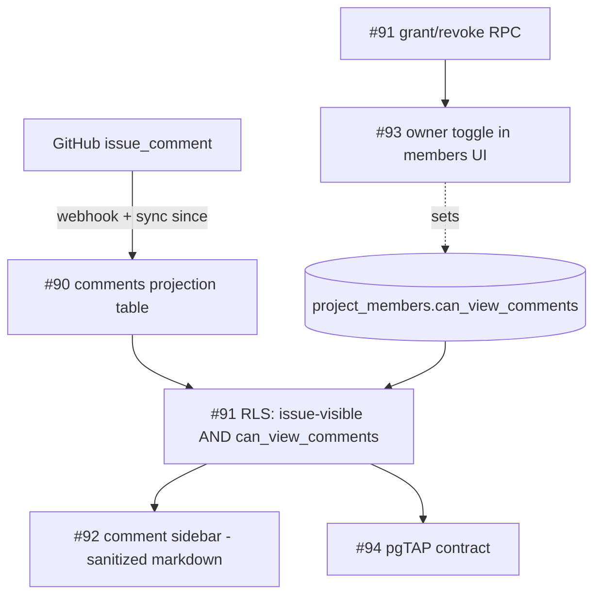
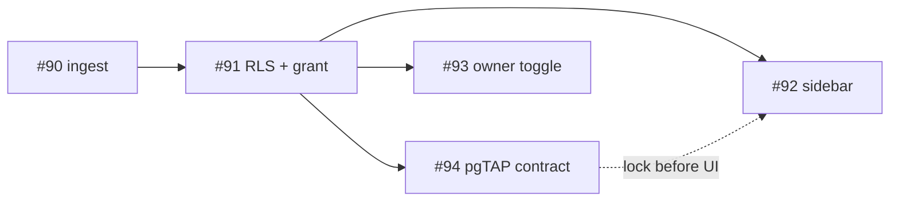

# Milestone audit — Client comments (milestone #8)

Pre-build audit of the "Client comments" milestone (issues #90-94), assessed against the
shipped Phase 3 projection/sync, the Phase 4 allowlist RLS (#26), the members UI (#103), and
the Phase 5 realtime hook (#37).

> [!NOTE]
> Goal of the milestone: let owners surface GitHub issue **comments** to selected clients
> in-app, rendered as markdown, without ever exposing GitHub URLs/internals. Visibility is
> gated **per member** (an explicit owner grant), layered on top of the existing per-issue
> allowlist gates.

## How it slots into the existing architecture

The pieces reuse proven patterns: the projection upsert core (`_shared/projection.ts`,
`sync.ts`), the allowlist security-definer helpers (`is_repo_visible_to_member`,
`is_milestone_shared`), the members service/UI (#103), and the realtime invalidate hook (#37).

---

## Issue-by-issue

### #90 Ingest issue comments (projection + sync + webhook) — area:backend, area:github

- **Context**: Strong. Names the new `comments` table, `listIssueComments` in `_shared/github.ts`, upsert via the shared sync core (backfill + `since`), the `issue_comment` webhook (create/edit/delete), and "no new App scope". Actionable.
- **Fit**: This is the foundation; everything else depends on it.
- **Architecture**: Consistent with the projection model (idempotent upsert by GitHub id). One correctness point on **excluding PR comments**:

> [!WARNING]
> The repo-level backfill endpoint `GET /repos/{o}/{r}/issues/comments?since=` returns comments
> on **both issues and PRs**, and the comment object does **not** carry a `pull_request` marker —
> so you cannot reliably filter PR comments from the comment payload alone (unlike `issues`, which
> have `issue.pull_request`). **Recommended rule:** only persist a comment whose parent issue
> `number` already exists in our `issues` projection for that repo (we only project non-PR issues).
> This auto-excludes PR comments and orphan comments, and keeps the FK clean. Add this to the
> acceptance criteria explicitly.

- **Deletes**: `since`/backfill cannot detect deletions (a deleted comment simply stops appearing). The `issue_comment` `deleted` webhook is the only delete path. Acceptable, but worth stating: between syncs with the webhook down, deletes lag. No `shared` column on comments (visibility is derived, per #91), so the projection "never write shared" invariant doesn't apply here — good.
- **Realtime synergy**: add `comments` to the `supabase_realtime` publication and reuse `useRealtimeInvalidate` (#37) for live comments — near-zero extra cost.
- **Risk & recommendation**: **KEEP.** Refine acceptance with the "parent issue must be in projection" rule (PR-exclusion mechanism) and note webhook-only deletes.

### #91 Per-member comment access + RLS — area:backend

- **Context**: Clear. `project_members.can_view_comments boolean not null default false`; RLS = owner reads all, member reads a comment iff (a) the comment's issue is visible to them (reuse #26 gates) AND (b) `can_view_comments`; owner-gated grant/revoke RPC.
- **Fit**: The security spine of the feature; mirrors the Phase 4 allowlist design.
- **Architecture**: Sound, but note two **new SECURITY DEFINER helpers** are required (RLS predicates can't call another table's policy):
  - `is_issue_visible_to_member(issue_id)` — re-expresses `issues_read_member`: `issue.shared AND is_repo_visible_to_member(project_repo_id) AND milestone coherence`.
  - `member_can_view_comments(project_id)` — `exists active membership with can_view_comments` for `auth.uid()`.
  The comment's project is reached via `comments -> issues -> project_repos.project_id`. The grant RPC follows the `is_owner`-gated RPC pattern (`wire_rpcs`/`share_rpcs`).
- **Justification**: Warranted; non-negotiable for a visibility feature.
- **Risk & recommendation**: **KEEP.** Call out the two helper functions in the build.

### #92 Comment sidebar (right panel) with markdown rendering — area:frontend

- **Context**: Clear. Click issue (Gantt/overview/mobile) -> right Sheet; sanitized GFM markdown; per-comment author/avatar/date/body; loading/empty/no-access states; owner "visible to N clients" hint.
- **Fit**: The client-facing payoff; enforces the "no GitHub URLs to clients" rule.

> [!WARNING]
> **This issue REPLACES existing behavior, and fixes a latent leak.** Today, clicking an issue bar
> runs `if (b.url) window.open(b.url, '_blank')` (`roadmap-gantt.tsx:632`) — it opens the raw GitHub
> issue URL in a new tab **for everyone, including clients**. That already violates the
> client-experience rule. #92 must swap this for the in-app sidebar. Decide at build time whether the
> **owner** keeps an explicit "Open on GitHub" affordance (clients must not).

- **Architecture**: Two net-new additions, both first-of-their-kind in this codebase:
  - **Markdown stack**: no markdown deps exist today. Needs `react-markdown` + `remark-gfm` + a sanitizer (`rehype-sanitize`, or DOMPurify). **Sanitization is mandatory** — comment bodies are untrusted and may contain raw HTML/script (XSS). Treat as a security acceptance criterion.
  - **Sheet primitive**: there is no `Sheet` in `components/ui` (we have Dialog/Popover). Add a radix-Dialog-based right-side Sheet, following the existing `dialog.tsx` conventions.
- **Justification**: High value; also closes a real client-experience gap.
- **Risk & recommendation**: **KEEP**, highest-visibility issue. Refine: explicitly list (1) replace the `window.open` bar click, (2) pin the sanitizer, (3) add the Sheet primitive.

### #93 Owner UI: grant comment access per member — area:frontend

- **Context**: Clear. Per-member "Can view comments" toggle in members management, wired to the grant/revoke RPC (optimistic), with a warning before granting.
- **Fit**: Drives #91; lives naturally in the #103 MembersTab.
- **Architecture**: Reuses the `Switch` component (`switch.tsx` exists) and the members service adapter (`setMemberRole` is the precedent — add `setCommentAccess`). Optimistic update via TanStack Query mutation, consistent with the existing members hooks.

> [!NOTE]
> Product caveat to honor in the warning copy: granting access exposes **all** comments on
> **every issue that member can already see** — including internal dev chatter. The milestone
> deliberately chose per-member (not per-comment) granularity; that is a reasonable v1, but the
> warning (this issue) is what makes it safe. Keep it prominent.

- **Justification**: Warranted.
- **Risk & recommendation**: **KEEP.** Depends on #91 (column + RPC).

### #94 Policy tests: comment visibility — area:backend

- **Context**: Clear; mirrors the Phase 4 capstone (`supabase/tests/allowlist_rls.test.sql` exists as the template). Four assertions covering grant/no-grant/hidden-issue/non-owner-grant.
- **Fit**: Matches the project's "RLS is the security boundary, prove it with pgTAP" discipline.
- **Architecture**: Consistent; transactional pgTAP, runs under `npx supabase test db`.
- **Justification**: Non-negotiable for a visibility feature — this is the contract lock.
- **Risk & recommendation**: **KEEP**, and run it **right after #91** (before the UI) so the contract is proven before anything is built on it.

---

## Overall verdict

> [!NOTE]
> **Coherence: high.** The milestone is a clean, well-scoped extension of existing patterns —
> projection sync (#90), allowlist-style RLS (#91), members UI (#93), realtime (#37 reuse), and a
> pgTAP capstone (#94). Scope is tight; nothing is premature or scope creep.

**Dependencies & build order:**

Recommended order: **#90 -> #91 -> #94 -> #92 -> #93** (#92 and #93 can follow #94 in either order; #94 locks the contract first, mirroring Phase 4).

**Cross-cutting items to fold into the build (not new issues):**
1. PR-comment exclusion via "parent issue must exist in the projection" (#90).
2. Two new SECURITY DEFINER helpers for the comment RLS (#91).
3. Replace the existing `window.open(github_url)` bar click; decide owner-only "Open on GitHub" (#92).
4. New deps (markdown + sanitizer) and a new Sheet primitive (#92).
5. Add `comments` to `supabase_realtime` + reuse `useRealtimeInvalidate` (#90/#92).
6. Privacy warning copy is load-bearing for the per-member granularity choice (#93).

> [!IMPORTANT]
> **GO.** The milestone is ready to build. Start with #90 (foundation). The only items needing a
> decision are build-time details (owner "Open on GitHub" affordance; exact sanitizer choice), not
> milestone-level blockers.
