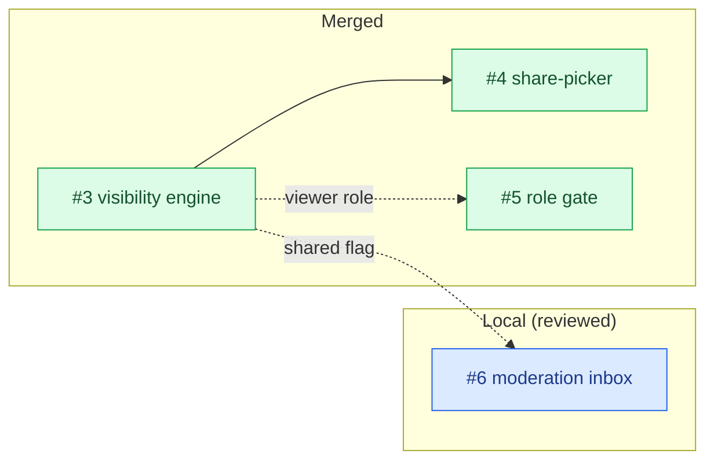
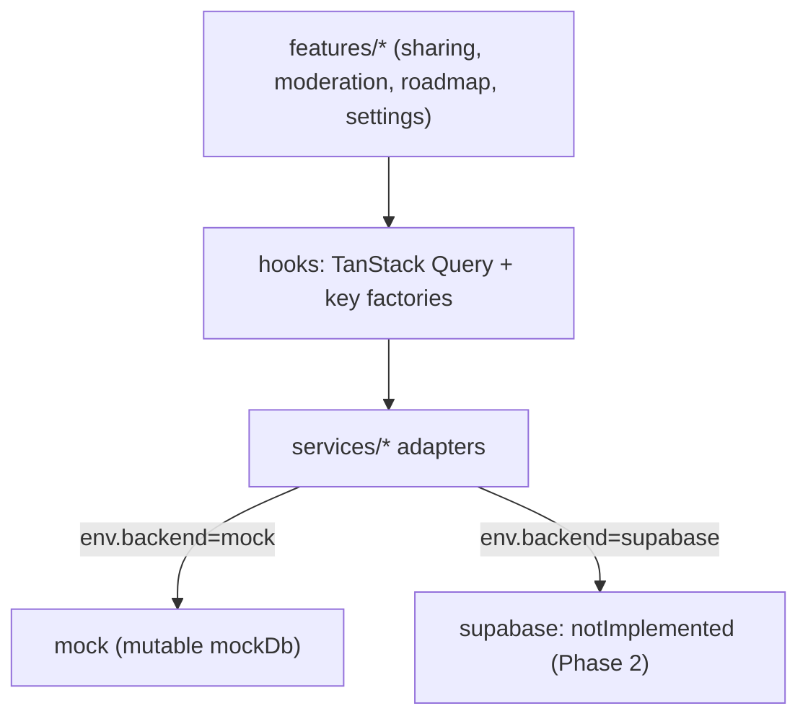

# Milestone Audit (closing) — Phase 1 · Mock future-ready

> [!NOTE]
> Date: 2026-06-07 · This supersedes the pre-build audit of 2026-06-06.
> Status: **3 of 4 merged** (#3 -> PR #58, #4 -> PR #59, #5 -> PR #60). **#6 is implemented and reviewed locally** on `6-moderation-inbox-ui-submissions` (8 files, uncommitted, awaiting maintainer review + push). The milestone is functionally complete pending the #6 merge.

## 1. Snapshot

| # | Title | State | PR | Verdict |
|---|---|---|---|---|
| 3 | Allowlist filtering in mock `getRoadmap` (by role) | CLOSED | #58 | Shipped, sound |
| 4 | Share-picker UI (curate milestones/issues) | CLOSED | #59 | Shipped, sound |
| 5 | Enforce roles: gate request form to editor/owner | CLOSED | #60 | Shipped, sound |
| 6 | Moderation inbox UI (submissions) | OPEN | local | Done + reviewed, pending merge |

## 2. Per-issue retrospective

### #3 — Allowlist filtering in mock `getRoadmap` (CLOSED)
- **Context**: Complete; clear acceptance, docs pointer.
- **Fit**: Foundation of Phase 4 (Visibility/allowlist), built early on mocks — correct.
- **Architecture**: Sound. `filterShared()` is a pure helper and the single source of truth for "what a client sees" (reused by the share-picker preview). `getRoadmap` keeps a `projectId`-only signature and filters by `auth.currentUser()`, mirroring Supabase RLS.
- **Justification**: Warranted (foundation).
- **Risk & recommendation**: **KEEP (done).** Unit-tested.

### #4 — Share-picker UI (CLOSED)
- **Context**: Complete; acceptance met (toggle, "share whole milestone", preview matches filtered result).
- **Fit**: Owner counterpart to #3.
- **Architecture**: Sound. `features/project/sharing` (ui + hooks), `useSetShared` invalidates `roadmapKeys.all`, `milestoneColor()` shared with the Gantt so the picker dots equal the bars. Preview renders `filterShared(data)` — no duplicated visibility logic.
- **Justification**: Warranted. Full-width settings + editorial General tab + global pointer rule rode along as deliberate polish (flagged in PR).
- **Risk & recommendation**: **KEEP (done).** Unit + integration tested.

### #5 — Enforce roles: gate request form to editor/owner (CLOSED)
- **Context**: Complete; one criterion (banner) was already shipped in #52.
- **Fit**: UI-level role gate; correctly defers the real barrier to Phase 4/5 RLS.
- **Architecture**: Minimal and sound — single `!isViewer` guard on the only request trigger; reuses the existing membership-role derivation.
- **Justification**: Warranted, though small.
- **Risk & recommendation**: **KEEP (done).** Adversarial review confirmed editors/owners keep the button, pending viewers are redirected entirely.

> [!WARNING]
> Carry-forward: this is a **UI gate, not authorization**. The enforceable barrier is the Phase 4/5 RLS insert policy. Must not be assumed "secured" before then.

### #6 — Moderation inbox UI (submissions) (OPEN — done locally, pending merge)
- **Context**: Complete; all three acceptance criteria satisfied (list pending with type/title/author; approve/deny updates status; distinct from the Access-requests tab).
- **Fit**: Direct precursor to Phase 5 (Write-back & moderation). Mock `setStatus` flips the row; the supabase branch is `notImplemented`; Phase 5 adds the real GitHub issue creation + `github_issue_number`.
- **Architecture**: Sound and idiomatic — `submissions.setStatus` on the service adapter, `submissionKeys.byProject` factory, `features/project/moderation` (`useSubmissions`, `useModerateSubmission`, `ModerationInbox`), new **Submissions** settings tab with a pending count. The inbox is a pure projection (filter pending); moderation preserves the row with its new status (no data loss).
- **Justification**: Warranted; the substantive milestone closer.
- **Risk & recommendation**: **KEEP (merge after review).** Adversarial review: 7/7 probe cases passed (deny, anonymous author, all four type labels, multi-pending, empty-from-start, status-preserved inverse, distinct tab + count).

> [!WARNING]
> Carry-forwards: (1) **mock honesty** — approve does not open a GitHub issue yet (Phase 5); the UI makes no such claim. (2) **five-tab** Settings row — cosmetic; verify wrap/scroll on very narrow widths. (3) Auto-animate was intentionally omitted from the inbox (jsdom `animate` polyfill never fires `onfinish`); optional follow-up if the polyfill is completed.

## 3. Cross-cutting architecture review

The milestone's thesis — **full UX on mocks, with backend-ready seams** — held throughout.

- **Adapter discipline**: every new method this milestone (`setMilestoneShared`, `setIssueShared`, `submissions.setStatus`) ships a mock impl and a `notImplemented` supabase stub. Phase 2 is an adapter swap, not a rewrite.
- **Single sources of truth**: `filterShared` (visibility) and `milestoneColor` (palette) are each defined once and reused across views/tests.
- **Query keys**: consistent factories (`roadmapKeys`, `submissionKeys`, `projectKeys`) keep invalidation predictable.
- **Tests**: 61 passing (21 files), including the visibility cascade, share mutations, role gate, and the moderation flow.

## 4. Overall verdict

> [!IMPORTANT]
> **GO to close Phase 1** once #6 is reviewed and merged, and **GO to start Phase 2 (Backend Supabase & auth)**. Coherence is high, every service seam is backend-ready, and there are no loose ends beyond the explicitly-deferred barriers.

- **Coherence**: High. Four issues, one thesis; visibility engine -> curation UI -> role gate -> moderation inbox.
- **Remaining action**: merge #6 (maintainer review pending). Nothing else blocks closure.
- **Phase 2 entry**: flip `env.backend` and implement the supabase branches behind the existing interfaces (`getRoadmap`, `set*Shared`, submissions `list/create/setStatus`, `getProjectAccess`, auth). Mirror the mock semantics already encoded (RLS = `filterShared`; identity scoping already in the query keys).

> [!WARNING]
> Debt ledger to carry into Phase 2-5 (all intentional Phase-1 simplifications):
> - UI role gate (#5) is not authorization -> Phase 4/5 RLS.
> - Moderation approve (#6) does not write back to GitHub -> Phase 5.
> - Mock identity = email; invite token = project id -> Phase 2/4.
> - `notImplemented` supabase branches across all services -> Phase 2.
