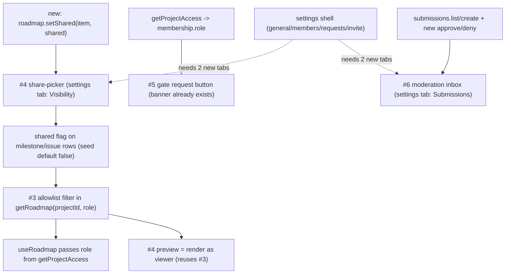

# Milestone audit (re-audit) — Phase 1 - Mock future-ready (#1)

Date: 2026-06-06
Branch: `restructure/sota-architecture`
Auditor: technical review (no code produced)

> [!NOTE]
> This **replaces** the earlier Phase 1 audit, which reviewed an older milestone membership (#2-#9, before those moved to "Phase 0 - Readiness"). Phase 1 now holds only the four pillars (#3-#6). This re-audit re-runs the review **after Phase 0 shipped** (services seam, settings shell, design system, animations) to answer: **is Phase 1 still aligned with what now exists?** Short answer: yes, with four concrete deltas.

## Method

- Read the 4 Phase 1 issues (`gh issue list --milestone "Phase 1 - Mock future-ready"`).
- Cross-checked each against the built code: `getRoadmap` signature, the `submissions` service, the `shared` flag on rows, the settings tabs, and the dashboard viewer banner.

## Snapshot

| # | Title | State | Phase 0 readiness |
| --- | --- | --- | --- |
| 3 | Allowlist filtering in mock `getRoadmap` (by role) | open | `shared` flag + seed (default false) ready; `getRoadmap` needs a role param |
| 4 | Share-picker UI (curate milestones/issues) | open | needs a `setShared` service + a settings home; preview reuses #3 |
| 5 | Enforce roles: gate request form | open | viewer banner already built (#52); just hide the button |
| 6 | Moderation inbox UI (submissions) | open | `submissions` service needs approve/deny + a settings home |

## How the pillars slot into the Phase 0 foundations

## Per-issue assessment

### #3 Allowlist filtering in mock `getRoadmap` (by role)

- **Context**: clear, testable acceptance (viewer/editor see only `shared`, owner sees all, issue hidden when its milestone is not shared).
- **Fit**: the keystone of the visibility model and the prerequisite for #4's preview. Fully aligned with the "clients never receive hidden items" promise.
- **Architecture**: sound -- filtering belongs in `getRoadmap` (data layer), so the mapper/UI never see hidden rows. Verified the `shared: boolean` flag exists on both milestone and issue rows and defaults to false in the seed. **Delta**: `getRoadmap(projectId)` currently takes no role; it must become `getRoadmap(projectId, viewer)` (or take the role), and `useRoadmap` + the dashboard must pass the role from `getProjectAccess`.
- **Justification**: warranted; without it the `shared` flag is inert.
- **Risk & recommendation**: **Keep, build first.** Low risk; the signature change ripples to `use-roadmap`, the dashboard, and `services.test` (which calls `getRoadmap('prj-apollo')`). One design decision to pin down: a shared issue under a non-shared milestone is hidden (per acceptance) -> decide whether shared *unscheduled* issues (no milestone) remain visible.

### #4 Share-picker UI (curate milestones/issues)

- **Context**: clear (toggle shared per item, "share whole milestone" helper, preview-as-viewer).
- **Fit**: the owner's curation surface that feeds #3 -> core product loop.
- **Architecture**: needs (a) a mutation to set `shared` per item -- not present yet (`roadmap.setShared(...)` or a small visibility service), and (b) a home. **Delta**: the settings shell tabs are general / members / requests / invite -- there is **no Visibility/Share tab**, so #4 adds one. The preview should reuse #3 (render `getRoadmap` as a viewer) rather than re-implement filtering.
- **Justification**: warranted.
- **Risk & recommendation**: **Keep, after #3.** Note the naming overlap to clarify: the existing **invite** tab = share *link*; the **share-picker** = item *curation*. They are different surfaces.

### #5 Enforce roles: gate request form to editor/owner

- **Context**: clear, with the right scoping note (UI-level only; RLS is the real barrier in Phase 4/5).
- **Fit**: aligned and partly **already built** -- the dashboard already renders the viewer read-only banner (`pd.viewerNote`, verified) from `isViewer`.
- **Architecture**: trivial and consistent -- `isViewer` is already derived from `membership.role`; the only remaining change is to hide/disable the "new request" button for viewers.
- **Justification**: warranted; smallest pillar.
- **Risk & recommendation**: **Keep (shrunk).** Effectively a one-line gate since the banner exists. Lowest risk in the milestone.

### #6 Moderation inbox UI (submissions)

- **Context**: clear (list pending submissions, approve/deny, kept distinct from access-requests).
- **Fit**: closes the client-submission loop (submit -> owner moderates). Aligned; the seed already carries one pending submission for testing.
- **Architecture**: `services/submissions` has `listSubmissions` + `createSubmission` but **no approve/deny** -> add a status mutation. **Delta**: needs a home; settings has no Submissions/Moderation tab. The existing **requests** tab is *access* requests (pending members) -- moderation (feature/bug submissions) is a separate surface, so the "naming collision fixed" in the acceptance means keeping access-requests and submissions as two clearly-labelled inboxes.
- **Justification**: warranted.
- **Risk & recommendation**: **Keep, independent.** Decide the home (a settings "Submissions" tab vs an owner-level admin inbox) before building.

## Cross-cutting alignment findings

> [!NOTE]
> Phase 0 left the right hooks for Phase 1: the `shared` invariant (seed default false), the services seam, `getProjectAccess` -> `membership.role`, the settings shell, the already-built viewer banner, and a seeded pending submission. The milestone is coherent and the build order is clean.

> [!WARNING]
> Four deltas to fold into Phase 1 (none are blockers):
> 1. **`getRoadmap` gains a role/viewer parameter** (#3) -> ripples to `use-roadmap`, the dashboard, and the services test.
> 2. **The settings shell needs two new tabs** -- Visibility (#4) and Submissions/Moderation (#6). The current tabs (general/members/requests/invite) do not host them; #52 anticipated this ("settings hosts the pillars") but the built tabs stopped at the access side.
> 3. **#5 shrank** -- the viewer banner is already shipped, so #5 is just gating the button.
> 4. **`submissions` needs approve/deny** (#6); **visibility needs `setShared`** (#4).
>
> Unchanged debt (not Phase 1's job): the mock keys identity on email and treats the invite token as the project id. Neither blocks Phase 1 (role, `shared`, submissions all work), but both must be reconciled in Phase 2 (Supabase auth/ids) and Phase 4 (opaque tokens).

## Verdict

> [!IMPORTANT]
> **GO** -- Phase 1 is still aligned. Build it with the four deltas above.

- **Coherence**: high; the four pillars map cleanly onto the Phase 0 foundations.
- **Build order**: #3 (filter) first -> #4 (curation UI + `setShared`, preview via #3). #5 (gate button) and #6 (moderation: add approve/deny + inbox) are independent and can run in parallel.
- **Before starting**: (a) extend `getRoadmap` with a role; (b) decide the two new settings tabs (Visibility, Submissions) and confirm the access-requests vs submissions naming; (c) add `setShared` and submission approve/deny to the services; (d) pin the shared-unscheduled-issue rule.

## Build decisions (locked)

Resolving every flagged item so the build is mechanical.

### D1 - `getRoadmap(projectId)` signature stays unchanged; the mock filters by identity

The mock branch resolves the current user via `auth.currentUser()` and the project owner:
`isOwner = me != null && project.owner_id === me.id` -> returns `isOwner ? data : filterShared(data)`.

- Rationale: this is the signature Supabase needs too (RLS filters server-side by `auth.uid()`), so the seam never changes -- **no ripple** to `use-roadmap`, the dashboard, or the existing tests.
- No-session (tests, future server contexts) is treated as unfiltered. `getRoadmap` is only reached behind the auth + access guards in-app, so this is a documented mock-only convenience; real RLS denies unauthenticated reads in Phase 2.
- `services/roadmap` importing `services/auth` is service-to-service (allowed), and mirrors "data filtered by the current identity".

### D2 - One pure `filterShared(data)` helper (the cascade rule)

`filterShared(data: RoadmapData): RoadmapData`:
- keep a milestone iff `milestone.shared`;
- keep an issue iff `issue.shared && (issue.milestone_id == null || its milestone is shared)`.

So: a shared issue under an unshared milestone is **hidden**; a shared **unscheduled** issue (no milestone) is **visible** (nothing gates it). Lives in `services/roadmap` (data layer), unit-tested, reused by both the mock `getRoadmap` (non-owner) and the #4 preview -> zero duplicated filter logic.

### D3 - Settings tabs: General / Members / Access requests / Sharing / Submissions

- **Sharing** (new) absorbs the old standalone *invite* tab: the share link + the **#4 share-picker** (toggle shared, "share whole milestone", preview-as-viewer). One coherent "what/how you share" surface.
- **Submissions** (new) = the **#6** moderation inbox.
- Naming collision resolved: **Access requests** = pending members; **Submissions** = feature/bug requests. Two clearly-labelled inboxes. (Approving *access* requests is not a Phase 1 issue -> Members/Access-requests stay basic placeholders this phase.)

### D4 - Service additions

- `services/roadmap.setMilestoneShared(id, shared, cascade = false)` (cascade also flips the milestone's issues -> the "share whole milestone" helper) and `setIssueShared(id, shared)`. Mock mutates rows; supabase stub `notImplemented`.
- `services/submissions.setStatus(id, 'approved' | 'denied')`. Mock updates the row; supabase stub. (Real backend opens the GitHub issue + fills `github_issue_number` later.)
- Query keys: reuse `roadmapKeys` (invalidate after `setShared` so the picker preview and the live roadmap refresh); add `submissionKeys.byProject(id)` for the inbox.

### D5 - #5 gate

Hide the "new request" button for viewers (`!isViewer && <Button>`); the read-only banner already exists. No service change.

### D6 - Feature folders

`features/project/sharing/` (#4) and `features/project/moderation/` (#6), mirroring the existing `features/project/*` layout, mounted in the Sharing / Submissions settings tabs.

### Locked build order

`#3` (filterShared + mock getRoadmap, with its tests) -> `#4` (setShared service + Sharing tab + share-picker + preview reusing `filterShared`). `#5` (one-line gate) and `#6` (setStatus + `useSubmissions` + moderation inbox in the Submissions tab) are independent and run in parallel.
