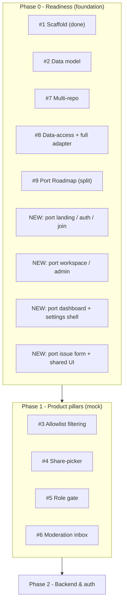
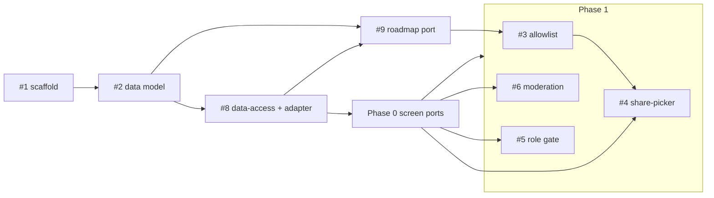

# Milestone audit — Phase 1 (Vista)

- Repo: `zestones/vista`
- Date: 2026-06-06
- Scope audited: all issues in milestone **Phase 1 - Mock future-ready** (#1 closed, #2–#9 open)
- Method: read each issue via `gh issue view`. No code produced.

> [!NOTE]
> Two scope decisions were taken during this audit and drive the verdict:
> 1. Introduce a **Phase 0 - Readiness** milestone (done before Phase 1) that holds the foundation + porting work — readiness for every later phase.
> 2. Build the **full `mock | supabase` adapter now** (#8), not a mock-only seam.

## Per-issue assessment

| # | Issue | Context | Fit | Architecture | Justification | Recommendation |
|---|-------|---------|-----|--------------|---------------|----------------|
| 1 | Scaffold SOTA structure | Complete | Strong | Sound (mirrors ARIA) | Warranted | **Keep** · move to Phase 0 · already closed |
| 2 | Mock data model | Good | Foundational | Sound | Warranted | **Keep** · move to Phase 0 |
| 3 | Allowlist filtering (mock) | Good | Pillar 1 | Sound | Warranted | **Keep** in Phase 1 |
| 4 | Share-picker UI | Gap (preview) | Pillar 1 | Sound | Warranted | **Refine** · keep in Phase 1 |
| 5 | Enforce roles (UI gate) | Good | Pillar 3 | Sound (UI-level, RLS later) | Warranted | **Keep** in Phase 1 |
| 6 | Moderation inbox | Gap (mock approve) | Pillar 2 | Sound | Warranted | **Refine** · keep in Phase 1 |
| 7 | Multi-repo (mock) | Thin | Foundational | Overlaps #2 | Partly redundant | **Merge/Refine** · move to Phase 0 |
| 8 | Data-access + adapter | Good | Foundational | Sound (caveat) | Warranted | **Refine** · move to Phase 0 |
| 9 | Port Roadmap Gantt | Good | Core | Sound | Warranted | **Split** · move to Phase 0 |

### Flags & details

> [!WARNING]
> **Screen-porting gap (the main finding).** The pillar issues (#4 share-picker, #5 role-gate, #6 moderation) assume the host screens already exist in the new structure — but there are **no issues** to port the legacy screens (landing, auth, join, workspace, admin, project dashboard + settings, issue form). In the current `src/`, those are stubs. Building pillars on stubs is not viable.
> Resolution: these ports become **Phase 0 - Readiness** (rebuild the working mock app in the SOTA architecture), then Phase 1 adds the pillars on top.

- **#7 vs #2 overlap.** `project_repos[]` is already in #2's scope. #7 only adds "roadmap aggregates across repos". Keep #7 as the *aggregation* slice or fold it into #2/#9; avoid duplicating the model work.
- **#8 full adapter (decision).** Building both branches now is the chosen path.
  > [!WARNING]
  > The `supabase` branch cannot be functional until Phase 2 (no DB yet). Implement it as a typed, wired stub that throws `NotImplemented` so `VITE_BACKEND=supabase` fails loudly, not silently. Accept that this is some throwaway wiring now in exchange for locking the seam early.
- **#9 too large.** A 640-LOC Gantt + mobile list + overview is one oversized issue. Split into: (a) desktop Gantt, (b) mobile list, (c) overview (stats + milestones table), (d) wire to `services/roadmap` + mappers. Easier to review and estimate.
- **#4 context gap.** Specify the "client preview" mechanism (a role-simulation toggle reading the same filtered selector).
- **#6 context gap.** Define mock "approve" behaviour (status -> approved, simulated issue number, no real GitHub call).

## Recommended reorganization

## Dependencies & build order

Build order: **#2 → #8 → (screen ports ‖ #9 roadmap) → #3 → #4 → #5/#6.**

## Verdict

> [!IMPORTANT]
> **No-go** to start **Phase 1 as it originally stood** — it mixed foundation/porting with new features and had no issues for the host screens the pillars need.
>
> **Go** once the backlog is reorganized: do **Phase 0 - Readiness** first (rebuild the mock app in the SOTA architecture: data model, data-access + adapter, and port every screen incl. the Gantt), then **Phase 1** adds the three pillars (allowlist, roles, moderation) on a real baseline.

### Actions applied after this audit
- Create milestone **Phase 0 - Readiness** (due before Phase 1).
- Move #1, #2, #7, #8, #9 to Phase 0; add the screen-port issues to Phase 0.
- Update #8 to "full adapter now" (with the NotImplemented-stub caveat).
- Keep #3, #4, #5, #6 in Phase 1 (the pillars).

### Still recommended (optional)
- Split #9 into 3–4 sub-issues.
- Fold #7 into #2/#9 to remove the model overlap.
- Tighten #4 and #6 acceptance with the gaps noted above.
