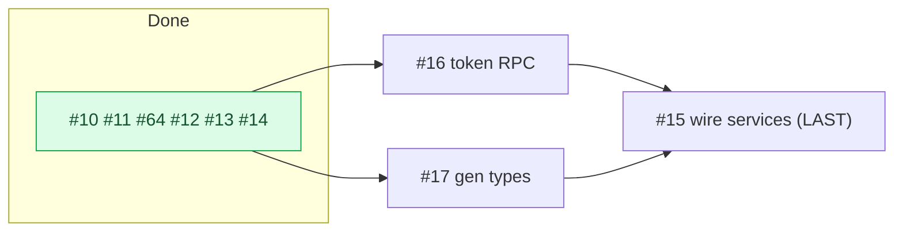

# Milestone Audit — Phase 2 · Backend Supabase & auth

> [!NOTE]
> Date: 2026-06-07 (re-confirmation after #13 + #14). Supersedes prior Phase 2 audits.
> Progress: **6 of 9 closed** — #10, #11, #64, #12, #13, #14. Remaining: **#16, #17, #15**.
> Nothing changed in the open issues since the last audit; the plan holds.

## 1. Snapshot

| # | Title | State |
|---|---|---|
| 10 | Supabase setup | CLOSED |
| 11 | core schema | CLOSED |
| 64 | projection schema | CLOSED |
| 12 | auth (magic link + Google + trigger) | CLOSED |
| 13 | reconcile invitations by email | CLOSED |
| 14 | base RLS policies | CLOSED |
| 16 | RPC `get_project_by_token` | OPEN |
| 17 | generate `database.types.ts` | OPEN |
| 15 | wire services/* to Supabase | OPEN |

## 2. Per-issue (re-confirmation)

### #16 — RPC `get_project_by_token` (KEEP, next)
- `security definer` RPC returning only public fields (name, description, color, member count); revoked token -> invalid.
- **Interaction with #14 (new):** invites are not directly selectable by clients (only `invites_manage` for owners), so the `security definer` RPC is exactly the controlled read path for `/join/:token`. Sound.
- Must precede #15 (the invites service calls it).

### #17 — Generate `database.types.ts` (KEEP)
- `supabase gen types typescript --local` (comment posted). All 10 tables exist -> complete regen.
- **Carry-forward:** fix the two mock sites that set `installation_id: null` (`seed.ts`, `projects.service.ts:92`) now that the generated type is non-null. Must precede #15.

### #15 — Wire services/* to Supabase (KEEP, LAST)
- Replace mock bodies for projects/members/invites/submissions with Supabase calls; signatures stable.
- **Interaction with #14 (new):** wired reads run **under RLS as the authenticated user** — tenant filtering is enforced by the policies (the service just queries; RLS scopes the rows), mirroring the mock's `filterShared` intent. Simplifies the service code.
- Depends on #12/#13 (auth/session), #14 (RLS), #16 (RPC), #17 (types).
- **Cutover:** keep `VITE_BACKEND=mock` as the dev default; exercise the wired services via contract/integration tests against the local stack. Full app flip stays clean (projection empty until Phase 3).

## 3. Build order

> [!IMPORTANT]
> **#16 -> #17 -> #15** (#15 last). #16 and #17 are independent and may interleave; the invariant is #15 last, after RPC + types exist.

## 4. Verdict

> [!IMPORTANT]
> **GO — continue with #16.** No new ambiguities, no scope changes. The foundation (auth, schema, RLS, reconciliation) is verified; the remaining three are well-specified and unblocked. Two clean issues (#16, #17) then the integration (#15).
