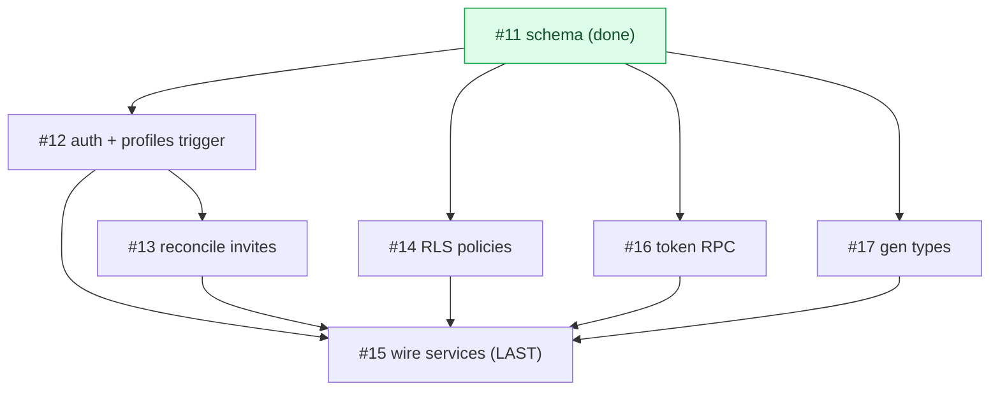
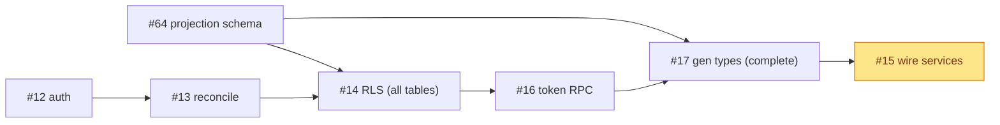

# Milestone Audit — Phase 2 · Backend Supabase & auth

> [!NOTE]
> Date: 2026-06-07 · Run after resolving #10 + #11 (2 of 8).
> Grounded in the vault specs: `Authentification & sessions.md`, `RLS & politiques d'accès.md`, `Modèle de données.md`, `Plan de migration (mock → Supabase).md`, `Invitations & flux de jonction.md`. No code produced.

## 1. Snapshot

| # | Title | State | Label |
|---|---|---|---|
| 10 | Supabase project + CLI + migrations | CLOSED | infra |
| 11 | DB schema (core 5) | CLOSED | backend |
| 12 | Auth: magic link + Google + profiles trigger | OPEN | backend |
| 13 | Reconcile invitations by email at login | OPEN | backend |
| 14 | Base RLS policies | OPEN | backend |
| 15 | Wire services/* to Supabase | OPEN | frontend |
| 16 | RPC `get_project_by_token` | OPEN | backend |
| 17 | Generate `database.types.ts` | OPEN | infra |
| 64 | DB schema: GitHub projection tables (split-out) | OPEN | backend |

## 2. Per-issue assessment

### #12 — Auth: magic link + Google + profiles trigger
- **Context**: Strong. The auth doc gives the exact `handle_new_user()` trigger SQL; providers are `signInWithOtp` (magic link) and `signInWithOAuth({provider:'google'})`; explicitly decoupled from GitHub.
- **Fit**: Core. Clients must not need GitHub; the GitHub App connection is a separate Phase-3 owner flow.
- **Architecture**: Sound. `profiles.id = auth.users.id`, name from `raw_user_meta_data` or email local-part. Role lives in `project_members`, not the JWT (RLS decides) — clean.
- **Justification**: Warranted, foundational.
- **Risk & recommendation**: **KEEP.** Magic link is fully local-testable via **Inbucket** (`:54324`). **Google OAuth needs your Google Cloud OAuth client (id/secret)** — same "needs your account" shape as the cloud deferral; magic link can land first, Google when creds are provided.

### #13 — Reconcile invitations by email at login
- **Context**: Strong. Doc gives the exact `update project_members set user_id = auth.uid() where user_id is null and lower(email)=lower(jwt email)`.
- **Fit**: Closes the invite-before-account loop (members seeded with `user_id null`, `email` known).
- **Architecture**: Doc offers RPC `claim_memberships()` OR a trigger on `profiles`. **Recommend the trigger on `profiles` insert** (automatic, no client round-trip; fires right after #12's trigger).
- **Justification**: Warranted.
- **Risk & recommendation**: **KEEP.** Depends on #12 (profiles must exist). Case-insensitive email match is already specified — good.

### #14 — Base RLS policies
- **Context**: Strong. Doc gives helper fns (`is_owner`, `is_active_member`, `has_role`) + per-table policies.
- **Fit**: The security boundary. `Projection tables come in Phase 4` (allowlist) — so #14 covers the **core 5** (the projection tables don't exist yet anyway).
- **Architecture**: Sound, `security definer stable` helpers; submissions insert gated by `has_role(editor)`, read by owner/author, update by owner; members read owner/self, manage owner; invites manage owner (resolution via RPC, not direct select).
- **Justification**: Warranted, critical.
- **Risk & recommendation**: **KEEP**, with two notes: (1) the doc shows no explicit **`profiles`** policy — add one (read own; read co-members' basic fields for the members UI); (2) the acceptance demands **policy tests** ("non-member reads nothing") — needs an RLS test method (SQL with `set local request.jwt.claims`, or pgTAP). Decide the harness when building.

### #16 — RPC `get_project_by_token`
- **Context**: Strong. `security definer` RPC returning only public fields (name, description, color, member count); revoked token -> invalid.
- **Fit**: Powers `/join/:token` without leaking private rows (invites are not directly selectable under RLS).
- **Architecture**: Sound — the canonical Supabase pattern for controlled public reads.
- **Justification**: Warranted.
- **Risk & recommendation**: **KEEP.** Must run **before** #15 (the invites service wiring calls it). Honor `revoked_at`.

### #17 — Generate `database.types.ts`
- **Context**: Adequate, but the **command is wrong for our setup** and the **timing conflicts with the phase split** (see the warning below).
- **Fit**: #15 needs generated `Row/Insert/Update`. But a full regen now would reflect only the **5 core tables** and **drop** `project_repos/milestones/issues` — which the still-mock roadmap (`seed.ts`, mappers) imports. That breaks the build.
- **Architecture**: `--linked` assumes a cloud project (deferred) — should be **`--local`** against the running stack.
- **Justification**: Warranted eventually, but **premature as a full regen** in Phase 2.
- **Risk & recommendation**: **RESOLVED — full gen.** Decision taken: pull the projection tables forward (new issue **#64**), so #17 runs a **complete** `supabase gen types typescript --local` (not `--linked`; no cloud link). Runs after #64, before #15. DTO aliases then derive from the generated `Row/Insert/Update`.

## 3. Build order

> [!WARNING]
> The issue numbers are **not** the build order. `#15` (wire) must be **last**, and `#17` (types) must precede it.

Recommended (decision applied): **#64 -> #12 -> #13 -> #14 -> #16 -> #17 -> #15.** Schema-first (#64 next) so #14 (RLS on every table) and #17 (gen types) both see the full set; #15 stays last.

## 4. Cross-cutting risks

> [!WARNING]
> 1. **#17 vs the phase split — RESOLVED:** projection tables pulled forward via **#64**, so a full `gen types --local` is complete and nothing the mock roadmap imports is dropped. (`#14` now also enables RLS on those tables, deny-all; allowlist read policies stay Phase 4.)
> 2. **Global `backend` flag cutover (#15):** flipping `VITE_BACKEND=supabase` app-wide breaks roadmap (`getRoadmap` supabase = `notImplemented`, projection is Phase 3). Recommend: keep `mock` as the dev default; exercise the 4 wired services via **contract/integration tests** against the local stack; the full app flip waits for Phase 3.
> 3. **Google OAuth creds (#12):** needs your Google Cloud OAuth client; magic link (Inbucket) is fully local.
> 4. **RLS test harness (#14):** pick the method (SQL `set request.jwt.claims` vs pgTAP) before building.

## 5. Verdict

> [!IMPORTANT]
> **GO to continue Phase 2.** Decision applied: projection tables pulled forward (**#64**), enabling a complete `gen types` and a clean app-wide `backend=supabase`. Build order: **#64 -> #12 -> #13 -> #14 -> #16 -> #17 -> #15** (#15 last). Specs are exact (vault docs give the SQL); #10/#11 are a verified foundation. Next: **#64** (schema-first).
