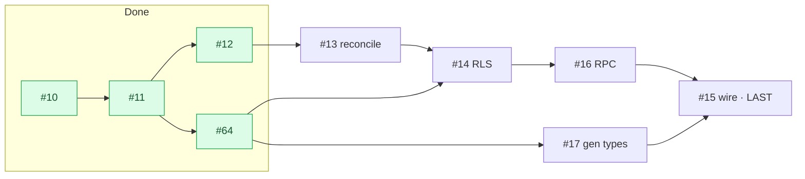

# Milestone Audit — Phase 2 · Backend Supabase & auth

> [!NOTE]
> Date: 2026-06-07 (re-confirmation after #64 + #12). Supersedes the prior Phase 2 audits.
> Progress: **4 of 9 closed** — #10 setup, #11 core schema, #64 projection schema, #12 auth.
> Remaining: #13, #14, #16, #17, #15. Grounded in the vault specs (auth, RLS, data model, invitations).

## 1. Snapshot

| # | Title | State |
|---|---|---|
| 10 | Supabase setup | CLOSED |
| 11 | core schema (profiles/projects/members/invites/submissions) | CLOSED |
| 64 | projection schema (installations/repos/milestones/issues/sync_state) | CLOSED |
| 12 | auth (magic link + Google + profiles trigger) | CLOSED |
| 13 | reconcile invitations by email at login | OPEN |
| 14 | base RLS policies | OPEN |
| 16 | RPC `get_project_by_token` | OPEN |
| 17 | generate `database.types.ts` | OPEN |
| 15 | wire services/* to Supabase | OPEN |

## 2. What #64 and #12 changed (two earlier risks resolved)

> [!NOTE]
> - **#64 (projection forward)** resolved the **#17 build-break risk** (gen types is now complete) **and** the **#15 global-flag cutover** risk: `backend=supabase` can flip app-wide because the roadmap tables now exist (empty until the Phase 3 sync).
> - **#12 (auth)** reworked the auth seam to `onAuthStateChange` + void sign-ins and shipped the `handle_new_user` trigger — so **#13** can link by email at profile-creation time, and **#15** has a real session to authorize against.

## 3. Per-issue (re-confirmation)

### #13 — Reconcile invitations by email at login (KEEP, next)
- Unblocked by #12 (profiles + trigger exist). **Recommendation: a trigger on `profiles` insert** (fires right after `handle_new_user`) using `new.id`/`new.email` — `update project_members set user_id = new.id where user_id is null and lower(email) = lower(new.email)`. Cleaner than a client-called RPC (no round-trip, runs server-side at signup). The vault doc allows either.
- Risk: case-insensitive match (specified). Verify a pending member by email becomes active-linked on first login.

### #14 — Base RLS policies (KEEP)
- Helper fns (`is_owner`, `is_active_member`, `has_role`) + policies per the RLS doc. RLS is already **enabled deny-all** on all 10 tables (#11/#64), so #14 adds the **base policies for the core tables**; the **projection allowlist read policies are Phase 4** (projection tables stay deny-all to clients until then).
- Add a **`profiles`** read policy (self + co-members) — not in the doc, flagged again. Pick an RLS test harness (SQL `set request.jwt.claims` or pgTAP); acceptance requires "non-member reads nothing".

### #16 — RPC `get_project_by_token` (KEEP)
- `security definer` returning only public fields (name, description, color, member count); revoked token -> invalid. Unblocked (invites/projects exist). Must precede #15 (invites service calls it).

### #17 — Generate `database.types.ts` (KEEP, now complete)
- `supabase gen types typescript --local` (corrected from `--linked`; comment posted on the issue). All 10 tables exist -> the regen is complete and nothing the mock imports is dropped.
- **Carry-forward from #64**: after regen, `installation_id` becomes non-null -> fix the two mock sites (`seed.ts`, `projects.service.ts:92`) that set `installation_id: null`. Part of #17.

### #15 — Wire services/* to Supabase (KEEP, LAST)
- Replace mock bodies with Supabase calls for projects/members/invites/submissions, signatures stable. Depends on #13/#14/#16/#17.
- **Cutover**: keep `VITE_BACKEND=mock` as the dev default; exercise the wired services via contract/integration tests against the local stack. With #64 in place, a full `backend=supabase` flip no longer breaks roadmap (empty projection until Phase 3).

## 4. Build order

> [!IMPORTANT]
> **#13 -> #14 -> #16 -> #17 -> #15** (#15 last). #14/#16/#17 are largely independent and may interleave; the invariant is #15 last, after auth + RLS + RPC + types exist.

## 5. Verdict

> [!IMPORTANT]
> **GO — continue with #13.** Coherence is high, two earlier risks (#17 break, #15 cutover) are now resolved by #64, specs are exact, and the foundation (#10/#11/#64/#12) is verified. No new ambiguities; no scope changes needed.
