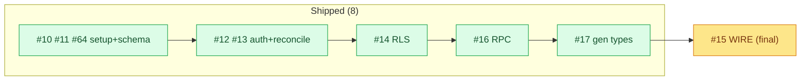

# Milestone Audit (closing) — Phase 2 · Backend Supabase & auth

> [!NOTE]
> Date: 2026-06-07. Closing pass — **8 of 9 closed**; only **#15 (wire services)** remains, the integration finale.
> Done: #10 setup, #11 core schema, #64 projection schema, #12 auth, #13 reconcile, #14 RLS, #16 token RPC, #17 gen types.

## 1. Snapshot

The foundation is verified and backend-ready: schema (10 tables) + RLS (pgTAP 14) + auth (magic link/Google/trigger) + reconciliation + the token RPC + generated types (which now also type the SQL functions).

## 2. #15 — Wire services/* to Supabase (the only open issue)

- **Context**: Adequate ("replace mock bodies with Supabase, signatures stable; UI unchanged"). The migration-plan doc is the spec.
- **Wiring surface (11 methods)** — the `notImplemented` supabase stubs:
  - `projects` (6): getProjectsForUser, getProject, getProjectAccess, createProject, updateProject, deleteProject
  - `invites` (2): getProjectByToken (wraps the #16 RPC), requestAccess
  - `submissions` (3): listSubmissions, createSubmission, setStatus
  - **Out of scope:** `roadmap` (getRoadmap, set*Shared) stays mock/`notImplemented` — Phase 3 (sync) + Phase 4 (allowlist).
- **Fit / architecture**: Sound — the services-adapter seam was built for exactly this; reads are tenant-filtered by RLS (#14), so service code is thin queries. Generated types (#17) type the RPCs.
- **Justification**: The milestone's payoff. Warranted.
- **Risk & recommendation**: **KEEP** — large but mechanical, except two decisions below.

> [!WARNING]
> **Two decisions to resolve in #15's issue-audit:**
> 1. **`requestAccess` under RLS** — a non-member can't insert their own pending row (`members_manage` is owner-only, #14). Needs a `request_access(token)` **security-definer RPC** (preferred, mirrors #16) or a narrow self-request policy.
> 2. **Cutover / roadmap** — `roadmap.getRoadmap` stays `notImplemented`, so a global `VITE_BACKEND=supabase` flip would crash the roadmap page (breaking "UI unchanged"). Either (A) keep `mock` as the dev default and contract-test the 11 wired methods against the local stack, or (B) give roadmap a minimal empty supabase impl (reads the deny-all projection -> []) so the flip is clean app-wide. (B) is small given #64 exists.

> [!NOTE]
> Size: 11 methods across 3 domains. Could be tackled domain-by-domain within the one issue (projects -> invites -> submissions), each with a contract/integration test signing into the local stack.

## 3. Build order
`#15` is last; everything it depends on (auth, RLS, RPC, types) is shipped. No other open work.

## 4. Verdict

> [!IMPORTANT]
> **GO — build #15 to close Phase 2.** The foundation is complete and verified; #15 is the well-scoped integration finale. Resolve the two flagged decisions (requestAccess RPC, roadmap cutover) during #15's audit. After #15 merges, Phase 2 is done and Phase 3 (GitHub App & sync) becomes the next front — the projection tables and their types already exist, so Phase 3 fills them.
