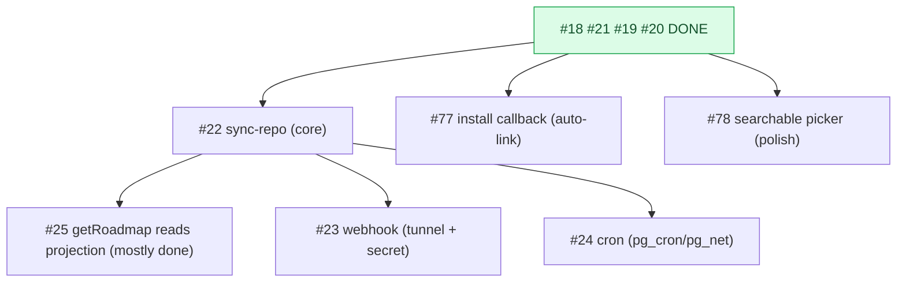

# Milestone Audit — Phase 3 · GitHub App & sync

> [!NOTE]
> Updated 2026-06-07 — **post-#19+#20 re-audit** (4 of 10 done; every-2 checkpoint). Supersedes the earlier passes.
> Two issues were added this checkpoint (#77, #78) from what #20 surfaced. Grounded in the live schema, the shipped Edge functions/services, and end-to-end testing on the local stack + live GitHub.

## 1. Snapshot

| # | Title | Label | State |
|---|---|---|---|
| 18 | Create the GitHub App | github | **DONE** |
| 21 | `_shared/github.ts`: App JWT + installation token | github | **DONE** |
| 19 | connect-installation (link install to owner) | github | **DONE** |
| 20 | Connect repos: project_repos + owner-read RLS + UI | frontend, github | **DONE** |
| 22 | Edge: sync-repo (backfill + incremental) | github | open |
| 25 | getRoadmap reads the projection | frontend | open |
| 23 | Edge: github-webhook (signature + upserts) | github | open |
| 24 | Scheduled re-sync (cron safety net) | infra | open |
| 77 | Wire the post-install callback (auto-link install) | github | open (new) |
| 78 | Searchable repo picker (All-repositories installs) | frontend | open (new) |

## 2. Carry-forward from the done work

> [!IMPORTANT]
> - **App ID `3988714`**, install `138638636` on `zestones/vista`. Key stored base64'd **PKCS#8** in the gitignored `supabase/functions/.env` (App ID, token helper, connect-installation, connect-repos all verified live).
> - **Owner-read RLS landed (#20)** on `github_installations`/`project_repos`/`milestones`/`issues`. Member-sees-`shared` allowlist is **Phase 4**. Projection writes stay server-side (service role).
> - **`connect-repos`** does list/attach/detach, owner-validated. The **create modal** now picks from installed repos + attaches on create; the **Settings → GitHub tab** manages repos. Coherent connect UX.
> - **Two gaps #20 exposed, now tracked:** the install→owner link is created manually (a dev shim re-points `installed_by`) until **#77**; an "All repositories" install returns ~79 repos that a flat list handles poorly → **#78**.

## 3. Per-issue (open)

### #22 sync-repo — KEEP, the core, build next
- Ready: `project_repos` exist (#20), token helper ready (#21), `sync_state` table exists for ETag/cursor. Testable against the real attached `zestones/vista`.
- **Invariant**: every upsert must omit `shared` from `on conflict do update` (the owner allowlist must survive re-sync). Backfill + incremental (`since`, `per_page=100`, ETag/304), upsert by `(project_repo_id, number)`, **ignore PRs**.

### #25 getRoadmap reads projection — KEEP, mostly DONE
- `roadmap.service.ts` already reads `project_repos -> milestones/issues` with no GitHub call, and the owner-read RLS now exists (#20). Reduces to: verify it renders real data once #22 backfills, and confirm no live fetch. **Slot right after #22** — likely a small verification PR.

### #23 github-webhook — KEEP, user-gated
- Verify `X-Hub-Signature-256` (HMAC) before parsing; handle `issues`/`milestone`/`installation*`; idempotent upserts; preserve `shared`. Needs a **tunnel** (smee/cloudflared) + **`GITHUB_WEBHOOK_SECRET`** (empty in `.env`).
- Note: subscribed events are `issues, milestone, repository` — **no `installation` event** subscribed yet; add it on the App if #23/#77 must react to install/uninstall.

### #24 scheduled re-sync — KEEP, verify extensions
- pg_cron → `net.http_post` → `sync-repo` hourly. **`pg_cron`/`pg_net` not yet enabled** (absent from config + migrations); #24 enables + confirms local support. Needs #22.

### #77 wire post-install callback — KEEP (new, well-justified)
- Without it, installing the App doesn't link to the logged-in owner, so a real login sees no repos (we re-point `installed_by` by hand today). The Edge fn exists (#19); #77 wires the **Setup URL → frontend route → connect-installation** redirect. Independent of sync; makes the product self-serve. Needs the App Setup URL set + a frontend callback route.

### #78 searchable repo picker — KEEP (new, polish)
- "All repositories" returns ~79 repos; the flat dropdown/list is hard to scan. Build a filterable combobox (UI kit has none yet) for the create modal + settings list. Independent; lowest priority.

## 4. Invariants / decisions
> [!WARNING]
> 1. **Never overwrite `shared`** in #22/#23 upserts (owner allowlist).
> 2. **#23/#24 are gated** on user infra (webhook tunnel + secret; pg_cron/pg_net).
> 3. **#77 vs the dev shim**: until #77, real-browser testing needs a manually-linked installation; #77 removes that.

## 5. Verdict

> [!IMPORTANT]
> **GO.** The foundation (App, token, install link, repo connect + RLS) is done and proven. Recommended build order:
> **#22 (sync, preserve `shared`) -> #25 (verify roadmap reads real data) -> #77 (auto-link install) -> #23 (webhook; needs tunnel + secret) -> #24 (cron; needs pg_cron/pg_net) -> #78 (searchable picker, polish).**
> #22 is unblocked and the clear next step; only #23/#24 carry outstanding user-gated infra.
