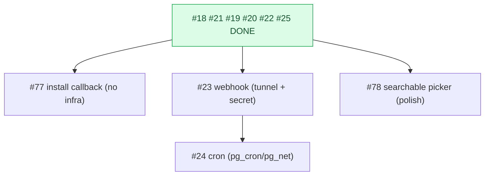

# Milestone Audit — Phase 3 · GitHub App & sync

> [!NOTE]
> Updated 2026-06-07 — **post-#22+#25 re-audit** (6 of 10 done; every-2 checkpoint). Supersedes earlier passes.
> Grounded in the shipped Edge functions/services/RLS and end-to-end testing on the local stack + live GitHub.

## 1. Snapshot

| # | Title | Label | State |
|---|---|---|---|
| 18 | Create the GitHub App | github | **DONE** |
| 21 | `_shared/github.ts`: App JWT + installation token | github | **DONE** |
| 19 | connect-installation (link install to owner) | github | **DONE** |
| 20 | Connect repos: project_repos + owner-read RLS + UI | frontend, github | **DONE** |
| 22 | sync-repo (backfill + incremental) | github | **DONE** |
| 25 | getRoadmap reads the projection | frontend | **DONE** |
| 77 | Wire the post-install callback (auto-link install) | github | open |
| 23 | github-webhook (signature + upserts) | github | open |
| 24 | Scheduled re-sync (cron safety net) | infra | open |
| 78 | Searchable repo picker (All-repositories installs) | frontend | open |

## 2. Carry-forward from the done work

> [!IMPORTANT]
> - **The read path is real and proven**: `getRoadmap` renders 7 milestones / 59 issues from `zestones/vista` via owner-read RLS, 0 GitHub calls (verified live + in the browser). #25 also fixed the always-on "Mock backend" badge to follow `env.backend`.
> - **`sync-repo` (#22)** holds the GitHub-object -> projection-row **mapping** + the **`shared`-preserving upsert** (key `(project_repo_id, number)`), gated by **`SYNC_TRIGGER_SECRET`**. The webhook (#23) and cron (#24) build directly on it.
> - **Dev shims to retire** (local only): the installation is hand-pointed to the logged-in owner and a local password was set to test; test projects (incl. a real "Vista") sit in the local DB. **#77 removes the install-link shim.**

## 3. Per-issue (open)

### #77 wire post-install callback — KEEP, do next (no infra gating)
- Today installing the App doesn't link to the logged-in owner (we re-point `installed_by` by hand), so a real login sees no repos. The Edge fn exists (#19); #77 wires **App Setup URL -> frontend route -> connect-installation**.
- **No user infra needed** -> the natural next build; makes connect self-serve and retires the shim. Set the App's Setup URL + add a frontend callback route + handle already-linked / not-logged-in.

### #23 github-webhook — KEEP, user-gated
- Verify `X-Hub-Signature-256` (HMAC) **before** parsing; handle `issues`/`milestone` (+ `installation*` once subscribed); **idempotent upserts that preserve `shared`**; handle deletes (drop the row).
- **Architecture note**: extract #22's object->row mapping + upsert into a shared helper so #23 reuses it (one place enforces the `shared` invariant). Per-event = single-row upsert.
- **Gates**: a **tunnel** (smee/cloudflared) + **`GITHUB_WEBHOOK_SECRET`** (empty in `.env`). The App currently subscribes to `issues, milestone, repository` — **add the `installation` event** if #23 must react to install/uninstall.

### #24 scheduled re-sync — KEEP, infra check
- pg_cron -> `net.http_post` -> `sync-repo` hourly, passing **`SYNC_TRIGGER_SECRET`** as the Bearer (the auth #22 expects). Safety net for missed webhooks.
- **Gates**: enable **`pg_cron` + `pg_net`** (not yet in config/migrations); store the trigger secret where the cron can read it (Vault / a db setting).

### #78 searchable repo picker — KEEP, polish
- "All repositories" returns ~79 repos; the flat dropdown/list is hard to scan. Build a filterable combobox (UI kit has none) for the create modal + the Settings list. Independent, lowest priority.

## 4. Invariants / gates
> [!WARNING]
> 1. **Never overwrite `shared`** — holds in #22; #23 must too (shared mapper recommended).
> 2. **User-gated**: #23 (webhook tunnel + `GITHUB_WEBHOOK_SECRET`), #24 (`pg_cron`/`pg_net`).
> 3. **Auth reuse**: #24 calls `sync-repo` with `SYNC_TRIGGER_SECRET`.

## 5. Verdict

> [!IMPORTANT]
> **GO.** The core projection pipeline (install -> connect -> sync -> read) is built and proven end to end. Recommended order:
> **#77 (self-serve install, no infra) -> #23 (webhook; needs tunnel + secret) -> #24 (cron; needs pg_cron/pg_net) -> #78 (picker, polish).**
> **#77 is the clear next step** — it needs nothing from you and removes the manual install shim. #23/#24 are the only ones gated on your infra.
