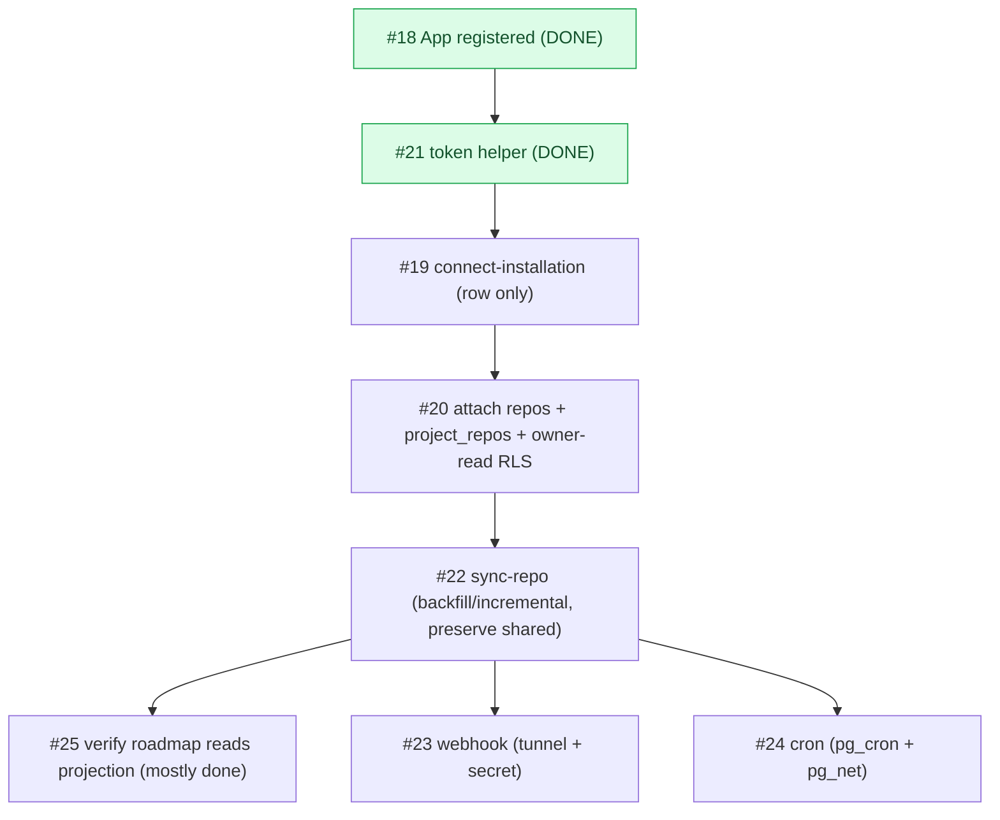

# Milestone Audit — Phase 3 · GitHub App & sync

> [!NOTE]
> Updated 2026-06-07 — **post-2-issues re-audit** (#18 + #21 done; every-2 checkpoint). Supersedes the pre-build audit.
> Grounded in the live schema (`supabase/migrations/`), the wired services (`src/services/roadmap`), and what we learned shipping #18/#21.

## 1. Snapshot

| # | Title | Label | State |
|---|---|---|---|
| 18 | Create the GitHub App (dev + prod) | github | **DONE** |
| 21 | Edge `_shared/github.ts`: App JWT + installation token | github | **DONE** |
| 19 | Edge: connect-installation (link install to owner) | github | open |
| 20 | Connect repos: github_installations + project_repos + UI | frontend, github | open |
| 22 | Edge: sync-repo (backfill + incremental) | github | open |
| 23 | Edge: github-webhook (signature + upserts) | github | open |
| 24 | Scheduled re-sync (cron safety net) | infra | open |
| 25 | getRoadmap reads the projection | frontend | open |

## 2. What #18 + #21 taught us (carry forward)

> [!IMPORTANT]
> - **App ID is `3988714`** (the `1788724` we first recorded was wrong — GitHub returned "Integration not found"). Client ID `Iv23liOnVgx79yB2iFvT`. Installation id for `zestones/vista` is **`138638636`**.
> - **PKCS#1 -> PKCS#8**: GitHub issues `BEGIN RSA PRIVATE KEY`; Web Crypto / jose import PKCS#8. The key is stored base64'd **PKCS#8** in the gitignored `supabase/functions/.env`.
> - **`_shared/github.ts` exists and is proven** end-to-end (jose RS256 -> install token -> read `zestones/vista`). `installationToken(id)` caches in memory and never logs/returns the token. #19/#22/#23 import it.
> - **eslint ignores `supabase/functions`** (Deno); `tsc -b` scopes to `src`/`__tests__`. New Edge code does not touch the frontend gates — but it is **not** covered by them either, so each Edge fn needs its own runtime verification (Deno / `functions serve`).

## 3. Per-issue assessment

### #19 connect-installation — KEEP, refine the AC
- **Context/Architecture**: `github_installations` is ready (`installation_id bigint unique`, `account_login`, `installed_by -> profiles(id)`). The fn reads the caller's Supabase JWT for `installed_by`, verifies the install via the App JWT (`GET /app/installations/{id}` from #21), inserts the row. Sound.
- **Gap**: the AC **"backfill kicked off"** is premature. `sync-repo` (#22) doesn't exist yet, and backfill operates on `project_repos`, which don't exist at install time — they're created at repo-attach (#20). 
- **Recommendation**: **#19 creates the installation row only.** Move the backfill trigger to #20 (after attach) / #22. Drop or reword that AC.

### #20 connect repos + UI — KEEP, owns the RLS unblock
- **Context/Architecture**: `project_repos(project_id, installation_id, owner, repo, github_repo_id)` is sync-ready. Owner lists the installation's repos (`GET /installation/repositories` via #21), inserts rows. Sound, multi-repo.
- **Blocker (confirmed)**: the projection is **deny-all** (RLS enabled, **zero** SELECT policies). Its AC "attached repos appear in the roadmap" cannot pass — the owner sees nothing.
- **Recommendation**: **the owner-read projection RLS policy rides with #20** (owner reads own `project_repos`/`milestones`/`issues`). The member-sees-`shared` allowlist is the Phase 4 refinement.

### #22 sync-repo — KEEP, the core
- **Context/Architecture**: token helper ready. Backfill + incremental (`since`, `per_page=100`, ETag/304), upsert by `(project_repo_id, number)`, ignore PRs. `sync_state` table exists for ETag/cursor.
- **Invariant**: every upsert must **omit `shared`** from `on conflict do update` (owner allowlist must survive re-sync).
- **Coupling**: full validation needs a `project_repo` row (#20) and the read policy to *see* the result. Can be unit-tested against a hand-inserted row, but **#20 and #22 are best built/validated together**.

### #23 github-webhook — KEEP, user-gated
- **Architecture**: verify `X-Hub-Signature-256` (HMAC-SHA256, **before** parsing), handle `issues`/`milestone`/`installation*`, idempotent upserts, preserve `shared`. Events subscribed on the App: `issues, milestone, repository` (confirmed) — note **no `installation` event** is subscribed yet; add it if #23 must react to install/uninstall.
- **Gates**: needs a **tunnel** (smee/cloudflared) + **`GITHUB_WEBHOOK_SECRET`** (currently empty in `.env` — you must paste it from the App settings).

### #24 scheduled re-sync — KEEP, verify extensions
- **Architecture**: pg_cron calls `sync-repo` hourly via `net.http_post` (pg_net). Safety net for missed webhooks.
- **Gap**: **`pg_cron`/`pg_net` are not enabled** (absent from `config.toml` + migrations). #24 must enable them and confirm local support.

### #25 getRoadmap reads projection — KEEP, mostly DONE
- **Reality**: `roadmap.service.ts` **already** reads `project_repos -> milestones/issues` via Supabase and makes **no** GitHub call on page view (#15). 
- **Remaining**: the owner-read RLS policy (shared with #20) so data actually returns, then confirm no live fetch. **Reduces to a verification + the policy** — consider folding the policy into #20 and keeping #25 as the read-path validation.

## 4. Decisions (my recommendation in each)

> [!WARNING]
> 1. **Owner-read projection RLS** -> ride with **#20** (its AC needs it; #25 then just verifies). Recommended over deferring to #25.
> 2. **#19 backfill trigger** -> **decouple**: #19 inserts the row; the sync kick fires from #20/#22 (sync needs `project_repos`, absent at install). Recommended.
> 3. **#20 + #22 built together** (mutually dependent for end-to-end validation), with #25 right after to confirm the read path.

## 5. Verdict

> [!IMPORTANT]
> **GO.** The milestone is coherent and the foundation (App + token helper) is proven. Revised build order:
> **#19 (row only) -> #20 (attach + owner-read RLS) + #22 (sync, preserve `shared`) -> #25 (verify read path) -> #23 (webhook; needs tunnel + secret) -> #24 (cron; needs pg_cron/pg_net).**
> Outstanding user-gated items: the **webhook tunnel + `GITHUB_WEBHOOK_SECRET`** for #23. Everything else I can build and verify on the local stack.
