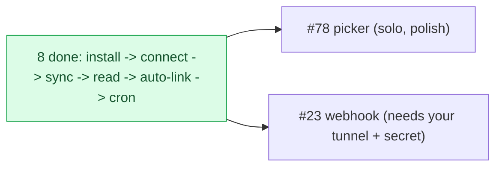

# Milestone Audit — Phase 3 · GitHub App & sync

> [!NOTE]
> Updated 2026-06-07 — **post-#77+#24 re-audit** (8 of 10 done; every-2 checkpoint). Supersedes earlier passes.
> Only two issues remain: #23 (webhook, user-gated) and #78 (picker, polish).

## 1. Snapshot

| # | Title | Label | State |
|---|---|---|---|
| 18 | Create the GitHub App | github | **DONE** |
| 21 | `_shared/github.ts`: App JWT + installation token | github | **DONE** |
| 19 | connect-installation | github | **DONE** |
| 20 | Connect repos + owner-read RLS + UI | frontend, github | **DONE** |
| 22 | sync-repo (backfill + incremental) | github | **DONE** |
| 25 | getRoadmap reads the projection | frontend | **DONE** |
| 77 | post-install callback (auto-link) | github | **DONE** |
| 24 | Scheduled re-sync (cron safety net) | infra | **DONE** |
| 23 | github-webhook (signature + upserts) | github | open |
| 78 | Searchable repo picker | frontend | open |

## 2. State of the pipeline
> [!IMPORTANT]
> The full projection pipeline is **built and proven live**: install the App -> callback auto-links it (#77) -> connect repos (#20) -> sync-repo backfills/refreshes (#22) -> getRoadmap renders from Postgres, 0 GitHub calls (#25) -> hourly cron safety-net (#24). Real `zestones/vista` data (7 milestones / 59 issues) flows end to end. Remaining work is **real-time freshness** (#23) and **UX polish** (#78).

## 3. Per-issue (open)

### #78 searchable repo picker — KEEP, solo, next
- "All repositories" returns ~79 repos; the create-modal dropdown + Settings list are flat. Build a filterable combobox (UI kit has none) for both. Pure frontend, **no infra** -> the next solo step.

### #23 github-webhook — KEEP, user-gated (the finale)
- Real-time projection updates. Verify `X-Hub-Signature-256` (HMAC) **before** parsing; handle `issues`/`milestone` (+ `installation*` once subscribed); **idempotent upserts that preserve `shared`**; deletes drop the row.
- **Reuse #22's mapping/upsert** (extract a shared helper so the `shared` invariant lives in one place).
- **Gates (you):** a webhook **tunnel** (smee/cloudflared) + **`GITHUB_WEBHOOK_SECRET`** (App webhook config + `.env`). The App subscribes to `issues, milestone, repository` — **add `installation`** if #23 reacts to install/uninstall.

## 4. Carry-forward / prod follow-ups (not blockers)
> [!WARNING]
> - **#77**: set the App **Setup URL** -> `http://localhost:5174/github/callback` so the real post-install redirect fires (works via direct navigation until then).
> - **#24**: in prod, set the two **vault** secrets (`sync_repo_url`, `sync_trigger_secret`).
> - **Invariant**: #23 upserts must never overwrite `shared` (shared mapper recommended).

## 5. Verdict

> [!IMPORTANT]
> **GO.** The core is done and proven; the milestone is coherent and nearly complete. Order: **#78 (solo, polish) -> #23 (the real-time finale, when you've set up the tunnel + secret).** #78 needs nothing from you; #23 is the only remaining user-gated item.
