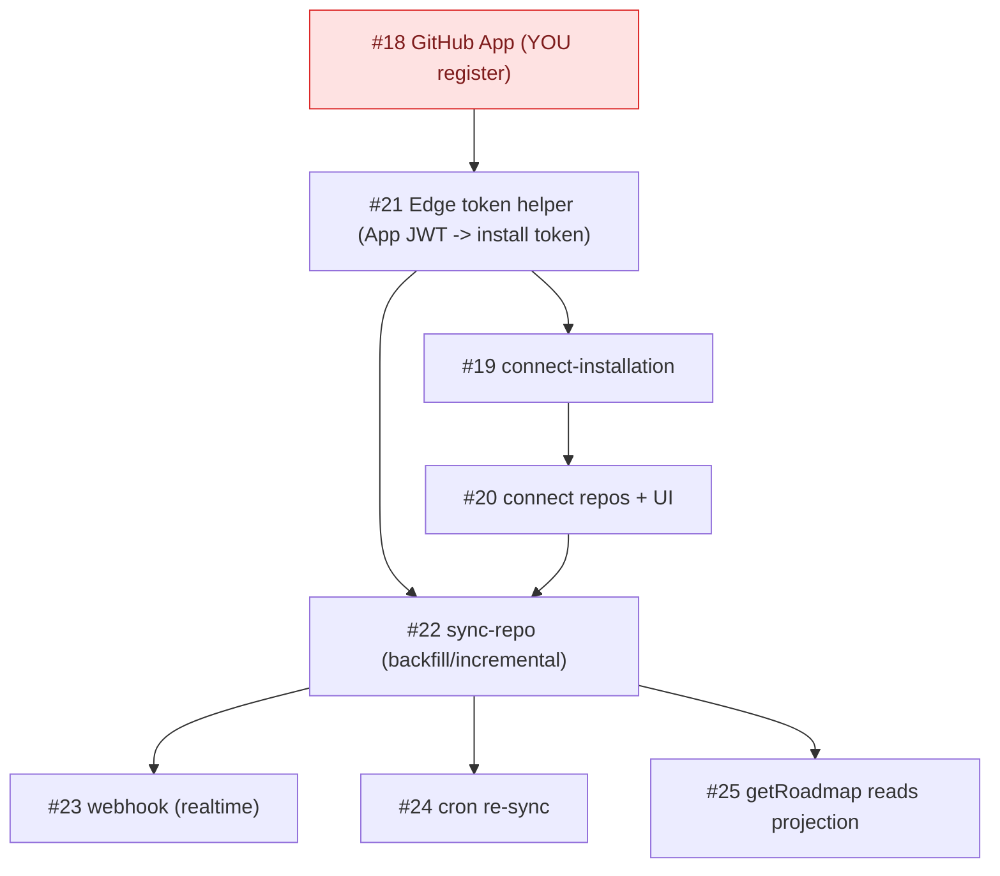

# Milestone Audit — Phase 3 · GitHub App & sync

> [!NOTE]
> Date: 2026-06-07. Phase 2 closed; this is the pre-build audit for Phase 3 (8 issues, all open).
> Grounded in the vault: GitHub App config, "Cache de projection & synchronisation", Edge Functions, "Stratégie de pull & performance".

## 1. Snapshot

| # | Title | Label |
|---|---|---|
| 18 | Create the GitHub App (dev + prod) | github |
| 21 | Edge `_shared/github.ts`: App JWT + installation token | github |
| 19 | Edge: connect-installation (link install to owner) | github |
| 20 | Connect repos: installations + project_repos + UI | frontend, github |
| 22 | Edge: sync-repo (backfill + incremental) | github |
| 23 | Edge: github-webhook (signature + upserts) | github |
| 24 | Scheduled re-sync (cron safety net) | infra |
| 25 | getRoadmap reads the projection | frontend |

## 2. The defining trait: this phase is heavily YOU-gated

> [!WARNING]
> Unlike Phase 2 (which I could build + verify entirely on the local stack), Phase 3 needs **your** hands for the parts I can't do:
> - **#18 register the GitHub App** (App ID, **private key PEM**, **webhook secret**, client id/secret) — I can't create a GitHub App; it's like the Google creds but bigger.
> - **A webhook tunnel** (smee/cloudflared) to test **#23** locally (GitHub must reach your Edge function).
> - **A real test repo** for **#22** backfill (the App is installed on `zestones/vista`).
>
> I build everything else (the Edge Functions in Deno, the connect-repos UI, getRoadmap) and test against the local stack — but meaningful end-to-end testing of #19/#22/#23 needs your App creds (+ tunnel for #23). So **#18 + creds gate the rest.**

## 3. Per-issue (all KEEP)
- **#18 GitHub App** — least-privilege (Issues R/W, Metadata R; events `issues`/`milestone`/`installation*`); keys are server-only. **You register; I scaffold config/docs + `supabase secrets` wiring.**
- **#21 token helper** — App JWT (RS256, exp <=10m) -> installation token; never logged/returned. Foundational for all Edge fns. Needs #18's private key.
- **#19 connect-installation** — Edge: verify install -> `github_installations` row tied to `profiles.id` -> kick backfill. New Deno surface.
- **#20 connect repos + UI** — owner picks repos -> `project_repos`; "items private by default" (`shared=false`). Needs #19/#21.
- **#22 sync-repo** — backfill + incremental (`since`, `per_page=100`, ETag/304), upsert by `(project_repo_id, number)`, **ignore PRs**. The core.
- **#23 github-webhook** — verify `X-Hub-Signature-256` first; handle issues/milestone/installation events; idempotent upserts. Needs the tunnel locally.
- **#24 cron** — pg_cron via `net.http_post` calling `sync-repo` hourly (safety net). Needs #22.
- **#25 getRoadmap reads projection** — partly done: #15 already pointed `getRoadmap` at `project_repos -> milestones/issues`; #25 finalizes it once data + a read policy exist.

> [!WARNING]
> **Two invariants/dependencies to hold across Phase 3:**
> 1. **Never overwrite `shared`** — every upsert (#22/#23) must omit `shared` from the `on conflict do update set` (the allowlist is owner-curated; sync re-running must not flip it). The doc makes this explicit.
> 2. **#25 needs a projection READ policy.** #14 left the projection deny-all (allowlist read = Phase 4). For the owner's roadmap to render in Phase 3 (#20/#25), Phase 3 must add at least an **owner-reads-own-projection** RLS policy; the member-sees-`shared` allowlist filter is the Phase 4 refinement. Decide whether that owner-read policy rides with #25 (recommended) or waits.

## 4. Verdict

> [!IMPORTANT]
> **GO — coherent and well-specified** (the sync/cache strategy is fully documented). Build order: **#18 (you) + #21 -> #19 -> #20 -> #22 -> #23 -> #24 -> #25.** The gate is **#18 + your App creds + a webhook tunnel**; without them I can write the Edge Functions but can't verify them end-to-end. One decision before we start (see chat): how you want to handle the GitHub App + tunnel.
