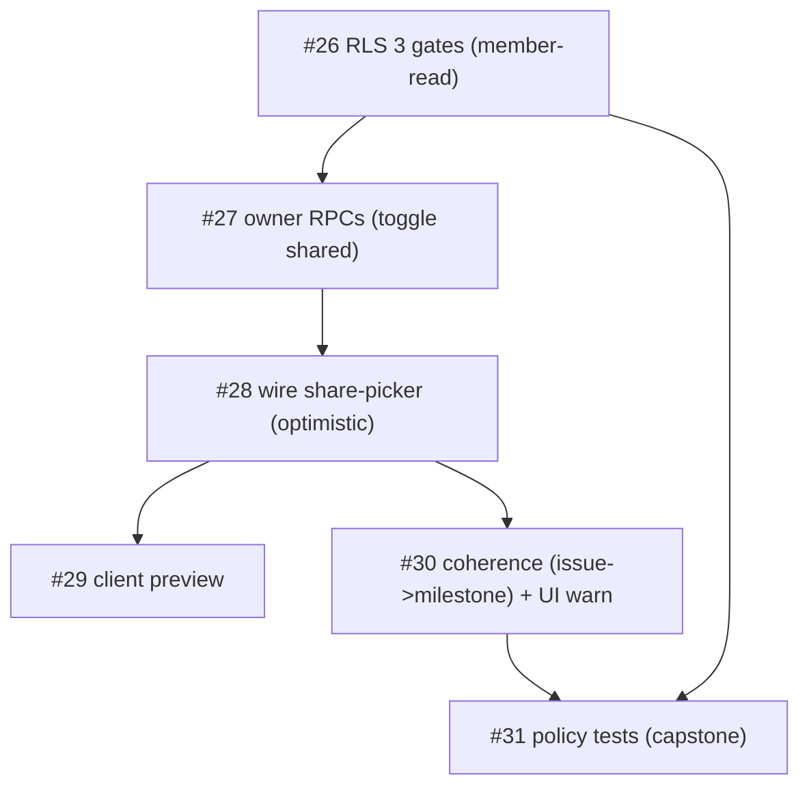

# Milestone Audit — Phase 4 · Visibility (allowlist)

> [!NOTE]
> Pre-build audit, 2026-06-07. Phase 3 closed; Phase 4 has 6 open issues (#26-#31). The job: enforce the owner-curated allowlist **server-side** so clients see only what's shared, wire the share-picker to real writes, and prove it with policy tests. Builds directly on Phase 2/3 (RLS helpers, owner-read projection, the mock share-picker).

## 1. Snapshot

| # | Title | Label |
|---|---|---|
| 26 | RLS visibility on milestones/issues (3 gates) | backend |
| 27 | Owner RPCs to toggle shared | backend |
| 28 | Wire share-picker to RPCs (optimistic) | frontend |
| 29 | Client preview (render as a viewer) | frontend |
| 30 | Issue/milestone visibility coherence | frontend, backend |
| 31 | Policy tests: viewer cannot read shared=false | backend |

## 2. What's already in place (foundations)
> [!IMPORTANT]
> - **Owner-read RLS** on `project_repos`/`milestones`/`issues` (#20) — Phase 4 *extends* it with the member path.
> - Helpers `is_owner(project)`, `is_active_member(project)`, `has_role` (#14); `project_members` table; `projects.visibility` + `available_on_vista`.
> - `shared boolean default false` on milestones/issues; sync/webhook **never** write `shared` (#22/#23 invariant) → curated choices survive re-sync.
> - The **share-picker UI** + mock `filterShared` exist (#4); `roadmap.service` supabase `setMilestoneShared`/`setIssueShared` are `notImplemented` — Phase 4 wires them.

## 3. Per-issue (all KEEP)

### #26 RLS 3 gates — the core, first
Read reaches a client only if: (1) project `visibility='shared'` AND `available_on_vista`, (2) `is_active_member`, (3) item `shared=true` — **owner bypasses all**. Add member-read policies alongside the owner-read ones (RLS policies OR). Joins milestones/issues → `project_repos` → `projects`. Writes stay service-role only. Sound, well-specified.

### #27 Owner RPCs — the write path
`set_milestone_shared`, `set_issue_shared`, `set_milestone_issues_shared` (cascade) — `security definer`, each asserts `is_owner`. Keeps the projection client-read-only while letting the owner flip `shared`. Matches the existing `roadmap.service` signatures (incl. `cascade`). Sound.

### #28 Wire share-picker (optimistic) — depends on #27
Point the supabase `setMilestoneShared`/`setIssueShared` at the #27 RPCs; TanStack Query optimistic update + rollback. "Survives re-sync" already holds (sync omits `shared`).

### #29 Client preview — depends on the toggle working
Owner previews the roadmap as a viewer (only `shared=true`). Client-side filter mirroring #26's RLS output (the picker already has a preview from #4 — finalize it for real data + ensure parity with RLS).

### #30 Issue/milestone coherence — couples with #26
An issue is hidden if its parent milestone isn't shared (avoid orphan shares). The **policy gate** (issue visible iff its milestone is too) belongs in #26's `issues_read`; #30 adds the **owner-facing UI warning** for incoherent shares.

### #31 Policy tests — capstone
pgTAP: viewer reads only `shared=true`, non-member nothing, viewer cannot insert a submission. Proves the allowlist end to end. Run after the policies (#26/#30) land.

## 4. Decision (my recommendation)
> [!WARNING]
> **#30's coherence GATE** (an issue needs its milestone shared) → **fold into #26's `issues_read` policy** (one place for the read gate, tested once in #31), leaving #30 as the **UI warning**. Recommended over a second policy migration. Confirm when we reach #26.

## 5. Verdict
> [!IMPORTANT]
> **GO.** Coherent, well-scoped, and every foundation is already in place; fully local-testable (pgTAP for gates, API for RPCs, app for picker/preview). Build order: **#26 → #27 → #28 → #29 → #30 → #31** (with #30's read-gate folded into #26). #26 is the unblocked starting point.
