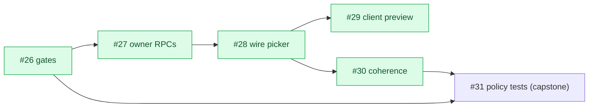
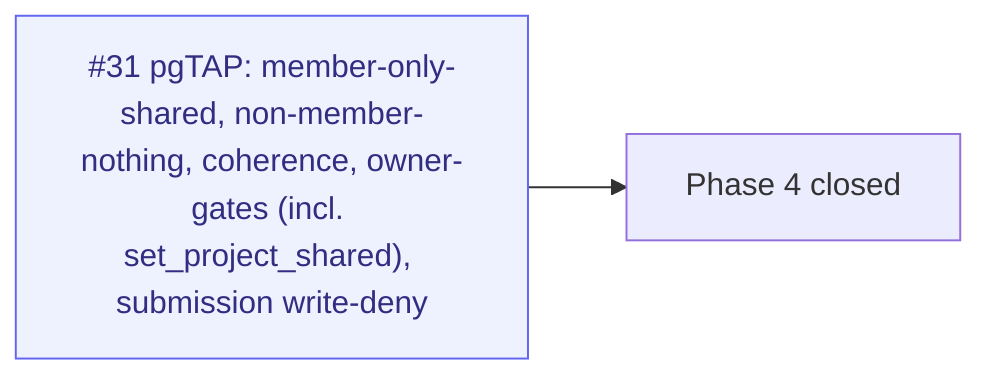

# Milestone Audit — Phase 4 · Visibility (allowlist)

> [!NOTE]
> Updated 2026-06-07 — **closeout checkpoint** (5 of 6 done). Supersedes the post-#26+#27 re-audit.
> The server-side allowlist, the owner curation UI, the client preview, and coherence all shipped and are proven. Only the pgTAP capstone (#31) remains to lock the contract in CI.

## 1. Snapshot

| # | Title | Label | State | Landed in |
|---|-------|-------|-------|-----------|
| 26 | RLS visibility (3 gates) | backend | **DONE** | #26 |
| 27 | Owner RPCs to toggle shared | backend | **DONE** | #27 |
| 28 | Wire share-picker to RPCs (optimistic) | frontend | **DONE** | PR #87 |
| 29 | Client preview (render as a viewer) | frontend | **DONE** | PR #88 |
| 30 | Issue/milestone visibility coherence | frontend, backend | **DONE** | PR #88 |
| 31 | Policy tests: viewer cannot read shared=false | backend | **open** | — |

## 2. Per-issue assessment

### #26 RLS visibility (3 gates) — DONE
- **Context/Architecture**: sound. `is_project_published` / `is_repo_visible_to_member` / `is_milestone_shared` (security definer) + member-read policies on project_repos/milestones/issues; owner-read from #20 retained (RLS is permissive/OR). Coherence baked into `issues_read`.
- **Risk**: none outstanding. Proven adversarially (owner-all / member-shared-only / non-member-nothing / gate-1 published).

### #27 Owner RPCs to toggle shared — DONE
- **Architecture**: `set_milestone_shared` / `set_issue_shared` / `set_milestone_issues_shared`, security definer, `is_owner`-gated (errcode 42501 → 403). In `database.types.ts`.
- **Risk**: none. Proven (owner flips / non-owner forbidden).

### #28 Wire share-picker to RPCs (optimistic) — DONE (PR #87)
- **Architecture**: supabase branch wired to the #27 RPCs; `useSetShared` does optimistic update + rollback + settle-invalidate. `shared` survives re-sync (projection omits it).
- **Risk**: none. Probes covered optimism/rollback/cascade.

### #29 Client preview (render as a viewer) — DONE (PR #88)
- **Context/Fit**: scope was chosen explicitly as a roadmap-page "Preview as client" mode (not just the picker list). Renders the real Gantt/Overview/Mobile through `filterShared` (== #26 RLS), framed with a link accent + dimming spotlight + centered "Client view" badge.
- **Architecture**: filter runs in `select` over cached rows (refetch-free toggle); state lifted to a `PreviewContext` so the AppShell frames the panel. Proven (preview-only-shared, toggle re-filters without refetch).
- **Note**: design iterated heavily (badge geometry per DESIGN.md, brightness, spotlight) — all polish, no logic risk.

### #30 Issue/milestone visibility coherence — DONE (PR #88)
- **Resolution**: implemented as **auto-share** — sharing an issue also shares its milestone, so an orphan (shared issue under a hidden milestone) can't be created via the picker. This **supersedes** the originally-scoped owner-facing "orphan warning": prevention beats warning, and the RLS coherence gate (#26 `issues_read`) remains the server-side backstop.
- **Risk**: low. Probed (issue-share lights up milestone; unshare leaves milestone alone). The only residual orphan path is data created outside the picker (e.g. a direct RPC) — caught by the #26 gate (hidden) and the #31 tests should assert it.

> [!NOTE]
> **Extras that rode along in PR #88** (surfaced during testing, bundled at the owner's request — no separate issues): owner-gated `set_project_shared` RPC ("Share everything"), stable milestone order (`getRoadmap .order`), scrollable client preview, header back-button history nav, per-project signature colors (+ backfill), and **backfill-on-attach** (a real bug: attaching a repo previously left the projection empty until the hourly cron). These are out-of-band for Phase 4's allowlist charter but are now in `main`.

### #31 Policy tests: viewer cannot read shared=false — OPEN (capstone)
- **Context**: clear and actionable. Acceptance: viewer reads only `shared=true`; non-member nothing; viewer cannot insert a submission.
- **Architecture/Fit**: pgTAP via `supabase test db`; the harness + pattern already exist (`supabase/tests/projection_rls.test.sql`, which explicitly defers the member allowlist to "Phase 4"). So #31 is the **net-new member-path proof**, not a rewrite.
- **Recommendation**: **keep**, and broaden slightly to lock everything Phase 4 shipped:
  - member sees only `shared=true` milestones/issues; non-member nothing (gates 1+2+3).
  - **coherence**: a `shared` issue under a non-`shared` milestone is hidden from the member.
  - owner RPCs: non-owner `set_*_shared` raises `forbidden`; **`set_project_shared` owner-gate** (new this milestone) included.
  - viewer cannot insert a submission (RLS write deny).
- **Risk**: low — these mirror the manual smoke tests already run for #26/#27 and the live `set_project_shared` owner/non-owner smoke. Main effort is enumerating cases in SQL.

## 3. Overall verdict

> [!IMPORTANT]
> **Phase 4 is functionally complete and proven by hand; #31 converts that proof into CI.** Coherence is sound (prevention + the #26 gate). The milestone is **GO to close out** — build #31 as the single remaining issue, expanded to also cover `set_project_shared` and the coherence gate.

> [!WARNING]
> Process flag: several real improvements (backfill-on-attach, project colors, back-nav, share-everything) landed in PR #88 without their own tracked issues. They're shipped and verified, but for traceability consider retroactively filing tickets — especially **backfill-on-attach**, which was a genuine bug, and **back-nav / project colors**, which are global (not allowlist) concerns that belong to a UX/project-model milestone rather than Phase 4.

### Build order (remaining)

