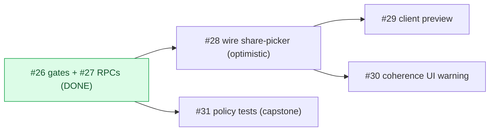

# Milestone Audit — Phase 4 · Visibility (allowlist)

> [!NOTE]
> Updated 2026-06-07 — **post-#26+#27 re-audit** (2 of 6 done; every-2 checkpoint). Supersedes the pre-build pass.
> The server-side allowlist (read gates + owner write RPCs) is now live and proven; the rest is wiring the UI to it, a preview, a coherence warning, and the pgTAP capstone.

## 1. Snapshot

| # | Title | Label | State |
|---|---|---|---|
| 26 | RLS visibility (3 gates) | backend | **DONE** |
| 27 | Owner RPCs to toggle shared | backend | **DONE** |
| 28 | Wire share-picker to RPCs (optimistic) | frontend | open |
| 29 | Client preview (render as a viewer) | frontend | open |
| 30 | Issue/milestone visibility coherence | frontend, backend | open |
| 31 | Policy tests: viewer cannot read shared=false | backend | open |

## 2. What's now live (foundations)
> [!IMPORTANT]
> - **Read gates (#26)**: member sees an item only if project published + active member + item shared; owner sees all; issue-coherence (an issue needs its milestone shared) is **already in `issues_read`**. Proven adversarially.
> - **Write RPCs (#27)**: `set_milestone_shared` / `set_issue_shared` / `set_milestone_issues_shared`, owner-gated, in `database.types.ts`. Proven (owner flips; non-owner forbidden).
> - The mock share-picker + `roadmap.service` mock writes work; the **supabase** `setMilestoneShared`/`setIssueShared` are still `notImplemented` — #28 wires them to the RPCs.

## 3. Per-issue (open)

### #28 wire share-picker (optimistic) — next, unblocked
Point the supabase `setMilestoneShared`(+cascade)/`setIssueShared` at the #27 RPCs (`rpc('set_milestone_shared'…)`, `set_milestone_issues_shared` for cascade). TanStack Query **optimistic update + rollback** (the picker already uses `useSetShared` → invalidates roadmap). "Survives re-sync" already holds (#22/#23 omit `shared`). Frontend; foundations ready.

### #29 client preview — after #28
Owner previews the roadmap as a viewer (only `shared=true`, with coherence). The picker already has a preview pane (#4, mock `filterShared`); #29 ensures it **matches the RLS-filtered output** for real data. Largely a finalize + parity check.

### #30 coherence — reduced to the UI warning
The **policy gate** (issue hidden unless its milestone is shared) already shipped in #26's `issues_read`. So #30 = the **owner-facing warning** in the share-picker when a shared issue's milestone isn't shared (orphan). Smaller than originally scoped.

### #31 policy tests — capstone (can pull early)
pgTAP: viewer reads only `shared=true`, non-member nothing, viewer cannot insert a submission. The policies exist (#26), so #31 **could run now**; recommended as the closer to also cover coherence. Mirrors the smoke tests I ran for #26.

## 4. Verdict
> [!IMPORTANT]
> **GO.** The hard part (server-side allowlist) is done and proven; the rest is UI wiring + a preview + a warning + tests. Order: **#28 → #29 → #30 → #31** (#31 can move earlier — the gates already exist). #28 is the unblocked next step; the visible payoff (toggle a share, watch it appear/disappear in the preview) lands across #28/#29.
