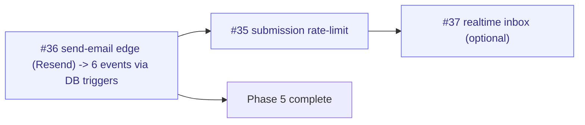

# Milestone Audit — Phase 5 · Write-back & moderation

> [!NOTE]
> Checkpoint audit, 2026-06-08 (supersedes the pre-build pass). The milestone grew from 6 to 10 issues during live testing — the additions (#99/#101/#103/#105) are what made the client loop actually usable. **7 done, 3 open.** The core loop is proven end-to-end live.

## 1. Snapshot

| # | Title | State | Note |
|---|-------|-------|------|
| 32 | Edge `create-issue` (approved -> GitHub) | **DONE** | keystone; idempotency guard folded in |
| 33 | Wire moderation inbox (approve/deny + target repo) | **DONE** | repo + milestone picker |
| 34 | RLS on submissions | **DONE** | was already shipped; owner-decide test added |
| 99 | Verified submitter + inbox tabs | **DONE** | trigger-stamped identity (anti-spoof) |
| 101 | Client "My requests" view | **DONE** | self-scoped status |
| 103 | Member-management UI (invite/requests/roles) | **DONE** | thin UI over existing RLS |
| 105 | Invite/join onboarding | **DONE** | public /join + return-to-invite |
| 35 | Idempotency: no double issue creation | **open** | guard done in #32; only rate-limit left |
| 36 | Transactional emails (Resend) | **open** | the substantive close-out |
| 37 | Realtime on moderation inbox (optional) | **open** | optional |

## 2. The loop is live
> [!IMPORTANT]
> Proven end-to-end during testing: connect repo -> publish (Shared + Available) -> invite link -> client signs in (magic link) -> returns to invite -> request -> owner approves (Members tab) -> client views the shared roadmap -> submits a request (verified identity) -> owner approves -> real GitHub issue -> client sees status in "My requests". The only thing the loop lacks is **proactive notification** (email).

## 3. Open issues

### #36 Transactional emails (Resend) — KEEP, the priority
- **Context** (vault `Notifications`): 6 events — access requested/approved/denied (now wired via #103) + submission received/approved/denied (via #32/#33). `RESEND_API_KEY` server-only; FR/EN templates; "avoid spam on bursts".
- **Architecture gap to decide at build**: triggers fire from **client-side** writes (member approve/deny, submission deny) and an **edge** (create-issue/approve). A clean, decoupled design is **DB triggers on status change -> `pg_net` -> a `send-email` Edge** (mirrors the cron->sync pattern), rather than scattering email calls across the client + edges. No email infra exists yet (`RESEND_API_KEY` absent).
- **Risk**: new external dependency + secret + 6 templates + the trigger wiring. Biggest remaining effort. Recommend building the shared `send-email` edge first, then one event at a time.
- **Verdict**: keep; build next.

### #35 Idempotency / rate-limit — KEEP, small, underspecified
- The **double-create guard already shipped** in #32 (atomic claim). What remains is an **applicative rate-limit** on submission insert (anti-spam) — **underspecified**: window? per user / per project? Likely a DB-side check (count recent submissions by `submitted_by` in a window) or a trigger.
- **Verdict**: keep; pin the exact rule before building. Low priority.

### #37 Realtime on inbox — KEEP as optional, last
- Supabase Realtime on `submissions` (and now `project_members` for the access-requests tab) -> invalidate. Small, no dependency. Clearly optional.

## 4. Verdict

> [!IMPORTANT]
> **GO to close out.** The milestone is coherent and the loop works; **#36 (emails) is the one piece that materially completes it** (pull -> push feedback). #35 and #37 are minor/optional hardening.

### Close-out order

> [!WARNING]
> Two things to settle when building: (1) **#36** delivery mechanism — DB triggers + `send-email` edge (recommended) vs inline calls; (2) **#35** rate-limit rule (window + scope). Both are build-time decisions, not blockers now.
> Process note: the milestone doubled in size from live testing — healthy, but #107 (visibility UX) and the Client-comments milestone (#8) are queued behind it; don't let Phase 5 keep absorbing scope.
