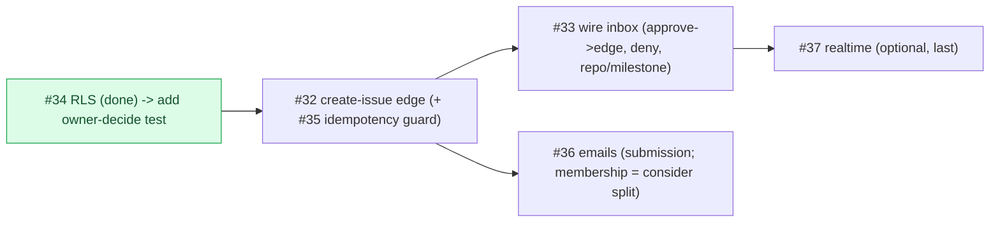

# Milestone Audit — Phase 5 · Write-back & moderation

> [!NOTE]
> Pre-build audit, 2026-06-08. Closes the product loop: a client request becomes a real GitHub issue after the owner approves. Source: vault `Pipeline de modération`, `Boîte de modération`, `Matrice des permissions`, `Notifications`.

## 1. Snapshot

| # | Title | Label | Already in place? |
|---|-------|-------|-------------------|
| 32 | Edge `create-issue` (approved submission -> GitHub) | github | **No** — keystone, net-new |
| 33 | Wire moderation inbox (approve/deny + target repo) | frontend | **Scaffold exists** (`moderation-inbox.tsx`, `use-submissions`, `use-moderate-submission`); needs real wiring |
| 34 | RLS on submissions (insert editor+, update owner) | backend | **Already shipped** (base RLS #14) |
| 35 | Idempotency: no double issue creation | github | **No** — guard belongs in #32 |
| 36 | Transactional emails (Resend) | backend | **No** — fully net-new |
| 37 | Realtime on moderation inbox (optional) | frontend | **No** — small, optional |

## 2. Foundations already present
> [!IMPORTANT]
> - **submissions table** has `type`, `title`, `body`, `status (pending/approved/denied)`, `github_issue_number`, `submitted_by` — the pipeline's data model is complete.
> - **submissions RLS** already matches #34 **exactly**: insert `has_role(project,'editor')`, update `is_owner` (using + with check), read `is_owner OR submitted_by = auth.uid()`. Proven in part by `rls_policies.test.sql` (viewer can't insert, editor can).
> - **Frontend scaffold**: moderation inbox UI + `use-submissions`/`use-moderate-submission` hooks + the submissions service (mock + supabase branches) exist; the supabase `setStatus` currently does a naive `update({status})` — approval must instead route through the `create-issue` edge.
> - **GitHub plumbing**: `installationToken` + read calls are proven (Phase 3). Only the **write** (`POST /issues`) is missing.

## 3. Per-issue assessment

### #32 Edge `create-issue` — keystone, KEEP
- **Context/Architecture**: clear and sound; mirrors `connect-repos` (owner JWT -> re-check `is_owner` -> mint installation token -> act). Adds the first **write** to GitHub: `POST /repos/:o/:r/issues`, title prefixed by type, label `via:vista` (create if missing), attribution line in body, **no @mentions**; store `github_issue_number` + status `approved`.
- **Risk**: external write — must be owner-gated server-side (never trust the client) and idempotent (see #35). The created issue returns **private** via sync (omit `shared`, already guaranteed).
- **Verdict**: keep; it's the milestone's center of gravity.

### #33 Wire moderation inbox — KEEP (depends on #32)
- **Context**: scaffold exists; wire approve -> `create-issue`, deny -> status; owner picks **target repo** (multi-repo) + optional milestone.
- **Architecture**: the supabase `setStatus` should not flip `approved` directly — approval goes through the edge (which sets the status after the GitHub write). Keep deny as a direct status update (owner RLS).
- **Verdict**: keep; straightforward once #32 lands.

### #34 RLS on submissions — ALREADY DONE, reduce to a test
- **Justification**: the policies already exist and match the acceptance verbatim. This isn't net-new work.
- **Recommendation**: **refine/close** — either close as satisfied, or reduce to a one-assertion pgTAP add ("only the owner can decide/update a submission") to lock the decide path, since the existing test only covers insert.

### #35 Idempotency — KEEP, fold the guard into #32
- **Context**: if `github_issue_number` is set, do not recreate (anti double-click/retry). Plus an applicative **rate-limit** on submission insert (anti-spam).
- **Risk/Gap**: the rate-limit is **underspecified** (where, what window, per user or per project?). The idempotency guard naturally lives inside `create-issue` (#32); the rate-limit is a separate, smaller concern.
- **Recommendation**: keep; build the idempotency guard as part of #32, and pin down the rate-limit rule before implementing (or split it out).

### #36 Transactional emails (Resend) — KEEP, but largest + mixed scope
- **Context**: Resend integration, `RESEND_API_KEY` server-only, recipient-language (FR/EN) templates.
- **Scope flag**: it bundles **membership** emails (access requested/approved/denied — a Phase 2/invitations concern) with **submission** emails (received/approved/denied). That's broad for one ticket and crosses the write-back charter.
- **Risk**: new external dependency + secret + templating + multiple trigger points (edge functions and/or DB hooks). Easy to underestimate.
- **Recommendation**: keep, but consider **splitting** into "submission emails" (in-scope) and "membership emails" (cross-cutting), or at least implement as a shared `_shared/email.ts` with per-event callers.

### #37 Realtime on inbox — KEEP as optional, do last
- Small: Supabase Realtime on `submissions` -> invalidate the inbox query. Clearly optional; no dependency.

## 4. Overall verdict

> [!IMPORTANT]
> **GO.** Strong foundations (data model + submissions RLS + inbox scaffold + proven GitHub token plumbing). The only heavy net-new pieces are the **`create-issue` edge (#32)** and **Resend (#36)**. #34 is effectively already done.

### Dependencies & build order

Recommended: **#34 (verify/test) -> #32 (+#35) -> #33 -> #36 -> #37**.

> [!WARNING]
> Three things to settle before/while building (raised in chat): (1) close or test-only #34; (2) #36 scope — split membership vs submission emails?; (3) #35 rate-limit rule is underspecified.
