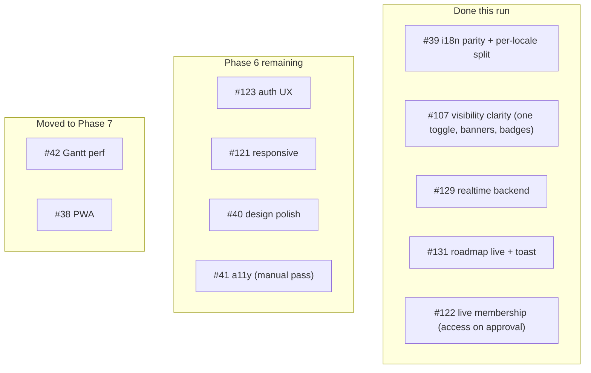
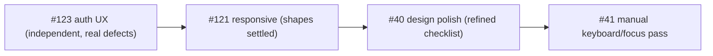

# Milestone audit — Phase 6: Polish, responsiveness & UX (#6)

Re-audit 2026-06-09 after a large build run (well past the every-2-issues cadence): #39, #107, #129, #131, #122 all landed. Supersedes the prior Phase 6 audit.

> [!NOTE]
> **Scope changes applied during this audit.** #42 (Gantt perf) and #38 (PWA) were moved to **Phase 7 — Production launch (#9)** — both are deferral/launch-time concerns, not polish. Phase 6 is now a tight polish/responsiveness/a11y/auth-UX milestone. (The two feature epics #124/#125 were moved to "Client experience v2 (#10)" in the previous audit.)

## Done this run (verification recap)

- **#39 i18n** — per-locale/per-domain catalogs, EN canonical typing (missing key fails tsc) + a vitest parity guard. Merged.
- **#107 visibility clarity** — collapsed Visibility + Available into one "Visible to clients" control; publish-state banner, combined badges, sidebar owned/invited split with a visible-marker, stable list order, honest role-aware empty state. Merged.
- **#129 / #131 / #122 realtime** — publication + replica identity for issues/milestones/projects/project_members; roadmap updates live with a coalesced toast; membership approval grants access live (workspace + join page) with an actor-suppressed toast. The whole "live updates" theme is complete.

## Per-issue assessment — remaining

### #123 — Auth UX hardening — KEEP (build next)
- **Context:** Excellent (severity table, 11 findings, 3 High).
- **Fit:** Core for the Phase 7 production posture; silent auth failures are unacceptable in a client-facing product.
- **Architecture:** Sound — surface errors via the existing Toaster, parse redirect error params (`error_description`/`otp_expired`), resend + cooldown, extract a shared `MagicLinkForm`. The infra already exists (Toaster mounted, `Input` supports `aria-invalid`).
- **Justification:** Warranted; the 3 High findings are real defects, not polish.
- **Risk & recommendation:** KEEP, build next. Mostly eyes-on; independent of everything else, so it can land anytime. A couple of tiny headless slices (gate the demo note on `env.backend==='mock'`).

### #121 — Responsive layout pass — KEEP (now unblocked)
- **Context:** Good (surfaces + breakpoints 360/768/1024 enumerated).
- **Fit:** Strong — clients open share links on phones.
- **Architecture:** Fine; touches many surfaces including the fragile `roadmap-gantt`/`roadmap-mobile` files (minimal edits only, never prettier them).
- **Justification:** Warranted.
- **Risk & recommendation:** KEEP. **Now is the right time** — the UI shapes settled with #107 and the realtime work, so responsive work won't be redone. Eyes-on.

### #40 — Design polish — REFINE
- **Context:** Thin ("final pass against DESIGN.md", "every screen") — unbounded as written.
- **Fit:** Strong for a client-facing product.
- **Architecture:** Fine (token consistency, focus-visible, empty/error/loading states).
- **Justification:** Warranted but needs scoping.
- **Risk & recommendation:** REFINE into a concrete per-screen checklist of missing states before starting; do alongside/after #121 so the final shapes are polished once.

### #41 — Accessibility pass — KEEP (reduced scope)
- **Context:** Adequate. The lint half is **already satisfied** — `jsx-a11y` recommended is enabled and clean (documented on the issue); strict surfaces only one defensible hover-on-static-div case, not worth a fragile-file edit.
- **Fit:** Good (quality / production).
- **Architecture:** Radix already covers most overlay a11y.
- **Justification:** Warranted but reduced — only the manual interaction pass remains.
- **Risk & recommendation:** KEEP, but scope is now the **manual keyboard/focus/ESC/tab-order pass**, which needs eyes and ideally an axe/e2e harness we don't yet have. Pair it with the #121/#40 polish pass.

## Overall verdict

> [!NOTE]
> **Coherence: strong.** With the epics and the two launch-concerns moved out, Phase 6 is exactly four cohesive items: auth UX (#123) + the visual polish trio (#121, #40, #41-manual). The structural and live-update heavy lifting is done.

> [!WARNING]
> **The headless-only run is over.** Everything remaining is **eyes-on** (UX copy, responsive behaviour, visual polish, keyboard a11y) — it needs the owner's validation in the running app, not just gate-green. Plan for that cadence. #41's manual pass would also benefit from adding an axe/e2e harness (currently absent).

### Build order

- **#123 first** — highest remaining value, independent, fixes real defects.
- **#121 → #40 → #41** as the polish sequence (responsive reshape, then visual polish, then keyboard a11y) so work isn't redone.

### Go / No-Go

> [!IMPORTANT]
> **GO.** Build **#123** next. Then the polish trio. Phase 6 is close to complete and well-scoped. Note the eyes-on cadence, and consider standing up an axe/e2e a11y harness before #41's manual pass. Phase 7 now also holds #42 (perf — measure first) and #38 (PWA), alongside the launch checklist.
