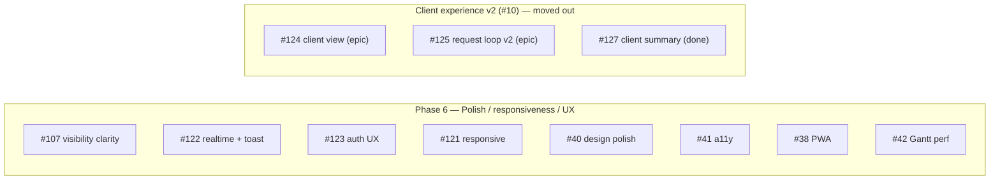
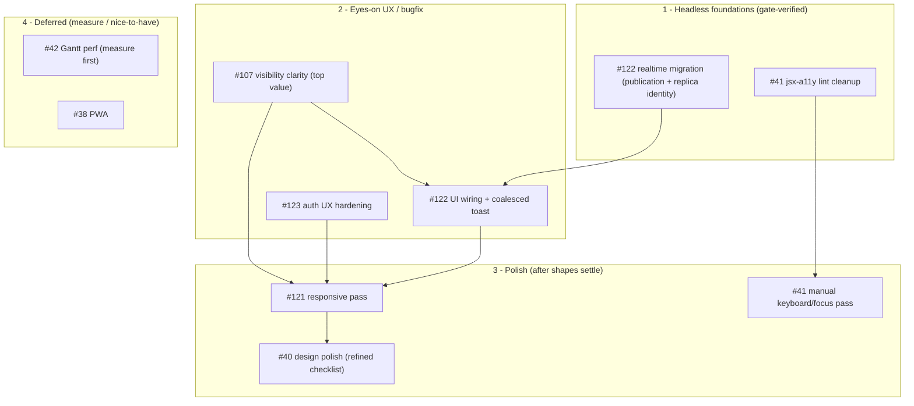

# Milestone audit — Phase 6: Polish, responsiveness & UX (#6)

Audit run 2026-06-09 after resolving two issues this build cycle (#39 i18n, #127 milestone client summary). Triggered by the every-2-issues cadence.

> [!NOTE]
> **Scope change applied during this audit.** The two feature epics that were sitting in Phase 6 (#124 client-facing view, #125 request loop v2) have been moved to a new dedicated milestone **"Client experience v2" (#10)**, along with the already-merged #127 (a #124 carve-out). Phase 6 is now coherent: polish, responsiveness, UX, and UX-bugfix only.

## Per-issue assessment

### #39 — i18n parity FR/EN + CI key-parity check — DONE (merged)
Shipped per-locale/per-domain catalogs with compile-time (canonical typing) + run-time (vitest) parity guards. No further action.

### #107 — Make visibility/availability clear (the "client sees nothing" trap) — KEEP (top priority)
- **Context:** Excellent. Live repro, concrete numbers, clear direction. The strongest-specified issue in the milestone.
- **Fit:** Core. It defends the product's main promise (a client actually sees the shared roadmap). The trap has bitten repeatedly.
- **Architecture:** Sound. Computed publish-state badge + clearer copy + warnings; the suggestion to consolidate `visibility` + `available_on_vista` into one "Publish" control is a genuine simplification worth doing.
- **Justification:** Strongly warranted. Highest user-visible value in the milestone.
- **Risk & recommendation:** KEEP, build first among the eyes-on work. Needs visual/copy judgment. Conceptually paired with #122's `projects` realtime (static clarity + live publish are two halves of the same trap).

### #122 — Live UI updates + toast — KEEP, SPLIT
- **Context:** Excellent (full realtime audit, tiers, the two traps in-body).
- **Fit:** Core. Removes "I have to refresh" and closes the live half of #107 (publish reflecting live).
- **Architecture:** Sound — extends the existing `useRealtimeInvalidate`. Backend = one additive migration (publication + replica identity for `issues`, `milestones`, `projects`, `project_members`). The publish event is only observable on the `projects` row (verified against RLS in the issue).
- **Justification:** Warranted.
- **Risk & recommendation:** KEEP, SPLIT. The **backend migration is headless and foundational — do it now**. UI wiring + toast (coalescing, don't-toast-the-actor) needs eyes, do after.

### #123 — Auth UX hardening — KEEP
- **Context:** Excellent (severity table, 11 findings, 3 High).
- **Fit:** Core for the Phase 7 production posture — silent auth failures are unacceptable.
- **Architecture:** Sound (surface errors via existing Toaster, parse redirect error params, resend+cooldown, extract a shared `MagicLinkForm`).
- **Justification:** Warranted; the 3 High findings are real defects, not polish.
- **Risk & recommendation:** KEEP. Mostly eyes-on; a couple of tiny headless bits (gate the demo note on mock). Independent of the other work — can slot anywhere.

### #121 — Responsive layout pass — KEEP (sequence late)
- **Context:** Good (surfaces + breakpoints 360/768/1024 enumerated).
- **Fit:** Strong. Clients open share links on phones.
- **Architecture:** Fine; touches many surfaces including the fragile `roadmap-gantt/mobile` files.
- **Justification:** Warranted.
- **Risk & recommendation:** KEEP, but **do late** — after #107/#122/#123 reshape their screens, so responsive work isn't redone on layouts about to change.

### #40 — Design polish — REFINE (sequence late)
- **Context:** Thin ("final pass against DESIGN.md"); acceptance is open-ended ("every screen").
- **Fit:** Strong for a client-facing product.
- **Architecture:** Fine (token consistency, focus-visible, empty/error/loading states).
- **Justification:** Warranted but unbounded as written.
- **Risk & recommendation:** REFINE into a concrete per-screen checklist of missing states before starting; otherwise it never "finishes." Do last (polish the final shapes).

### #41 — Accessibility pass — KEEP, SPLIT
- **Context:** Adequate (Radix focus trap, jsx-a11y lint, tab order).
- **Fit:** Good (quality/production).
- **Architecture:** Radix already provides most overlay a11y; lint is enforceable.
- **Justification:** Warranted, partially already covered.
- **Risk & recommendation:** KEEP, SPLIT. The **jsx-a11y lint cleanup is headless** — do it standalone. Keyboard/focus interaction testing needs eyes (and ideally an axe/e2e harness we don't have yet) — manual pass later.

### #38 — PWA (manifest, SW, icons, offline shell) — DEFER (lowest priority)
- **Context:** Adequate, with a correct warning (never cache Supabase responses).
- **Fit:** Weak for a live-data, client-facing viewer — offline shell has little value when the content is live roadmap data.
- **Architecture:** Sound config, but a misconfigured service worker can poison cache and break the app.
- **Justification:** Nice-to-have, not core. Premature relative to the UX bugfixes.
- **Risk & recommendation:** DEFER to the end of Phase 6 or to Phase 7. Not headless-clean (needs an install/offline browser smoke).

### #42 — Gantt performance for large repos — DEFER / DROP-until-measured
- **Context:** Thin and speculative — "profile… virtualize **if needed**", no perf target, no observed problem.
- **Fit:** Only matters with large repos; no evidence current repos hit a wall.
- **Architecture:** Virtualization is invasive and lands squarely in `roadmap-gantt.tsx` / `roadmap-mobile.tsx` — the fragile, never-prettier files.
- **Justification:** **Premature optimization.** Classic "if needed" without a measurement.
- **Risk & recommendation:** DEFER. First (and only, for now) step is to **measure** with a large synthetic repo; build virtualization only if a real threshold is breached. Lowest priority; high regression risk; not headless (perceived fluidity needs eyes).

## Moved out — now in "Client experience v2" (#10)

- **#124 (epic, client-facing view)** — KEEP, SPLIT. Foundation already started (#127 client_summary backend, merged). Remaining: client_summary editor UI + banner + changelog (frontend), and the **public read-only view link** (backend + UI). The view link is confidentiality-critical (a `SECURITY DEFINER` RPC that bypasses RLS) and has an open decision: **invite-token reuse vs a dedicated revocable view token** (recommendation: dedicated). Needs a paranoid pgTAP pass.
- **#125 (epic, request loop v2)** — KEEP, SPLIT. Backend (discussion thread + rich statuses + request↔issue link) is headless; the **email digest depends on Resend (#36, Phase 7)** — sequence accordingly.

## Overall verdict

> [!NOTE]
> **Coherence (post-split): good.** Phase 6 is now a focused polish/responsiveness/UX/bugfix milestone. The mix of "real UX defects" (#107, #123) and "true polish" (#40, #41, #121) plus two deferral candidates (#38, #42) is healthy and shippable. The feature epics that muddied it are out.

### Dependencies & recommended build order

- **#107 and #122 are the value core** — do them together/adjacent (static clarity + live publish are the same trap).
- **Polish (#121, #40, #41-manual) must come last**, after #107/#122/#123 reshape their screens, to avoid redone work.
- **#38 and #42 are deferral candidates** — #42 only after a measured perf problem; #38 as an end-of-phase or Phase 7 nice-to-have.

### Go / No-Go

> [!IMPORTANT]
> **GO** to continue the build. Recommended next: **#122's realtime migration** (clean, foundational, headless), then **#107** as the highest-value eyes-on item. Refine #40 into a checklist before starting it, and don't touch #42 until a real perf problem is measured.
