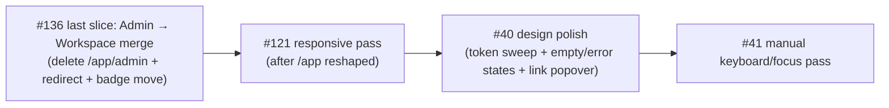

# Milestone audit — Phase 6 · Polish, responsiveness & UX (re-audit #2, post-#136 build-out)

**Date:** 2026-06-09 · **Auditor:** Claude (adversarial re-audit, read-only)
**Scope:** 26 issues (22 closed, 4 open). The previous re-audit (`milestone-Phase 6 … (milestone #6)-audit.md`, commit `9aea052`) covered the pre-epic state (#39, #107, #122, #123, #129, #131 and moved #42/#38 to Phase 7); this pass re-verifies its conclusions briefly and audits the **#136 epic + 16 sub-issues** built since, against the code on `main`.

**Gates on `main` at audit time (hard evidence):** build exit 0 · ESLint clean · Prettier clean · vitest **25 files / 80 tests green**.

---

## Part 1a — Previously audited closed issues (spot re-check only)

| # | Title | Spot evidence | Verdict |
|---|---|---|---|
| #39 | i18n parity FR/EN + CI check | `__tests__/unit/lib/i18n/i18n-parity.test.ts` exists and passes in the suite | CLOSED — holds |
| #107 | Visibility clarity | Re-audited last pass; roadmap empty-state still branches `asClient` (`roadmap-page.tsx:127`) | CLOSED — holds |
| #122 / #131 / #129 | Realtime + toasts + publication | Re-audited last pass; `useRealtimeInvalidate` now also powers both submission inboxes (#143/#145) | CLOSED — holds |
| #123 | Auth UX (resend + cooldown) | `src/features/auth/magic-link-form.tsx` contains resend/cooldown logic | CLOSED — holds |

> [!NOTE]
> No counter-evidence surfaced against any previously-closed item. The realtime plumbing proved reusable for the new inboxes — a good sign for the architecture.

## Part 1b — The #136 epic and its sub-issues

**Epic #136 (OPEN — correctly).** Work breakdown: 5 slices. **4 of 5 verified done** in code; the remaining one (Admin → Workspace merge) is the only reason the epic is open. Claims audited adversarially below; all line refs checked on `main` today.

| # | Claim (as closed) | Verification (hard evidence) | Verdict |
|---|---|---|---|
| #137 | People tab merges Members+Requests+Invite | `settings-tabs.tsx` renders exactly 3 triggers (`general`, `people`, `visibility`); `people-tab.tsx` holds the three sections | DONE — holds |
| #139 | Client-visibility tab merges publish + share picker | `client-visibility-tab.tsx` exists; `ALIAS` maps `sharing → visibility` | DONE — holds |
| #141 | GitHub folded into General | `general-tab.tsx:84` renders `<GithubTab/>`; `ALIAS` maps `github → general` | DONE — holds |
| #143 | Per-project submissions surface + repointed deep-links | Route exists; `settings-tabs.tsx:27` redirects legacy `?tab=submissions`; migration `20260609140000` repoints `submission_received` → `/app/projects/:id/submissions` | DONE — holds |
| #145 | Global inbox at `/app/submissions` | Route + sidebar item (owner-gated, pending count) + `listOwnerInbox` (owner-filtered, pending-only); `useModerateSubmission` invalidates `submissionKeys.all` so both inboxes refresh | DONE — holds |
| #147 | Shared card + markdown bodies | `SubmissionCard` shared by both inboxes; lazy `<Markdown>`; global `.md` typography | DONE — holds |
| #149 | Composer: toolbar + live preview | `composer-toolbar.tsx`, `editor-insert.ts` (6 unit tests), split/tabs layout | DONE — holds |
| #151 | WYSIWYG default + markdown toggle | TipTap in lazy chunk (~151 kB gz, verified in build output); custom `Callout`/`Mermaid` nodes; 4 round-trip tests incl. plain-blockquote non-hijack | DONE — holds |
| #153 | Headings, colored type dropdown, discard guard | H1–H3 in both modes; type `Select` tinted like inbox chips; guard covered by integration test (Esc on dirty draft) | DONE — holds |
| #155 | Heading scale fix | Explicit em scale in `index.css` (`.md`) **and** `comment-panel.tsx` (`.cmt-md`) | DONE — holds |
| #157 | Collapsible cards | Header-row default, `aria-expanded`, no-body cards not expandable | DONE — holds |
| #159 | Animated expand + submit toast | `AnimatePresence` height+fade; submit closes modal + toast; test asserts close-on-submit; jsdom `elementFromPoint` polyfill added | DONE — holds |
| #161 | Demo source removed | `NewProjectInput` has no `source`; mock seeding branch gone; repo picker single/optional path; admin-table fallback now `ws.noRepo` | DONE — holds |
| #163 | Dirty-aware Save + scrollable repos | `general-tab.tsx` computes `dirty`, guards empty name, Discard button; available list `max-h-80 overflow-y-auto`; counts + Connected badges | DONE — holds |
| #165 | Red Remove on attached repos | Coral text + tinted hover on the detach button | DONE — holds |
| #167 | Description → Overview About block | `PageHeader` no longer receives `description` on the roadmap; `RoadmapOverview` renders the About card | DONE — holds |

### Deep-link audit (the epic's stated top risk)

| Link | Where | Status |
|---|---|---|
| `submission_received` → `/app/projects/:id/submissions` | migration `20260609140000` | Correct (owner inbox) |
| `submission_approved/denied` → `/app/projects/:id?tab=requests` | same migration | **Correct** — targets the *client* (`submitted_by`); editors get the "My requests" tab (`roadmap-page.tsx:218`), viewers fall back to gantt by design (`:122`) |
| Legacy `?tab=submissions` | `settings-tabs.tsx:27` | Redirects to the new surface |
| Legacy `members/requests/sharing/github` tabs | `ALIAS` map | All remapped |
| Mock seed `'/settings?tab=requests'` (`seed.ts:299`) | mock only | Works via `ALIAS` (→ people). Cosmetic staleness; fix opportunistically |

### Minor findings (non-blocking, flagged for the record)

> [!NOTE]
> 1. **Composer link button** uses `window.prompt` (acknowledged v1 trade-off in #151's PR); a popover input is a candidate polish item for #40.
> 2. **Rich → markdown toggle normalizes formatting** (canonical serializer output; acknowledged in #151).
> 3. **`seed.ts:299`** carries a legacy settings link (works via alias).
> 4. The previous audit-doc commit was **never pushed** and has been rebased along locally (now `9aea052`) — push it with this doc.
> 5. `admin-table.tsx` (and its new `ws.noRepo` key usage) is scheduled for deletion by the Admin→Workspace slice — no action needed now.

## Part 1c — Open issues

| # | State | Audit |
|---|---|---|
| #136 | OPEN | Epic; 4/5 slices verified done. Remaining: **Admin → Workspace merge** (stats header + inline visible-toggle onto `/app` cards, move pending badge, delete `/app/admin` + sidebar entry, **redirect `/app/admin → /app`**). Context sufficient; keep open until that lands. **KEEP** |
| #121 | OPEN | Responsive pass. Scope still valid; note the composer (#149/#151) already ships mobile write/preview tabs and the inboxes are single-column — the remaining hotspots are the Gantt, comment panel, settings tables, and the app shell. Should run **after** the Admin merge (it reshapes `/app`). **KEEP (re-scoped down)** |
| #40 | OPEN | Design polish. Much of the recent work *is* polish; what remains per its checklist: token consistency sweep + empty/error/loading states on every screen (several new surfaces added their own). Candidate additions from this audit: composer link popover. **KEEP (refresh checklist when picked up)** |
| #41 | OPEN | Accessibility. Previous audit already reduced scope to the **manual keyboard/focus/ESC pass** (jsx-a11y is clean — re-verified via ESLint green). New surfaces added since (composer, collapsible cards with `aria-expanded`, discard dialog) extend the manual checklist. **KEEP** |

---

## Part 2 — Milestone synthesis

**Coherence.** Strong. The session-built #136 series is unusually coherent — one epic, sixteen thin slices, each gate-green with FR/EN parity, and the moderation/composer surfaces now share one rendering pipeline (`components/markdown`) instead of three. No conflicting issues found; no duplicates among open items.

**Scope-creep check.** The epic grew from 5 planned slices to 16 shipped issues — but the additions (#147→#167) were all owner-reviewed UX refinements of the new surfaces, not drift into other domains. Acceptable creep; properly tracked as sub-issues.

**Dependencies & order:**

**Gaps for milestone completion:**
1. The Admin → Workspace slice (closes #136) — including the `/app/admin → /app` redirect the epic explicitly requires.
2. The eyes-on trio #121 → #40 → #41 (unchanged from the previous audit, now slightly re-scoped).
3. Still no axe/e2e a11y harness for #41's manual pass (carried over from the previous audit; optional but recommended).

> [!WARNING]
> Same caveat as last time, doubled: 16 merged slices were validated headless (gates + owner screenshots mid-stream). The remaining work is **eyes-on by definition**. Budget owner validation time per slice.

### Go / No-Go

> [!IMPORTANT]
> **GO.** Build the **Admin → Workspace merge** next (it closes #136 and unblocks #121's reshaped `/app`), then #121 → #40 → #41. No blockers, no refuted claims, all 22 closed issues hold against the code.
