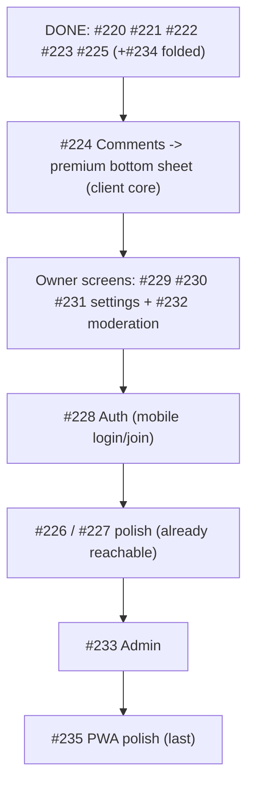

# Milestone audit — Mobile-first experience (#12)

> [!NOTE]
> Re-audit after #220, #221, #222, #223, #225 shipped (+ #234 folded into #222). The landscape shifted:
> the project hub now **reuses** several desktop components inside the mobile shell, so a few "build"
> issues are really "polish" now. Read-only; no code produced. Progress: **6 closed / 10 open** (incl. epic).

## What now exists (hard evidence)

- Shell + nav: `src/mobile/shell/` (`mobile-shell`, `bottom-nav` with Submissions, `screen-header` with a persistent `NotificationBell`, `screen-stack` level-aware transitions, `mobile-form-sheet` keyboard-aware, `sheet`, `route-level`).
- Screens: `mobile-home` (search + cards + create), `mobile-project` (merged Overview hub: search/filter/sort → drill-in; Requests tab; owner actions), `mobile-milestone` (issue search/filter → comments), `mobile-account`.
- Composers: `MobileComposer` (request) + `MobileNewProject` — both on the shared `MobileFormSheet`.
- **Reachable via reuse already**: comments (`CommentPanel` mounted in `mobile-shell-layout`, opened from the milestone detail), my-requests (`MyRequests` in the hub Requests tab), notifications (`NotificationBell` in every header).

## Part 1 — per-issue verdict (open)

| # | Issue | State vs reality | Verdict |
|---|-------|------------------|---------|
| 224 | Comments sheet | **Reachable** (desktop `CommentPanel` overlay mounted in the shell), but not a bespoke mobile sheet | **Refine → premium**: rebuild as a drag-dismiss, keyboard-aware bottom sheet on `MobileFormSheet`/`Sheet` + `use-comments`. High value (client core). **Next.** |
| 226 | My requests / status | **Reachable** (hub Requests tab reuses `MyRequests`) | **Refine → polish** (mobile-tuned list) or accept. Low urgency. |
| 227 | Notifications | **Reachable** (`NotificationBell` popover in headers) | **Refine → premium** (full-screen/sheet notifications; popover is desktop-ish). Low urgency. |
| 228 | Auth (login + join) | Public routes shared with desktop (works, responsive) | **Keep** — mobile-first login/join. Medium (functional today). |
| 229 | Settings — General | Desktop fallback (reachable via hub `…` → settings) | **Keep** — build mobile screen. |
| 230 | Settings — People | Desktop fallback | **Keep** — build (`use-members`). |
| 231 | Settings — Client visibility | Desktop fallback | **Keep** — build (`use-set-shared`). |
| 232 | Moderation inbox | Desktop fallback (Submissions tab + hub `…`) | **Keep** — build mobile triage. |
| 233 | Admin console | Desktop fallback | **Keep — late** (power-user, lowest client value). |
| 235 | PWA polish (icons, install, offline, portrait) | nominal PWA exists | **Keep — last.** |

No duplicates. #234 folded into #222 (closed).

## Part 2 — synthesis

### Order

### Two buckets
- **Polish the reachable** (#224, #226, #227): they already work via reuse — upgrade the UX to bespoke-mobile when prioritized. Only **#224 is high-value** (comments are core to the client loop); #226/#227 can be late.
- **Build the fallbacks** (#228–#233): owner/auth surfaces still render the desktop page on mobile — build mobile screens for true parity.

### Gaps
- **PullToRefresh** primitive still deferred — fold into the first polish issue that wants it, or #235.
- Comment composer keyboard-awareness will reuse `MobileFormSheet` (already built).

### Go / no-go
> [!IMPORTANT]
> **GO.** No blockers; every remaining surface is hook-backed and either reachable (polish) or desktop-fallback (build). Recommended next: **#224 — comments as a premium, keyboard-aware bottom sheet** (highest client value; the `Sheet`/`MobileFormSheet` primitives are in place).
