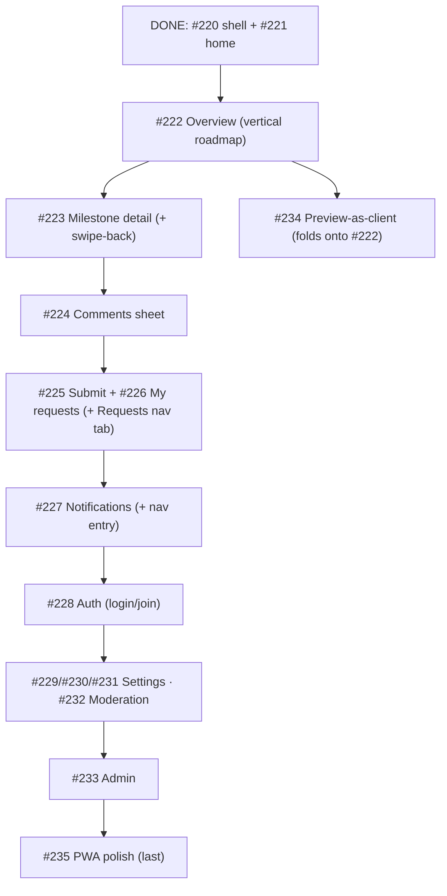

# Milestone audit — Mobile-first experience (#12)

> [!NOTE]
> Run after #220 (foundation) + #221 (home) shipped. Audits the 14 remaining issues against what now exists: the platform split, `MobileShell` (bottom nav, `ScreenHeader`, `Sheet`, `ScreenStack` via `TabTransition`), `usePlatform` + override, `MobileProjectCard`, and the desktop-page fallback. Read-only; no code produced.

## Reality checks (hard evidence)

- Every remaining screen reuses an **existing** data hook — no backend gap (the one gap, `get_projects_for_user` progress, was fixed in #221):
  `use-roadmap.ts`, `use-roadmap-data.ts`, `use-comments.ts`, `use-my-submissions.ts`, `use-submit-request.ts`, `use-members.ts`, `use-invite-link.ts`, `use-owner-inbox.ts`, `use-submissions.ts`, `use-moderate-submission.ts`, `use-notifications.ts`.
- Shell primitives in place: `src/mobile/shell/` (`mobile-shell`, `bottom-nav`, `screen-header`, `sheet`, `mobile-shell-layout`). `Sheet` (motion drag-to-dismiss) is ready for #224.
- Deferred in P0 (not yet built): **PullToRefresh** primitive, **swipe-back** in `ScreenStack` (currently a crossfade), and the **bottom nav only has 2 tabs** (Home, Account).

## Part 1 — per-issue verdict

| # | Issue | Reuses (verified) | Verdict | Notes |
|---|-------|-------------------|---------|-------|
| 222 | Project Overview (vertical roadmap) | `useRoadmap` | **Keep — next** | Flagship client view. Bespoke vertical: milestone cards + progress ring, tap → detail. Entry from a project tap on the home. |
| 223 | Milestone detail | roadmap data (no fetch) | **Keep** | Push screen from #222 (client summary, issues, progress). First real push → add swipe-back here. |
| 224 | Comments sheet | `use-comments` + comment-panel ctx | **Keep** | Consumed by #222/#223 (tap an issue). `Sheet` primitive already exists. Keyboard-aware. |
| 225 | Submit a request (full-screen) | `use-submit-request` | **Keep** | Mobile full-screen composer (desktop has the rich modal). |
| 226 | My requests / status | `use-my-submissions` | **Keep** | Reuses `SubmissionCard`. Pairs with #225 under a Requests surface. |
| 227 | Notifications | `use-notifications` | **Keep** | Needs a nav entry (see gaps). |
| 228 | Auth (login + join) | auth context | **Keep** | Public routes are shared today; mobile-first login/join. Low coupling. |
| 229 | Settings — General | `useUpdateProject` | **Keep** | Owner. |
| 230 | Settings — People | `use-members` / `use-invite-link` | **Keep** | Owner. |
| 231 | Settings — Client visibility | `use-roadmap-data` / `use-set-shared` | **Keep** | Owner. Mirrors the share-picker just polished on desktop. |
| 232 | Moderation inbox | `use-owner-inbox` / `use-moderate-submission` | **Keep** | Owner. |
| 233 | Admin console | admin queries | **Keep — late** | Power-user surface, skews desktop; lowest client value. |
| 234 | Preview-as-client | preview context | **Refine / fold** | Not a standalone screen — it's the #222 overview, client-scoped. Absorb into #222 or do immediately after. |
| 235 | PWA polish (icons, install, offline, portrait) | manifest / `sw.js` | **Keep — last** | Independent; release-readiness pass. |

No duplicates besides #234↔#222 overlap. No drops. All scopes are clear and hook-backed.

## Part 2 — synthesis

### Build order

### Gaps to fold in (not new issues unless noted)
- **Bottom-nav extension**: add Requests + Notifications tabs as #226/#227 land (the nav is built for 2 today). Small, do it inside those issues.
- **PullToRefresh**: build the primitive in #222 (first long list/roadmap) and reuse in #226/#232.
- **Swipe-back**: upgrade `ScreenStack` from crossfade to direction-aware push/pop in #223 (first push screen).
- **#234** should be re-scoped onto #222 (a client-scoped toggle), not a separate screen.

### Go / no-go
> [!IMPORTANT]
> **GO.** The foundation + data layer fully support all remaining screens; no blockers. Recommended next issue: **#222 Project Overview** (the flagship client view), carrying the PullToRefresh primitive. Lock the #234-into-#222 decision before starting.
