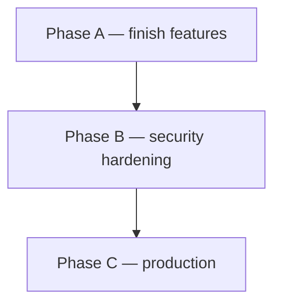

# Roadmap to launch

> Snapshot 2026-06-11, after the mobile-first milestone (#12 / epic #219) shipped. Goal: finish the last feature work, harden security, then productionize. Email/Resend was dropped (#36) — single-owner usage, in-app notifications suffice.

## Phase A — finish the last features

The big client/owner surfaces are done. Two things remain worth building.

| # | Item | Notes |
|---|------|-------|
| #193 | **Public read-only share link** (token, no account) | The only real backend piece left of the old #124 epic. Token-scoped read path (new RPC/RLS mirroring `get_project_by_token` #16, returning shared roadmap content) + a public route reusing the Overview UI. Read-only, allowlist-scoped, **fail-closed — must not become a leak channel**. |
| #125 | **Request loop v2** (epic — split when picked up) | (1) discussion thread + rich statuses on requests (`received → under review → needs info → planned → in progress → delivered / declined`); (2) visible request ↔ issue ↔ roadmap link in "My requests". **Email digest dropped.** New DB columns + RLS; in-app only (ties into #108 / #122). |

> [!NOTE]
> Order: **#193 first** (small, self-contained, high client value), then cut #125 into its two sub-issues and build (1) then (2).

## Phase B — security hardening (from the backend audit, S1–S6)

All currently **audited only** (POCs in the audit docs) — no fixes yet. This is the highest-risk cluster; do it before exposing anything publicly (especially before #193 ships a public path).

| # | Sev | Item |
|---|-----|------|
| #184 | S1 (high) | Verify installer identity in `connect-installation` — no ownership check |
| #183 | S2 | Revoke `notify()` EXECUTE — any caller (incl. anon) can write to any user's bell |
| #185 | S4 | Default-deny EXECUTE on public functions + `request_access` guard (mind the [[vista-supabase-grant-gotcha]]: `revoke … from public` does NOT remove anon/authenticated grants) |
| #186 | S3 | Require `APP_ORIGIN` — CORS defaults to `*` when unset |
| #187 | S5 | `create-issue` rollback can resurrect a concurrently-denied submission |
| #188 | S6 | Informational: sync secret compare, webhook replay, inbox `owner_id` |

> [!IMPORTANT]
> #184 (S1) and #183 (S2) are the headline auth/authorization holes — fix first. #193's public path makes S3/S4 (CORS + default-deny EXECUTE) sequencing-critical: harden the read path before/with shipping the share link.

## Phase C — production

| # | Item |
|---|------|
| #44 | Security checklist before prod (gate; runs after Phase B) |
| #45 | Production deploy + CI |
| #43 | Observability (Edge logs, error tracking) |
| #41 | Accessibility pass |
| #42 | Gantt performance for large repos |
| #40 | Design polish (Tailwind pass, empty/error states) |
| #46 | Owner onboarding guide (README) |

## Recently closed (context)

Milestone #12 mobile-first (epic #219) — all sub-issues. Plus: #38 PWA (done by #235), #189 progress aggregate (migration), #121 responsive (superseded by #12), #124 client-progress epic (banner/changelog/summary shipped; remainder = #193), #36 emails (dropped).
