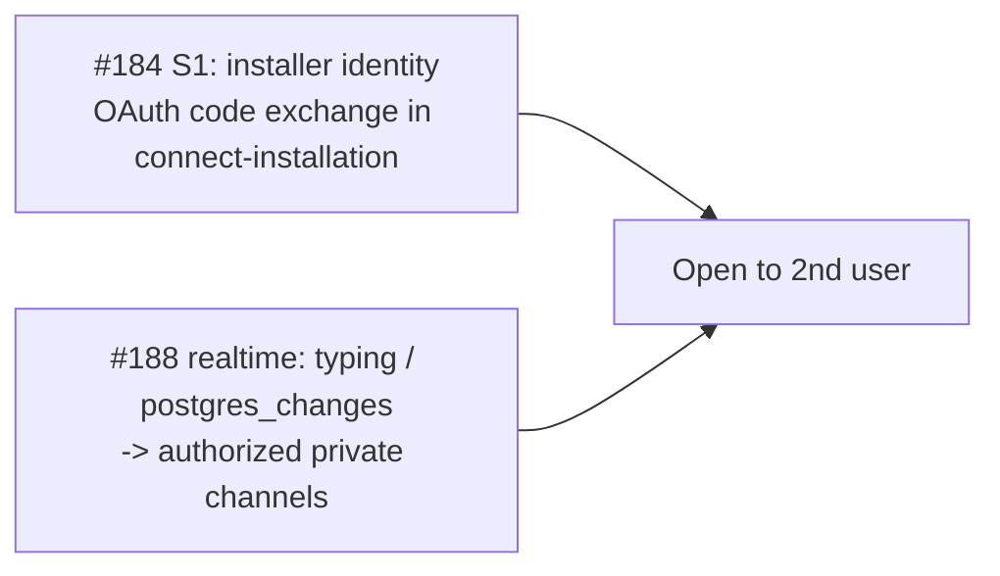

# Security checklist before prod (#44)

Gate the launch on security. This consolidates the backend audit
(`docs/audits/backend-security-audit.md`), the Phase B fixes
(#183 / #185 / #186 / #187 / #188), and the deferred multi-user gates
(#184, realtime).

> [!NOTE]
> Severity legend: **[BLOCKER]** must be done before any prod deploy ·
> **[SOLO-OK]** safe while you are the only user · **[MULTI-USER]** required
> before a second user gets access.

> [!IMPORTANT]
> Items marked **verified locally** were checked against the current code and
> the local database on 2026-06-12 (see [Local verification results](#local-verification-results-2026-06-12)).
> Items marked **verify in prod** can only be confirmed against the deployed
> project and must be re-run there.

---

## 1. Secrets and environment (Supabase function secrets)

- [ ] `APP_ORIGIN` set to the real app origin — **[BLOCKER]** for CORS (#186 warns but stays open to `*` until this is set)
- [ ] `SYNC_TRIGGER_SECRET` set (cron -> `sync-repo` bearer)
- [ ] `GITHUB_WEBHOOK_SECRET` set (HMAC verify)
- [ ] `GITHUB_APP_ID` / `GITHUB_APP_PRIVATE_KEY_BASE64` set (PKCS#8, base64 single-line)
- [ ] `SUPABASE_SERVICE_ROLE_KEY` present only in Edge Functions, never in the client bundle
- [ ] **[MULTI-USER]** `GITHUB_APP_CLIENT_ID` / `GITHUB_APP_CLIENT_SECRET` populated (needed for #184)

## 2. Client bundle hygiene

- [ ] `grep -r "service_role\|SERVICE_ROLE" dist/` returns nothing
- [ ] only the intended `VITE_` vars are in the bundle (anon key is expected; no service key / secrets)
- [x] tokens never logged (installation tokens, JWTs) — **verified locally**: `_shared/github.ts` returns tokens but never logs them; `connect-installation` discards the user token after the ownership check

## 3. Database / RLS

- [x] RLS enabled on every `public` table — **verified locally** (0 tables without RLS). Re-run in prod:
  ```sql
  select tablename from pg_tables t where schemaname='public'
  and not exists (select 1 from pg_class c join pg_namespace n on n.oid=c.relnamespace
    where n.nspname='public' and c.relname=t.tablename and c.relrowsecurity);
  ```
- [x] **Anon-EXECUTE audit (S4 standing rule)** — **verified locally and categorized** (see the finding below). Re-run before launch:
  ```sql
  select p.oid::regprocedure, has_function_privilege('anon', p.oid,'execute') as anon
  from pg_proc p join pg_namespace n on n.oid=p.pronamespace
  where n.nspname='public' and p.prokind='f' and has_function_privilege('anon', p.oid,'execute')
  order by 1;
  ```

> [!IMPORTANT]
> **Finding — the "only two functions anon-callable" rule is stricter than the implemented design.**
> The audit query returns more than `get_public_roadmap` and `get_project_by_token`,
> but every extra falls into one of three safe buckets, confirmed by reading each
> definition locally:
>
> 1. **RLS helper functions** (`is_owner`, `is_active_member`, `has_role`,
>    `is_project_published`, `is_milestone_shared`, `is_repo_visible_to_member`,
>    `is_issue_visible_to_member`, `member_can_view_comments`) — these *must* be
>    callable by anon/authenticated for RLS policies to evaluate.
> 2. **Trigger functions** (`set_updated_at`, `handle_new_user`,
>    `handle_user_login`, `stamp_submission_*`, `on_*_notify`,
>    `guard_submission_dedupe`, `enforce_pin_cap`) — these run as triggers; a
>    direct EXECUTE grant on them is inert.
> 3. **Owner-mutating RPCs** (`set_project_shared`, `set_issue_shared`,
>    `set_milestone_shared`, `set_milestone_issues_shared`,
>    `set_milestone_client_summary`, `set_member_comment_access`,
>    `rotate_share_link`, `revoke_share_link`, `get_projects_for_user`) — each is
>    SECURITY DEFINER and **guarded internally** by `auth.uid()` / `is_owner(...)`,
>    raising `forbidden` / `not authorized` on an unauthorized (or anon) caller.
>
> `create_project` and `request_access` were the only ones that actually needed an
> EXECUTE revoke; both were revoked in #185 and confirmed absent from the anon list.
>
> **Not an active hole** — the internal guards are the real control. **Optional
> defense-in-depth (recommended, not a blocker):** add explicit
> `revoke execute ... from anon, public` migrations for the bucket-3 RPCs so the
> grant posture matches the standing rule. Owner decision required before
> shipping any such migration.

## 4. Migrations + edge functions to deploy together

This batch is applied locally; confirm it shipped to prod as one unit (the
enum/notify changes and the `create-issue` edge must move together). **All five
migrations are present in `supabase/migrations/` — verified locally.**

- [ ] `20260611160000_public_share_links.sql` (#193)
- [ ] `20260611170000_request_thread.sql` (#249)
- [ ] `20260611180000_request_loop_notifications.sql` (#250)
- [ ] `20260612120000_revoke_notify_execute.sql` (#183 / S2)
- [ ] `20260612130000_default_deny_anon_execute.sql` (#185 / S4)
- [ ] redeploy edge: `create-issue` (rollback guard #187 + lifecycle), `_shared/cors.ts` (#186)

## 5. Hardening already shipped (Phase B) — verify it survived deploy

- [x] **S2 #183** — `notify()` revoke migration present — **verified locally** (`20260612120000_revoke_notify_execute.sql`). Re-confirm in prod:
  `has_function_privilege('anon','public.notify(uuid,uuid,public.notification_kind,jsonb,text)','execute')` = false
- [x] **S4 #185** — `create_project` / `request_access` not anon-callable — **verified locally** (absent from the anon-EXECUTE list); both have `auth.uid()` guards
- [x] **S3 #186** — CORS warns in logs if hosted without `APP_ORIGIN` — **verified locally** (`_shared/cors.ts` logs `[cors] APP_ORIGIN is not set...` when hosted and unset). Then set it (section 1)
- [x] **S5 #187** — `create-issue` rollback guarded on the `planned` state — **verified locally** (`create-issue/index.ts`: approve flips undecided -> `planned`; rollback guarded on `planned` and still-uncreated)
- [x] **S6 #188** — accepted-risk (negligible / idempotent); no action

## 6. Regression baseline to re-run post-deploy (from the audit POCs)

**verify in prod** — these invariants were proven locally by the audit; confirm
they still hold against the deployed project:

- [ ] Cross-tenant reads blocked (private project / members / PII / notifications / submissions / issues / allowlist)
- [ ] Writes / privilege-escalation blocked (priv-esc, takeover, moderation hijack, forge-notif, mint-invite)
- [ ] Owner-gated RPCs reject cross-tenant calls (`set_*`, `rotate_share_link` / `revoke_share_link` -> forbidden) — **internal guards verified locally**, re-run cross-tenant POC in prod
- [ ] `get_public_roadmap` fail-closed (bad / revoked / expired token -> null)
- [ ] Submission identity stamped server-side (forged `submitter_email` overwritten)

## 7. Edge / transport

- [x] Webhook signature verified (HMAC SHA-256 over the raw body, constant-time compare) — **verified locally** (`github-webhook/index.ts`: `timingSafeEqual` over `sha256=<hex>`)
- [x] `sync-repo` requires `SYNC_TRIGGER_SECRET` — **verified locally** (rejects without the matching `Authorization: Bearer` secret)
- [ ] CORS restricted via `APP_ORIGIN` — **verify in prod** (set the secret, section 1)

## 8. [MULTI-USER] Gate before a second user gets access



- [x] **#184 (S1)** — `connect-installation` verifies the caller owns the installation's GitHub account (OAuth `?code=` exchange + ownership check) — **code shipped and verified locally**; the App's "Request user authorization during installation" toggle + `CLIENT_ID` / `CLIENT_SECRET` (section 1) make it live, **validatable only in prod**
- [ ] **#188 realtime** — typing channel `typing:<uuid>` and `postgres_changes` subscriptions upgraded to authorized / private channels so only owner + submitter can join

---

## Acceptance

- [ ] sections 1-7 fully ticked (prod-launch, single user)
- [ ] section 8 ticked before inviting any second user
- [ ] policy / regression checks green in prod

---

## Local verification results (2026-06-12)

Run from the repo against the local stack. Code items checked by reading the
current sources; database items by querying the local Postgres.

| Check | Result |
|---|---|
| Tables without RLS | none (0) |
| `create_project` / `request_access` anon-EXECUTE | revoked (absent from anon list) |
| `notify()` revoke migration | present (#183) |
| default-deny anon migration | present (#185) |
| Owner-mutating RPCs anon-EXECUTE | present but internally guarded (`auth.uid()` / `is_owner`) — defense-in-depth gap, not an active hole |
| `_shared/cors.ts` `APP_ORIGIN` warning | present |
| `github-webhook` HMAC constant-time verify | present |
| `sync-repo` `SYNC_TRIGGER_SECRET` bearer | required |
| `create-issue` rollback guard on `planned` | present |
| Tokens logged | none found in `_shared/github.ts` / `connect-installation` |
| All five section-4 migrations on disk | present |

**Not verifiable locally (prod only):** secrets in section 1, client-bundle
grep (needs a prod build), the in-prod re-runs of the RLS / anon-EXECUTE
queries, the section-6 regression POCs, live #184 OAuth, and #188 realtime
channel authorization.
